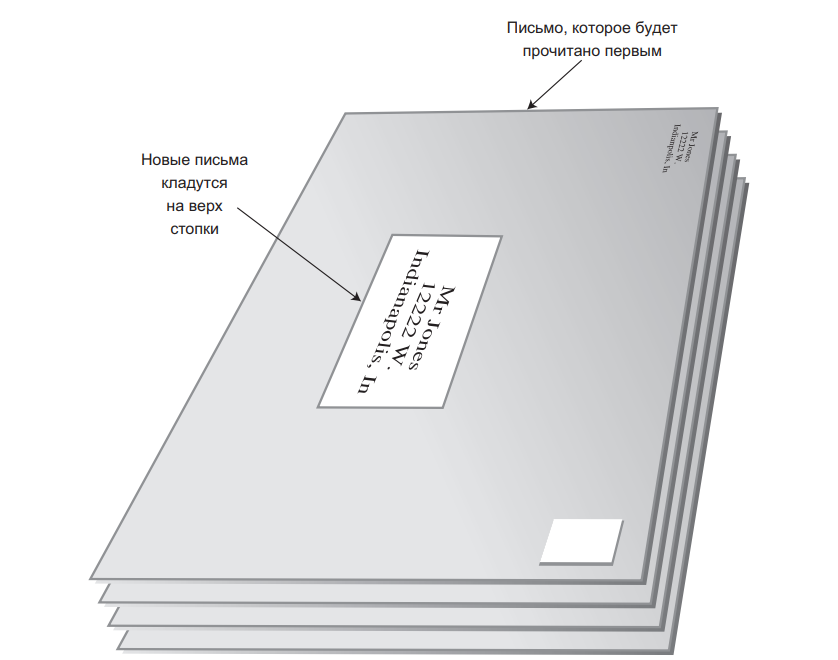
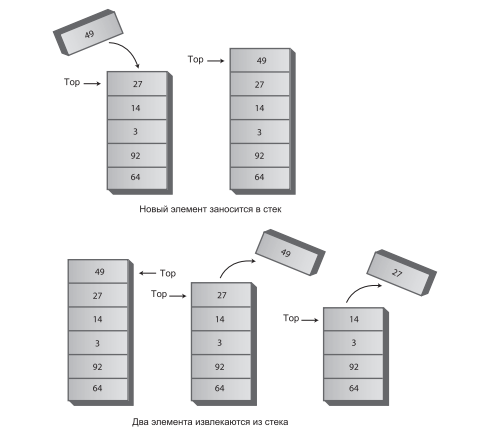
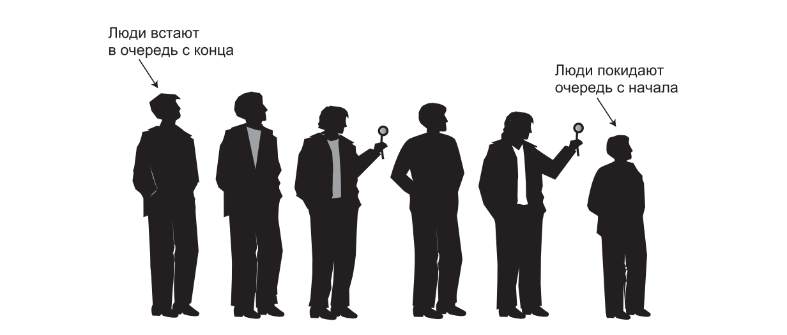
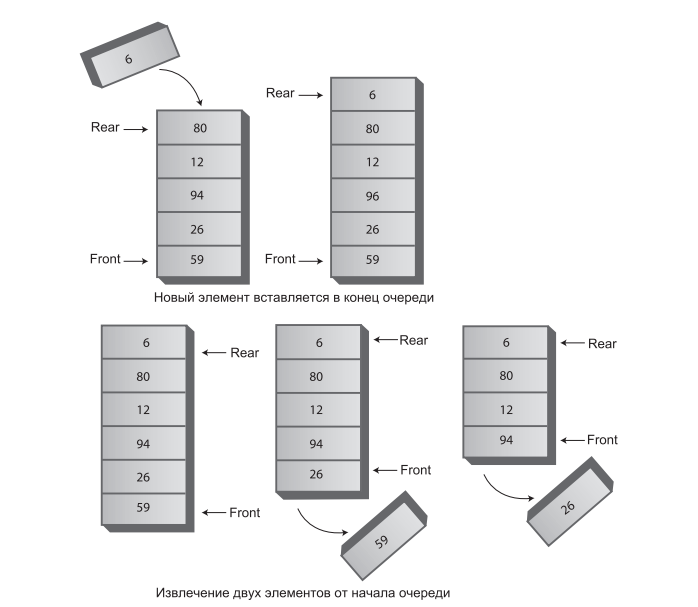
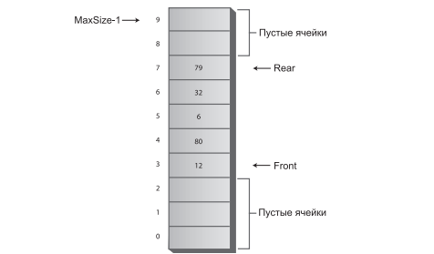
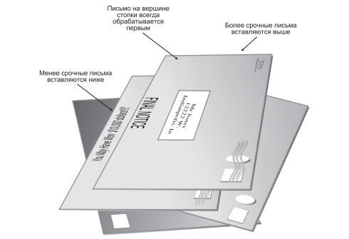
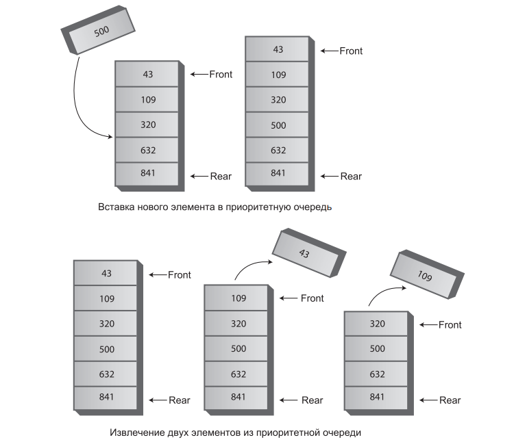

# Занятие №6 26.11.2024
##  Стеки и очереди

На этом занятии мы рассмотрим три структуры данных:
- стек;
- очередь;
- приоритетная очередь.

Они имеют ряд отличий на концептуальном уровне.

Структуры и алгоритмы, которые мы рассмотрим, чаще используются в инструментарии программиста.
Они предназначены скорее для упрощения программирования на концептуальном уровне, а не для полноценного хранения данных.

Они создаются и используются для выполнения конкретных задач во время работы
программы, когда задача выполнена, эти структуры уничтожаются.
___

В массивах, которые мы создавали ранее, у нас был произвольный доступ к данным. 
Мы могли получать / удалять / вставлять данные без каких-то ограничений, все ограничивалось лишь нашей реализацией.

Напротив, структуры данных этого занятия ограничивают доступ к элементам. 
В любой момент времени можно взаимодействовать лишь с одним элементом (если реализация соответствует концепции).
___

Структуры данных которые мы сегодня рассмотрим, гораздо сильнее зависят от интерфейса. 
Это обусловлено строгостью концепции.

### Стеки

#### Определение

В стеке доступен только один элемент данных: тот, который был в него вставлен
последним. Удалив этот элемент, пользователь получает доступ к предпоследнему
элементу и т. д.

Основные операции со стеком — **вставка** (занесение) элемента в стек и **извлечение** из стека — выполняются только на вершине стека, то есть с его верхним элементом. 
Говорят, что стек работает по принципу **LIFO** (Last-In-First-Out), потому что последний занесенный в стек элемент будет первым извлечен из него.

#### Аналогия

Для объяснения идеи стека лучше всего воспользоваться аналогией. 
Многие люди складывают приходящие письма стопкой на журнальном столике. 
Когда появится свободная минута, они обрабатывают накопившуюся почту сверху вниз. 
Сначала они открывают письмо, находящееся на вершине стопки, и выполняют необходимое действие — оплачивают счет, выбрасывают письмо и т. д. 
Разобравшись с первым письмом, они переходят к следующему конверту, который теперь оказывается на верху стопки, и разбираются с ним. 
В конечном итоге они добираются до нижнего письма (которое теперь оказывается верхним).



#### Программная реализация

Программная реализация стека символов (```char```):

```java
public class StackImpl {

    private int maxSize;
    private char[] stackArray;
    private int top;

    public StackImpl(int s) {
        maxSize = s;
        stackArray = new char[maxSize];
        top = -1;
    }

    public void push(char j) {
        stackArray[++top] = j;
    }

    public char pop() {
        return stackArray[top--];
    }

    public char peek() {
        return stackArray[top];
    }

    public boolean isEmpty() {
        return (top == -1);
    }

    public boolean isFull() {
        return (top == maxSize-1);
    }
}
```



#### Применение

Стеки также часто используются при разборе некоторых видов текстовых строк.
Как правило, строки содержат программный код, написанный на компьютерном языке, и обрабатываются программой-компилятором.
Чтобы дать представление о процессе разбора, можете рассмотреть пример в пакете ```stack```.

#### Эффективность

Занесение и извлечение элементов из стека, реализованного в классе ```StackImpl```, выполняется за время ```O(1)```. 
Иначе говоря, время выполнения операции не зависит от количества элементов в стеке; следовательно, операция выполняется очень быстро, не требуя ни сравнений, ни перемещений.

### Очереди

#### Определение

Структура данных, называемая в информатике очередью, напоминает стек, но в очереди первым извлекается элемент, вставленный первым (**FIFO**, First-In-FirstOut), 
тогда как в стеке, как мы видели, первым извлекается элемент, вставленный последним (LIFO). 
Она работает по тому же принципу, что и любая очередь из жизни: человек, первым вставшим в очередь, первым доберется до ее конца. 
Тот, кто встанет в очередь последним, последним дойдет до ее конца.  
Очередь — такой же вспомогательный инструмент, как и стек.



#### Программная реализация

```java
public class QueueImpl {
    private int maxSize;
    private long[] queArray;
    private int front;
    private int rear;
    private int nItems;

    public QueueImpl(int s) {
        maxSize = s;
        queArray = new long[maxSize];
        front = 0;
        rear = -1;
        nItems = 0;
    }

    public void insert(long j) { // Вставка элемента в конец очереди
        if (rear == maxSize-1) { // Циклический перенос
            rear = -1;
        }
        queArray[++rear] = j; // Увеличение rear и вставка
        nItems++; // Увеличение количества элементов
    }

    public long remove() { // Извлечение элемента в начале очереди
        long temp = queArray[front++]; // Выборка и увеличение front
        if (front == maxSize) { // Циклический перенос
            front = 0;
        }
        nItems--; // Уменьшение количества элементов
        return temp;
    }

    public long peekFront() { // Чтение элемента в начале очереди
        return queArray[front];
    }

    public boolean isEmpty() {
        return (nItems == 0);
    }

    public boolean isFull() {
        return (nItems == maxSize);
    }

    public int size() {
        return nItems;
    }
}
```





#### Применение

В операционной системе вашего компьютера (и в сети) трудятся различные очереди, незаметно выполняющие свои обязанности. 
В очереди печати задания ждут освобождения принтера. 
Данные, вводимые с клавиатуры, тоже сохраняются в очереди. 
Если вы работаете в текстовом редакторе, а компьютер на короткое время отвлекся на выполнение другой операции, нажатия клавиш не будут потеряны; они ожидают в очереди, пока у редактора не появится свободное время для их получения. 
Очередь обеспечивает хранение нажатий клавиш в исходной последовательности до момента обработки.

#### Эффективность

Вставка и извлечение элементов очереди, как и элементов стека, выполняются за время ```O(1)```.

### Приоритетная очередь

#### Определение

Приоритетная очередь является более специализированной структурой данных.
У приоритетной очереди, как и у обычной, имеется начало и конец, а элементы извлекаются от начала. 
Но у приоритетной очереди элементы упорядочиваются по ключу, так что элемент с наименьшим (в некоторых реализациях — наибольшим) значением ключа всегда находится в начале. 
Новые элементы вставляются в позициях, сохраняющих порядок сортировки.

#### Аналогия

Каждый раз, когда почтальон отдает вам письмо, вы вкладываете его в стопку непрочитанных писем в соответствии с приоритетом. 
Если письмо требует немедленного ответа (счета / налоги), оно кладется наверх, а письма, на которые можно ответить в свободное время (рассылка / спам), подкладываются под низ стопки. 
Письма со средним приоритетом размещаются где-то в середине; чем выше приоритет, тем выше оказывается письмо в стопке. 
Верх стопки соответствует началу приоритетной очереди.
Когда у вас появляется время на чтение, вы берете письмо с верха стопки (из начала очереди); таким образом, самые важные письма будут обработаны первыми.



#### Программная реализация

```java
public class PriorityQueueImpl {
    // Элементы массива сортируются по значению ключа,
    // от максимумa (0) до минимума (maxSize-1)
    private int maxSize;
    private long[] queArray;
    private int nItems;

    public PriorityQueueImpl(int s) {
        maxSize = s;
        queArray = new long[maxSize];
        nItems = 0;
    }

    public void insert(long item) {
        int j;// сдвинуть вверх
        if (nItems == 0) { // Если очередь пуста,
            queArray[nItems++] = item; // вставляем в ячейку 0
        } else { // Если очередь содержит элементы
            for (j = nItems - 1; j >= 0; j--) { // Перебор в обратном направлении
                if (item > queArray[j]) { // Если новый элемент больше,
                    queArray[j + 1] = queArray[j]; // сдвинуть вверх
                } else { // Если меньше,
                    break; // сдвиг прекращается
                }
            }
            queArray[j + 1] = item; // Вставка элемента
            nItems++;
        }
    }
    
    public long remove() {
        return queArray[--nItems]; 
    }

    public long peekMin() {
        return queArray[nItems-1]; 
    }
    
    public boolean isEmpty() {
        return (nItems==0); 
    }

    public boolean isFull() {
        return (nItems == maxSize); 
    }
}
```


#### Применение

Приоритетные очереди (как и обычные) часто используются в компьютерных системах.
Скажем, в операционной системе с вытесняющей многозадачностью программы могут размещаться в приоритетной очереди, чтобы высокоприоритетная программа первой получила процессорное время для ее выполнения.

#### Эффективность

В рассмотренной реализации приоритетной очереди вставка выполняется за время ```O(N)```, а извлечение — за время ```O(1)```.

### Итоги

- Стеки, очереди и приоритетные очереди обычно используются для упрощения некоторых операций из области программирования.
- В этих структурах данных доступен только один элемент.
- В стеке доступен элемент, который был вставлен последним.
- Основные операции со стеком — вставка (занесение) элемента на вершину стека извлечение элемента, находящегося на вершине.
- В очереди доступен элемент, который был вставлен первым.
- Основные операции с очередью — вставка элемента в конец очереди и извлечение элемента в начале очереди.
- Очередь может быть реализована в форме циклической очереди (на базе массива), в которой осуществляется циклический переход индексов от конца массива к началу.
- В приоритетной очереди доступен элемент с наименьшим (или иногда с наибольшим) значением ключа.
- Основные операции с приоритетной очередью — вставка элемента в порядке сортировки и удаление элемента с наименьшим значением ключа.
- Эти структуры данных реализуются на базе массивов или других структур (например, связанных списков).

___
## Задание

1. Реализовать рассмотренные структуры данных. И добавить обработку ошибок в случае попытки вставить элемент в заполненную или пустую структуру данных.
2. С помощью стека решить задачу поиска палиндромов.

___
## Полезные ссылки
- https://prog-cpp.ru/data-struct/ - здесь можете более подробно изучить рассмотренные на этом занятии (и не только) структуры данных.