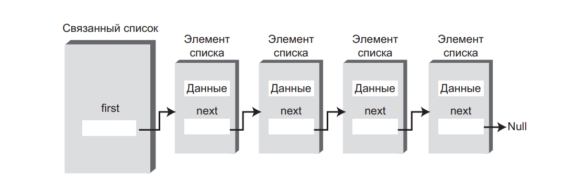
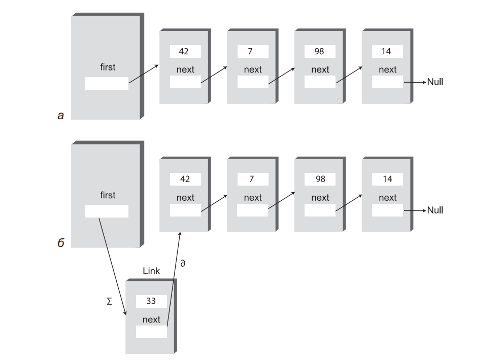
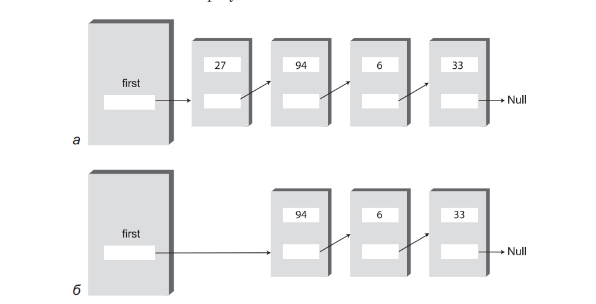
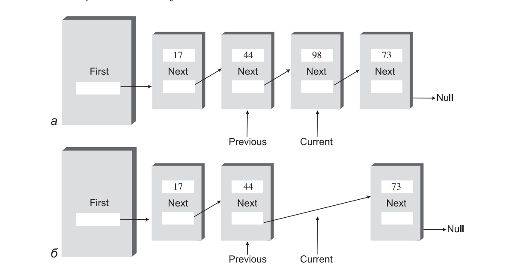
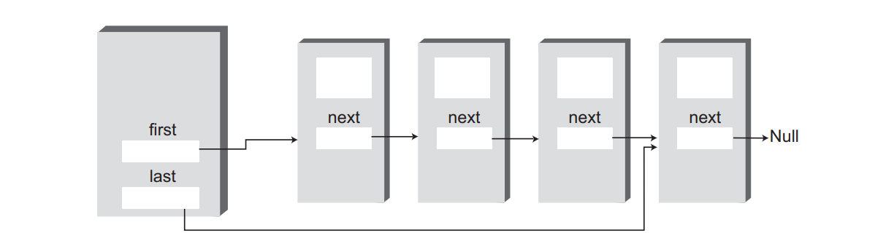
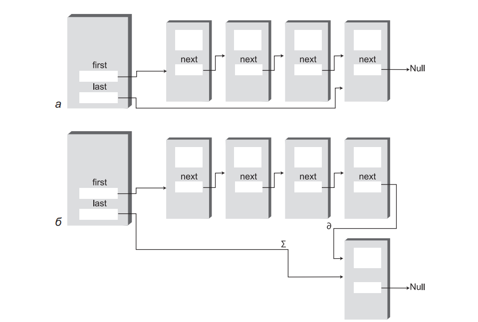
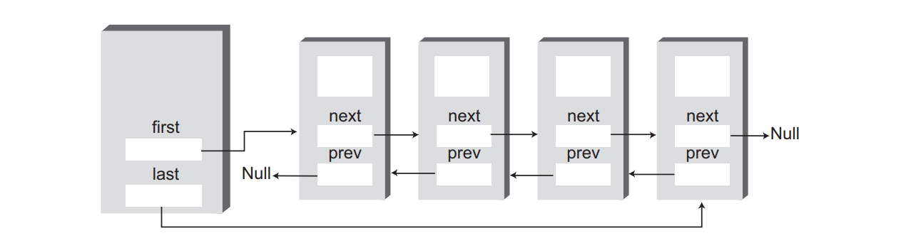

# Занятие №7 04.12.2024
##  Связные списки

На этом занятии мы рассмотрим связанные списки — структуру данных, которая решает некоторые из проблем массива. 
Вероятно, связанный список является второй по популярности структурой данных после массива.

Гибкость связанных списков хорошо подходит для многих общих задач хранения данных. 
Кроме того, связанный список может заменить массив в качестве базы для других структур хранения данных (таких, как стеки и очереди).
Более того, связанные списки часто могут использоваться вместо массивов (исключение составляют ситуации с частым произвольным доступом к отдельным элементам по индексу).

### Строение связанного списка

В связанном списке каждый элемент данных встраивается в специальный объект, называемый элементом списка (классу, на основе которого создаются такие объекты, часто присваивается имя ```Link```). 
Так как список содержит много однотипных элементов, для них удобно создать отдельный класс, отличный от класса самого связанного списка. 
Каждый элемент (то есть объект ```Link```) содержит ссылку на следующий элемент списка; поле, в котором эта ссылка хранится, обычно называется ```next```. 
Объект списка содержит ссылку на первый элемент ```first```.



```java
public class Link {    
    private Data someData; // Произвольные данные
    private Link next; // Ссылка на следующий элемент списка
    
    // Конструкторы & аксессоры
}
```

> *Стоит сделать оговорку по поводу ссылок.*
> *Разные языки программирования по-разному хранят данные в памяти и организовывают доступ к ним.*
> *Например, в Java, переменные хранят не сами значения переменных, а ссылки на значения в памяти.*
> *Такой подход позволяет реализовывать связанный список через ссылки в специальных классах (```Link```).*
> *В С++ напротив, поле вида ```Link next;```, действительно содержит объект типа ```Link```.*
> *При реализации структур данных необходимо учитывать эти особенности языков.*

### Простой связанный список

Реализация простого связанного списка полностью соответствует его описанию.
Пример программной реализации:

```java
public class Link {
    private int data;
    private Link next;

    // Конструкторы & аксессоры
}
```

```java
public class SimpleLinkedList {
    private Link first;

    public SimpleLinkedList() {
        first = null;
    }
    
    public boolean isEmpty() {
        return first == null;
    }
    
    public void insertFirst(int data) {
        Link newLink = new Link(data);
        newLink.setNext(first);
        first = newLink;
    }
    
    public Link deleteFirst() {
        Link temp = first;
        first = temp.getNext();
        return temp;
    }

    public Link find(int key) { 
        Link current = first;
        while (current.iData != key) {
            if(current.next == null) {
                return null;
            } else {
                current = current.next;
            }
        }
        return current;
    }

    public Link delete(int key) {
        Link current = first;
        Link previous = first;
        
        while (current.iData != key) {
            if(current.next == null) {
                return null;
            } else {
                previous = current;
                current = current.next;
            }
        }
        
        if (current == first) {
            first = first.next;
        } else {
            previous.next = current.next;
        }
        
        return current;
    }
    
    public void displayList() {
        System.out.print("List (first-->last): ");
        Link current = first;
        while(current != null) {
            current.displayLink();
            current = current.getNext();
        }
        System.out.println();
    }
}
```
Рассмотрим реализацию методов более подробно...

#### isEmpty

```java
public boolean isEmpty() {
    return first == null;
}
```

Тут все просто, если класс реализующий связанный список содержит ссылку на первый элемент, значит он не пуст, иначе - пуст.

#### insertFirst

```java
public void insertFirst(int data) {
    Link newLink = new Link(data);
    newLink.setNext(first);
    first = newLink;
}
```

Метод ```insertFirst()``` класса ```SimpleLinkedList``` вставляет новый элемент в начало списка.
В этой позиции вставка выполняется проще всего, потому что ```first``` уже указывает на первый элемент. 
Чтобы вставить в список новый элемент, достаточно присвоить полю next созданного объекта ссылку на предыдущий первый элемент, 
а затем изменить поле ```first``` так, чтобы оно указывало на только что вставленный элемент.



#### deleteFirst

Метод ```deleteFirst()``` является противоположностью ```insertFirst()```. 
Он отсоединяет первый элемент, для чего в поле ```first``` заносится ссылка на второй элемент (который находится по значению поля next в первом элементе):

```java
public Link deleteFirst() {
    Link temp = first;
    first = temp.getNext();
    return temp;
}
```



#### displayList

Чтобы вывести содержимое списка, мы начинаем со ссылки ```first``` и перемещаемся от элемента к элементу. 
Переменная current последовательно указывает (а точнее, ссылается) на каждый элемент списка. 
Сначала она содержит ```first```, то есть ссылку на первый элемент списка. 
Команда ```current = current.next;``` присваивает current ссылку на следующий элемент списка, так как именно эта ссылка хранится в поле ```next``` каждого элемента.

```java
public void displayList() {
    System.out.print("List (first-->last): ");
    Link current = first;
    while(current != null) {
        current.displayLink();
        current = current.getNext();
    }
    System.out.println();
}
```


#### find

Принцип работы метода ```find()``` напоминает метод ```displayList()```. 
Ссылка current, изначально содержащая указатель ```first```, перебирает ссылки по цепочке, для чего ей многократно присваивается ```current.next```. 
Для каждого элемента списка ```find()``` проверяет, совпадает ли ключ данного элемента с искомым. 
Если ключи совпадают, метод возвращает ссылку на текущий элемент.
Если ```find()``` доходит до конца списка, так и не обнаружив нужной ссылки, возвращается ```null```.

```java
public Link find(int key) { 
    Link current = first;
    while (current.iData != key) {
        if(current.next == null) {
            return null;
        } else {
            current = current.next;
        }
    }
    return current;
}
```

#### delete

Для поиска удаляемого элемента метод ```delete()``` использует тот же способ, что и метод ```find()```. 
Однако этот метод должен хранить ссылку не только на текущий элемент списка ```(current)```, но и на предыдущий элемент ```(previous)```. 
Это необходимо из-за того, что при удалении текущего элемента метод должен связать предыдущий элемент со следующим. 
Чтобы обратиться к предыдущему элементу, необходимо сохранить ссылку на него.



```java
public Link delete(int key) {
    Link current = first;
    Link previous = first;
    
    while (current.iData != key) {
        if(current.next == null) {
            return null;
        } else {
            previous = current;
            current = current.next;
        }
    }
    
    if (current == first) {
        first = first.next;
    } else {
        previous.next = current.next;
    }
    
    return current;
}
```
___
Рассмотрим иные реализации связанного списка:

### Двусторонние списки

Двусторонний список похож на обычный связанный список с одной дополнительной возможностью: 
в нем хранится ссылка не только на первый, но и на последний элемент.



Наличие ссылки на последний элемент позволяет вставлять новые элементы не только в начале, но и в конце списка.
Конечно, новый элемент можно вставить в конце и обычного односвязного списка, перебирая все его содержимое до последнего элемента, но такое решение неэффективно.

Благодаря возможности быстрого обращения к последнему элементу (вместе с первым) двусторонний список хорошо подходит для некоторых ситуаций, в которых односторонний список недостаточно эффективен. 
Например, двусторонний список может использоваться для реализации очереди; пример будет рассмотрен в следующем разделе.

```java
public class FirstLastLinkedList {
    private Link first;
    private Link last;

    public FirstLastLinkedListt() {
        first = null;
        last = null;
    }
    
    public boolean isEmpty() {
        return first == null;
    }
    
    public void insertFirst(int data) {
        Link newLink = new Link(data);
        if (this.isEmpty()) {
            last = newLink;
        }
        newLink.setNext(first);
        first = newLink;
    }

    public void insertLast(int data) {
        Link newLink = new Link(data);
        if (this.isEmpty()) {
            first = newLink;
        } else {
            last.setNext(newLink);
        }
        last = newLink;
    }
    
    public Link deleteFirst() {
        Link temp = first;
        first = temp.getNext();
        return temp;
    }

    public Link find(int key) {
        Link current = first;
        while (current.getData() != key) {
            if(current.getNext() == null) {
                return null;
            } else {
                current = current.getNext();
            }
        }
        return current;
    }

    public Link delete(int key) {
        Link current = first;
        Link previous = first;

        while (current.getData() != key) {
            if(current.getNext() == null) {
                return null;
            } else {
                previous = current;
                current = current.getNext();
            }
        }

        if (current == first) {
            first = first.getNext();
        } else {
            previous.setNext(current.getNext());
        }

        return current;
    }
    
    public void displayList() {
        System.out.print("List (first-->last): ");
        Link current = first;
        while(current != null) {
            current.displayLink();
            current = current.getNext();
        }
        System.out.println();
    }
}
```



К сожалению, переход от обычного списка к двустороннему не упрощает удаление последнего элемента — ведь в вашем распоряжении нет ссылки на предпоследний элемент, в поле next которого необходимо записать null. 
Для простого удаления последнего элемента необходимы двусвязные списки.

### Двусвязные списки

Рассмотрим следующую разновидность связанных списков: двусвязный список (не путайте с двусторонним списком!). 
Потенциальным недостатком обычных связанных списков является сложность перемещения по списку в обратном направлении. 
Команда вида ```current = current.next``` позволяет легко перейти к следующему элементу списка, но соответствующего способа перехода к предыдущему элементу не существует. 
В некоторых ситуациях это ограничение создает проблемы.

Допустим, в текстовом редакторе связанный список используется для хранения текста. 
Каждая строка на экране хранится в виде объекта ```String```, встроенного в элемент списка. 
Когда пользователь перемещает курсор вниз по экрану, программа переходит к следующему элементу списка для обработки или вывода следующей строки. 
Но что произойдет, если пользователь переместит курсор вверх? 
При использовании обычного связанного списка придется вернуть переменную current (или ее аналог) к началу списка, а затем перебрать все элементы до предыдущего элемента.
Конечно, такой способ неэффективен — перемещение к предыдущей строке должно осуществляться за один шаг.

Двусвязный список предоставляет такую возможность. 
Он позволяет перемещаться по списку как в прямом, так и в обратном направлении. 
Дело в том, что каждый элемент хранит ссылки на два других элемента вместо одного. 
Первая ссылка указывает на следующий элемент, как и в обычных списках. 
Вторая ссылка указывает на предыдущий элемент.



```java
public class DoublyLinkedList {
    private DoublyLink first;
    private DoublyLink last;

    public DoublyLinkedList() {
        first = null;
        last = null;
    }

    public boolean isEmpty() {
        return first == null;
    }

    public void insertFirst(int data) {
        DoublyLink newLink = new DoublyLink(data);
        if (this.isEmpty()) {
            last = newLink;
        } else {
            first.setPrevious(newLink);
        }
        newLink.setNext(first);
        first = newLink;
    }
    
    public void insertLast(int data) {
        DoublyLink newLink = new DoublyLink(data);
        if (isEmpty()) {
            first = newLink;
        } else {
            last.setNext(newLink);
            newLink.setPrevious(last);
        }
        last = newLink;
    }
    
    public DoublyLink deleteFirst() {
        DoublyLink temp = first;
        if (first.getNext() == null) {
            last = null;
        } else {
            first.getNext().setPrevious(null);
        }
        first = first.getNext();
        return temp;
    }
    
    public DoublyLink deleteLast() {
        DoublyLink temp = last;
        if (first.getNext() == null) {
            first = null;
        } else {
            last.getPrevious().setNext(null);
        }
        last = last.getPrevious();
        return temp;
    }
    
    public boolean insertAfter(int key, int data) {
        DoublyLink current = first;
        
        while (current.getData() != key) {
            current = current.getNext();
            if (current == null) {
                return false;
            }
        }
        
        DoublyLink newLink = new DoublyLink(data);
        if (current == last) {
            newLink.setNext(null);
            last = newLink;
        } else {
            newLink.setNext(current.getNext());
            current.getNext().setPrevious(newLink);
        }
        newLink.setPrevious(current);
        current.setNext(newLink);
        return true;
    }
    
    public DoublyLink deleteKey(long key) {
        DoublyLink current = first;
        while (current.getData() != key) {
            current = current.getNext();
            if (current == null) {
                return null;
            }
        }
        
        if (current == first) {
            first = current.getNext();
        } else {
            current.getPrevious().setNext(current.getNext());
        }
        
        if (current == last) {
            last = current.getPrevious();
        } else {
            current.getNext().setPrevious(current.getPrevious());
        }
        return current;
    }
    
    public void displayForward() {
        System.out.print("List (first-->last): ");
        DoublyLink current = first;
        while (current != null) {
            current.displayLink();
            current = current.getNext();
        }
        System.out.println();
    }
    
    public void displayBackward() {
        System.out.print("List (last-->first): ");
        DoublyLink current = last;
        while (current != null) {
            current.displayLink();
            current = current.getPrevious();
        }
        System.out.println();
    }
}
```

### Эффективность связанных списков

Вставка и удаление в начале связанного списка выполняются очень быстро. 
Операция сводится к изменению одной или двух ссылок, выполняемому за время O(1).
Поиск, удаление и вставка рядом с конкретным элементом требует перебора в среднем половины элементов списка, для которого необходимо O(N) сравнений.
У массива эти операции тоже выполняются за время O(N), но связанный список все равно работает быстрее, потому что он не требует перемещения элементов при вставке или удалении.
Повышение эффективности может быть весьма значительным, особенно если копирование занимает существенно больше времени, чем сравнение.

Другое важное преимущество связанных списков перед массивами заключается в том, что связанный список всегда использует ровно столько памяти, сколько необходимо, и может расширяться вплоть до всей доступной памяти. 
Фиксация размера массива при создании обычно приводит либо к неэффективному использованию памяти (если массив слишком велик) или исчерпанию всей доступной памяти (если массив слишком мал).

## Типы данных и абстракция

> *На удивление, абсолютно случайно, за этот семестр удалось закончить концептуально обособленный блок изучения нашей дисциплины.*
> *Мы изучили простейшие алгоритмы, основные структуры данных, но самое главное это то, что мы говорили обо всем с практической точки зрения.*
> *Все эти абстракции в первую очередь нужны для более эффективного решения практических задач.*
> *В качестве некоего итога, приведу выдержку из книги на тему типов данных и абстракций.*

### Типы данных
Выражение «тип данных» имеет достаточно широкий смысл. 
Когда-то оно применялось к встроенным типам данных — таким, как int и double. 
Обычно это первое, что приходит в голову при виде этого термина.

Термином «примитивный тип» в действительности обозначаются сразу два понятия: элемент данных, обладающий определенными характеристиками, и набор операций, разрешенных для этих данных. 
Например, переменные типа int в Java могут принимать целочисленные значения в диапазоне от –2 147 483 648 до +2 147 483 647, к которым могут применяться операторы +, –, *, / и т. д. 
Допустимые операции типа данных являются неотделимой частью его смыслового содержания; чтобы понять смысл типа, необходимо понять, какие операции могут с ним выполняться.

Объектно-ориентированное программирование позволяет программисту определять собственные типы данных в форме классов. 
Некоторые из этих типов представляют числовые величины, используемые по аналогии с примитивными типами.
Например, можно определить класс для представления времени (с полями данных для хранения часов, минут, секунд), класс для представления дробей (с полями для хранения числителя и знаменателя) или класс для представления сверхдлинных чисел (строка, символы которой представляют цифры). 
Такие классы могут поддерживать операции сложения и вычитания, как и типы int и double, — разве что в Java вместо операторов + и — должны использоваться методы с функциональной записью вида add() и sub().

Выражение «тип данных» естественным образом подходит для таких классов, ориентированных на работу с числовыми данными. 
Однако оно также распространяется и на классы, не обладающие этой характеристикой. 
Более того, любой класс представляет некоторый тип данных: он тоже состоит из данных (полей) и операций, разрешенных для этих данных (методов).

Если уж на то пошло, любая структура данных (стек, очередь и т. д.), представленная в виде класса, тоже может называться типом данных.
Стек во многих отношениях отличается от int, но оба типа определяются как совокупность схемы данных и набора операций с этими данными.

### Абстракция

Спецификация абстрактного типа данных часто называется интерфейсом. 
В интерфейсе объединяется все, что видит пользователь класса — обычно его открытые методы. 
В классе стека интерфейс образуется из методов push(), pop() и других аналогичных методов.

### Списки ADT

Теперь, когда вы знаете, что такое абстрактный тип данных, мы можем рассмотреть еще один пример: список. 
Список (иногда также называемый линейным списком) представляет собой группу элементов, расположенных друг за другом — как бусины на нити или дома на улице. 
Списки поддерживают некоторые фундаментальные операции; обычно в них можно вставлять элементы, удалять элементы, а также прочитать элемент в заданной позиции (скажем, третий элемент).

Не путайте списки ADT со связанными списками, которые рассматривались на этом занятии. 
Список определяется своим интерфейсом, то есть конкретными методами, используемыми для взаимодействия с ним. 
Интерфейс может реализоваться на базе разных структур, в том числе массивов и связанных списков. 
Список является абстракцией таких структур данных.

### Абстрактные типы данных как инструмент проектирования

Концепция абстрактных типов данных полезна в процессе проектирования архитектуры программного продукта. 
Если вам требуется хранить какие-либо данные, для начала выясните, какие операции должны выполняться с этими данными.
Потребуется ли обращаться к последнему вставленному элементу? К первому?
К элементу с заданным ключом? К элементу в заданной позиции? Ответы на такие вопросы приводят к определению абстрактного типа. 
Только после того, как абстрактный тип данных будет полностью определен, можно переходить к подробностям представления данных или программированию методов, работающих с этими данными.

Отделение спецификации ADT от подробностей реализации упрощает процесс проектирования. 
Кроме того, оно упростит возможные изменения реализации в будущем. 
Если пользователь имеет дело только с интерфейсом ADT, вы сможете изменять реализацию, не нарушая работоспособности готового пользовательского кода.

Конечно, после определения абстрактного типа необходимо тщательно выбрать базовые структуры данных, чтобы указанные операции выполнялись по возможности эффективно. 
Скажем, если вам необходим произвольный доступ к элементу N, представление в виде связанного списка вряд ли будет уместно, потому что операции произвольного доступа в связанных списках выполняются неэффективно.
В данной ситуации лучше воспользоваться массивом.