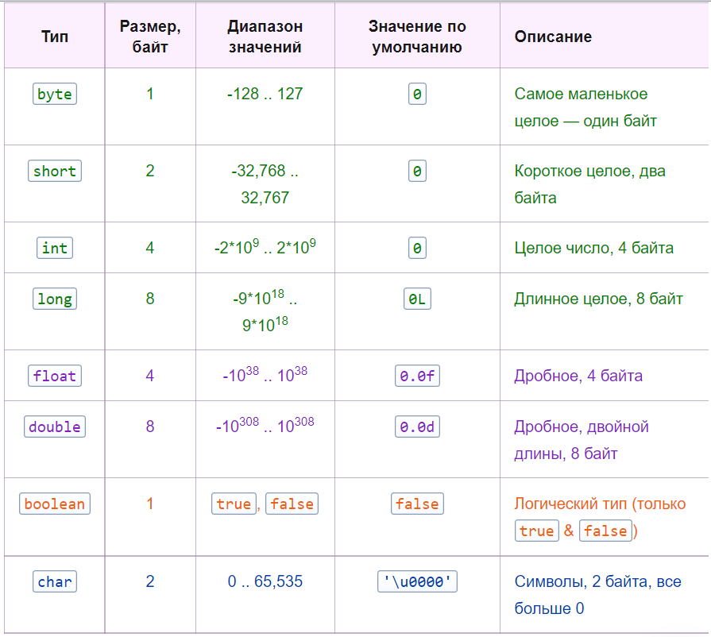

# Занятие №2 15.10.2024

> *Как я говорил ранее, на нашей дисциплине не будет ограничений в выборе средств решения лабораторных работ.
Но дисциплину я буду объяснять, используя ЯП Java. Поэтому, уделим немного времени азам.*

# Основы ЯП Java 

### Что такое Java?
***Java*** — строго типизированный объектно-ориентированный язык программирования общего назначения.

Традиционный ```Hello world!!!``` на Java.
```java
public class Main {
    public static void main(String[] args) {
        System.out.println("Hello world!");
    }
}
```

### Типы данных
> На сайте Oracle различные темы представлены как "пути" или Trail. 
> Так, путь знакомства с Java называется "[Trail: Learning the Java Language: Table of Contents](https://docs.oracle.com/javase/tutorial/java/TOC.html)". 
> И основы языка (т.е. Language Basics) начинаются с Variables.

Типы данных в Java бывают ***двух типов***:

 - примитивные;
 - ссылочные (объекты);

В Java существует два основных типа данных: примитивные и объектные, они же ссылочные. 
Примитивные типы в Java встроены в сам язык и служат базовыми строительными блоками для хранения простых значений. 
Объектные типы данных создаются программистом и представляют собой более сложные структуры, которые включают в себя объекты.

#### Примитивы



Пример инициализации примитивной переменной.
```java
public class Main {
    public static void main(String[] args) {
        int x = 1;
    }
}
```

#### Ссылочные

По сути - это все кроме примитивов...

Самый популярный тип ссылочной переменной - это строка. 
Переменные типа строка являются объектами класса String.

**Класс** - Класс в объектно-ориентированном программировании (ООП) — это шаблон кода, по которому создаётся какой-то объект.
**Объект** - это экземпляр класса.

> ***Класс != объект***

Пример создания объекта.
```java
public class Main {
    public static void main(String[] args) {
        Person person = new Person("Роман", "Орлов");
    }
}
```

Подробнее об ООП в соответствующем разделе.

### Базовые конструкции

#### Методы

```java
//1. Методы / функции и т.д.
    //Шаблон создания метода
    /*
    * <модификатор доступа (public)> <static (разберем в ООП)> <возвращаемое значение> <название> (<тип аргумента> <локальное название>) {
    *     какой-то код;
    * }
    * */
    public static void simpleMethod(int x, int y) {
        //Код внизу позволяет вывести что-нибудь в консоль
        //Почему именно такая запись, а не просто print() разберем на теме ввода/вывода.
        System.out.println(x);
        System.out.println(y);
    }
```

#### Арифметические операции

```java
    public static void arithmetic() {
        Random random = new Random();

        int x = random.nextInt(10);
        int y = random.nextInt(10);

        System.out.println("x = " + x);
        System.out.println("y = " + y);

        System.out.println(x + y);
        System.out.println(x - y);
        System.out.println(x * y);
        System.out.println(x / y);
        //Операция получения остатка от деления. Пример: 10 % 3 = 1, 4 % 2 = 0
        //С ее помощью легко определять четность числа
        System.out.println(x % y);

        //Для возведения в степень, тригонометрических операций, и собственно всего, что сложнее вышеописанного.
        //Придется воспользоваться объектом Math.
        //Пример - возводим 3 во 2-ую степень
        System.out.println(Math.pow(3, 2));
    }
```

#### Операции сравнения

```java
    public static void compareConstructs() {
        Random random = new Random();

        int x = random.nextInt();
        int y = random.nextInt();

        System.out.println("x = " + x);
        System.out.println("y = " + y);

        //Base
        System.out.println(x == y);
        System.out.println(x > y);
        System.out.println(x >= y);
        System.out.println(x < y);
        System.out.println(x <= y);

        //Вышеописанные операторы сравнения не подходят для сравнения объектов
        //Сравнение объектов разберем подробнее попозже
    }
```

#### Условные конструкции

```java
    public static void conditionalConstructions() {
        Random random = new Random();
        Scanner scanner = new Scanner(System.in);

        int x = random.nextInt();
        int y = random.nextInt();
        String string = scanner.next();

        if (x > y) {
            System.out.println("x more than y");
        } else if (x < y) {
            System.out.println("y more than x");
        } else {
            System.out.println("x equals y");
        }

        switch (string) {
            case "example1" -> {
                System.out.println("input -> example1");
            }
            case "example2" -> {
                System.out.println("input -> example2");
            }
            default -> {
                System.out.println("input -> unknown");
            }
        }
    }
```

#### Циклы

```java
    public static void loopConstructions() {
        Scanner scanner = new Scanner(System.in);
        
        //Инициализация массива
        //<тип данных>[] <название> = new <тип данных>[<размер массива>];
        int[] arr = new int[10];
        int[][] multiplyArr = new int[10][10];
        int[] presetArr = {1, 2, 3, 4, 5, 6};

        //обычный цикл
        //for (<тип счетчика> <название> = <значение>; <счетчик> <условие> <сравниваемая переменная>; <операция над счетчиком>) {
        //     какой-то код;
        // }
        for (int i = 0; i < arr.length; i++) {
            arr[i] = scanner.nextInt();
            System.out.println("arr №" + (i + 1) + " = " + arr[i]);
        }

        //for each
        //for (<тип элемента массива> <название переменной, отражающей элемент массива> : <массив>) {
        //     какой-то код;
        // }
        for (int element : arr) {
            System.out.println(element);
        }

        int counter = 0;

        // пока выполняется условие - делай
        // while(<какое-то условие>) {
        //     какой-то код;
        // }
        while (counter < arr.length) {
            counter++;
            System.out.println("counter = " + counter);
        }

        counter = 0;

        // делай - пока выполняется условие
        // do {
        //     какой-то код;
        // } while(<какое-то условие>)
        do {
            counter++;
            System.out.println("counter = " + counter);
        } while (counter < arr.length);
    }
```
___
# Задание

- Зарегистрироваться на сайте https://acmp.ru/index.asp?main=tasks
- Отсортировать задачи по сложности, по возрастанию.
- Решить 5 - 10 задач, сложностью от 1% до 10%.
- Загрузить решения в свой личный репозиторий (github), скинуть мне в личку ссылку (если репозиторий приватный, то не забудьте меня в него пригласить).

___
### Полезные ссылки по теме

 - https://javarush.com/quests/lectures/questsyntaxpro.level20.lecture00 - установка java и небольшой разбор, что там под капотом.  
 - https://javarush.com/quests/lectures/questsyntaxpro.level20.lecture01 - установка и немного о средах разработки.
 - https://www.baeldung.com/java-compiled-interpreted - более подробно о том, что там под капотом.
 - https://youtu.be/zZBiln_2FhM?si=w44DKTgxLEFhV7tG - ссылка с туториалом по гиту.