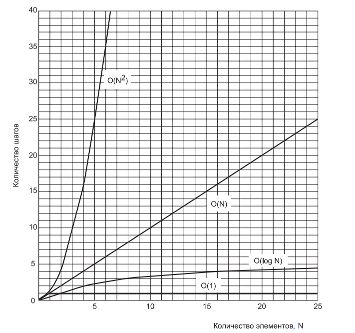

# Занятие №4 29.10.2024
##  Линейный и бинарный поиск. Big O Notation.

Когда вы начнете работать с хоть сколько-нибудь значительным объемом данных, то вы начнете на постоянной основе заниматься их сортировкой.
Имена придется сортировать по алфавиту, данные о продажах - по ценам и т.д.

Также сортировка данных может стать подготовительным этапом перед поиском. Перед тем как разбирать методы сортировки,
давайте рассмотрим самую очевидную ситуацию, которая покажет насколько важной может быть сортировка данных 
и коротко поговорим о методологии расчета сложности алгоритмов.

Сделаем небольшую доработку в массив, запретим вставлять дубликаты. Данная доработка позволит более прозрачно рассмотреть операцию и ускорить операцию поиска,
но несколько усложнит вставку значений (т.к. во время вставки придется проверять уникальность элемента).

Обновленная операция вставки...
```java
@Override
public boolean insert(long value) {
    for (int i = 0; i < nElems; i++) {
        if (array[i] == value) {
            return false;
        }
    }
    
    array[nElems] = value;
    nElems++;
    return true;
}
```

Теперь, давайте представим себе массив в котором все значения упорядоченны по возрастанию ключевых значений. 
Такие массивы называются ***упорядоченными***. При вставке элемента в такие массивы необходимо найти подходящее место для нового элемента массива.

Операция вставки в упорядоченном массиве...
```java
@Override
public boolean insert(long value) {
    if (this.contains(value)) {
        return false;
    }

    int i;
    for (i = 0; i < nElems; i++) {
        if (array[i] > value) {
            break;
        }
    }

    for (int j = nElems; j > i; j--) {
        array[j] = array[j - 1];
    }

    array[i] = value;
    nElems++;
    return true;
}
```

Для чего же хранить упорядоченные данные. Одно из преимуществ такого подхода - существенное ускорение операции поиска за счет применения ***двоичного поиска***.

Сравним количество операций сравнения необходимых для поиска значения в упорядоченном и неупорядоченном массиве.

#### Неупорядоченный массив - линейный поиск

В неупорядоченном массиве, выполняя поиск, мы буквально надеемся на удачу. Если нам повезет, мы выполним поиск элемента за одну операцию, если нет, то за N - кол-во элементов в массиве.

#### Упорядоченный массив - двоичный поиск

Принцип двоичного поиска в упорядоченном массиве данных заключается в постоянном делении массива данных на два и сравнении искомого элемента, со средним значением в выбранной области.
Рассмотрим на примере, допустим, что мы ищем число 33 в упорядоченном массиве, диапазон значений которого от 1 до 100.

| Попытка       | Предположение | Результат сравнения | Диапазон возможных значений |
|---------------|---------------|---------------------|-----------------------------|
| 0             |               |                     | 1-100                       |
| 1             | 50            | Меньше              | 1-49                        |
| 2             | 25            | Больше              | 26-49                       |
| 3             | 37            | Меньше              | 26-36                       |
| 4             | 31            | Больше              | 32-36                       |
| 5             | 34            | Меньше              | 32-33                       |
| 6             | 32            | Больше              | 33-33                       |
| 7             | 33            | Верно               |                             |


Реализация метода поиска в упорядоченном массиве с помощью двоичного поиска...
```java
@Override
public boolean contains(long searchValue) {
    int operationsNumber = 0;
    int lowerBound = 0;
    int upperBound = nElems - 1;
    int currentIndex;

    while (true) {
        System.out.println("Количество операций в упорядоченном массиве: " + ++operationsNumber);
        currentIndex = (lowerBound + upperBound) / 2;
        long currentElement = array[currentIndex];
        if (currentElement == searchValue) {
            return true;
        } else if (lowerBound > upperBound) {
            return false;
        } else {
            if (currentElement < searchValue) {
                lowerBound = currentIndex + 1;
            } else {
                upperBound = currentIndex - 1;
            }
        }
    }
}
```

#### Итог

В итоге, вышеописанный эксперимент доказывает, что поиск в упорядоченном массиве в большинстве случаев выполняется значительно быстрее.
Также, данный поиск можно использовать для вставки или удаления конкретного значения, так как эти операции связаны с поиском элемента,
а операция нахождения максимального и минимального значения и вовсе выполняются за константное время, т.к. мы просто должны обратиться к элементу массива по индексу.

### Big O Notation / O - синтаксис

Для определения сложности алгоритмов в программировании принято использовать систему условных значений под названием O - синтаксис.
Казалось бы, всегда можно сравнить алгоритмы "в лоб" как мы сделали это выше, но в реальном мире все не так просто 
и значения эффективности алгоритмов могут сильно коррелировать с количеством элементов.

Таким образом, критерий сравнения (сложность алгоритма) должен связывать скорость алгоритма с количеством обрабатываемых элементов.
Рассмотрим на примерах.

#### Вставка в неупорядоченный массив
На данный момент, вставка в неупорядоченный массив является единственным реализованным нами методом, который не зависит от количества элементов в массиве.
Новый элемент всегда размещается в следующей свободной ячейке. Вставка всегда выполняется с постоянной скоростью. 
Можно сказать, что время вставки элемента в неупорядоченный массив T является константой K: ```T = K```.

#### Линейный поиск

Мы уже видели, что при линейном поиске элементов в массиве количество сравнений для поиска заданного значения в среднем составляет половину от общего
количества элементов. Таким образом, если N — общее количество элементов, то время поиска T пропорционально половине N: ```T = K * N/2```.
Переменная ```K``` учитывает в себе множество факторов, поэтому, для удобства, внесем константу ```2``` в значение этой переменной.
Формула примет вид: ```T = K * N```
Таким образом, среднее время линейного поиска пропорционально размеру массива. Если увеличить размер массива вдвое, то поиск займет вдвое
больше времени.

#### Двоичный поиск

Аналогичным образом построим формулу, связывающую ```T``` с ```N``` для двоичного поиска: ```T = K × log2(N)```.
Аналогично прошлому примеру внесем константу в переменную ```K```, формула примет вид: ```T = K × log(N)```

#### О - синтаксис

«O-синтаксис» почти не отличается от приведенных формул, если не считать того, что в нем не используется константа ```K```. 
При сравнении алгоритмов особенности конкретного микропроцессора или компилятора несущественны; важна только закономерность изменения ```T``` для разных значений ```N```, а не конкретные числа.
А это значит, что постоянный коэффициент не нужен.

В «O-синтаксисе» используется прописная буква «O»; считайте, что он обозначает «порядок» (Order of). 
В «O-синтаксисе» линейный поиск выполняется за время ```O(N)```, а двоичный поиск — за время ```O(log N)```. 
Вставка в неупорядоченный массив выполняется за время ```O(1)```, то есть за постоянное время (обозначаемое константой 1).

| Алгоритм                           | Время выполнения в O-синтаксисе |
|------------------------------------|---------------------------------|
| Линейный поиск                     | O(N)                            |
| Двоичный поиск                     | O(log N)                        |
| Вставка в неупорядоченном массиве  | O(1)                            |
| Вставка в упорядоченном массиве    | O(N)                            |
| Удаление в неупорядоченном массиве | O(N)                            |
| Удаление в упорядоченном массиве   | O(N)                            |

О - синтаксис носит исключительно оценочный характер и не дает конкретных цифр. 
Это самый информативный и универсальный способ сравнить алгоритмы (не считая замера времени).



На основе графика зависимости количества шагов от количества элементов, можем сделать несколько выводов об алгоритмах с соответствующей сложностью:
- ```O(1)``` - отличный алгоритм;
- ```O(log(N))``` - хороший алгоритм;
- ```O(N)``` - неплохой алгоритм;
- ```O(N^2)``` - плохой алгоритм;
___
## Задание

В качестве заготовки можете использовать классы из пакета ```examples```.
Вам необходимо ***оптимизировать*** операции:
- поиска минимального / максимального значения (целевая сложность ```O(1)```);
- вставки (целевая сложность ```O(log(N))```);
- удаления (целевая сложность ```O(log(N))```);
в упорядоченном массиве.

Как это сделать? На занятии по ООП мы с вами рассматривали такое понятие как перегрузка и переопределение. 
Для выполнения задания вам понадобится ***переопределение***. Давайте вспомним, что это такое.
***Переопределение*** - это возможность заменить реализацию метода из базового класса (или интерфейса), который уже определён в производном классе, 
с тем же именем, списком аргументов и типом возвращаемого значения.
Переопределенные методы в Java зачастую помечаются аннотацией ```@Override```.
___
## Полезные ссылки

- https://stepik.org/lesson/13230/step/1?unit=3416 - в целом, курс сложноватый, мы с вами пройдем все в более понятном формате, 
но если хотите углубить понимание О - синтаксиса, то советую пройти этот юнит.
- https://habr.com/ru/companies/otus/articles/347900/ - для углублений знаний по переопределению и перегрузке.