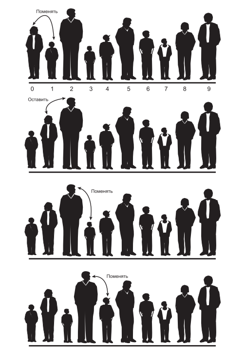
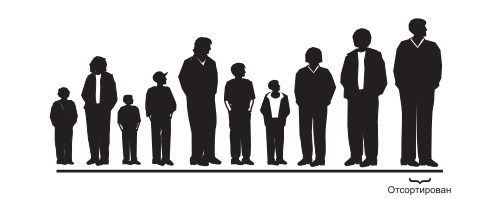
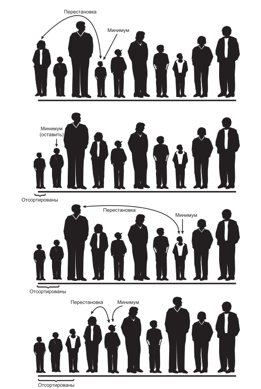
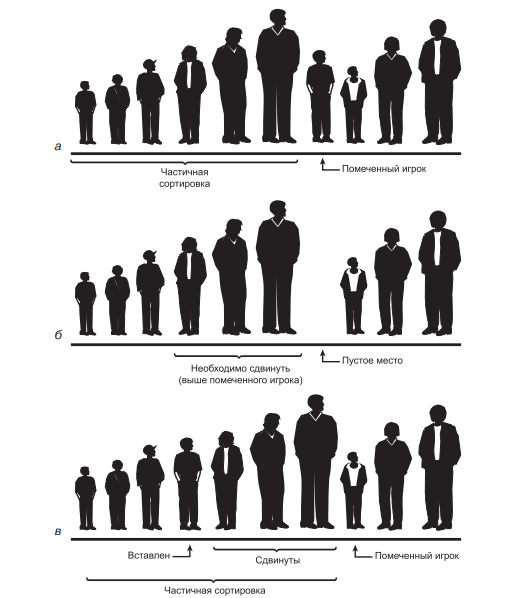

# Занятие №5 09.11.2024
##  Сравнение объектов. Простая сортировка.

Во всех примерах, приводившихся ранее, мы работали с массивом примитивных данных типа ```long```.
Хранение примитивных типов упрощает примеры, но оно не характерно для использования реальных структур данных. 
Обычно хранимые элементы данных (записи) состоят из многих полей. 
Скажем, в записи работника может храниться фамилия, имя, возраст, номер социального страхования и т. д. 
В каталоге коллекции марок хранится название страны, выпустившей марку, номер по каталогу, состояние, текущая стоимость и т. д

### Сравнения объектов.

Давайте разберем основные операции, которые позволяли нам реализовывать методы наших массивов,
и сравним их реализацию с примитивными и ссылочными (объектными) данными.

В качестве хранилища с примитивными данными мы будем использовать наш массив целых чисел типа long из прошлых занятий.
В качестве хранилища с объектами мы будем использовать массив объектов класса ```Person```:

```java
public class Person {
    private String firstName;
    private String lastName;
    private String passportSeriesNumber;
    private byte age;
    
    // Конструкторы & аксессоры
}
```
> *В рамках данного занятия мы будем работать с той условностью, что наши массивы принимают только уникальные значения.*

#### Тождество

Для того чтобы добавить новый элемент в массив с примитивными данных мы проходились в цикле по всем элементам 
и проверяли их равенство с помощью оператора ```==```, на этой логике был реализован метод ```contains```...

```java
 public boolean contains(long searchValue) {
    for (int i = 0; i < nElems; i++) {
        if (array[i] == searchValue) {
            return true;
        }
    }

    return false;
}
```

Особенностью примитивных типов является то, что они хранятся в памяти в качестве значений, тогда как объекты хранятся в качестве ссылок на ячейки памяти, где хранятся данные об объекте.
Не будем углубляться в устройство памяти в ```Java```. Вышесказанное было нужно лишь для того, чтобы понять, что следующий код ***будет сравнивать не значения переменных, а их ссылки***...

```java
import lesson5.examples.compare.Person;

public class Main {
    public static void main(String[] args) {
        lesson5.examples.compare.Person person1 = new lesson5.examples.compare.Person("Roman", "Orlov", "1234123456", 26);
        Person person2 = new Person("Roman", "Orlov", "1234123456", 26);

        System.out.println(person1 == person2); // false
    }
}
```

Казалось бы, значения переменных должны быть одинаковыми, так и есть, но объекты записаны в разные ячейки памяти и оператор ```==``` сравнивает лишь ссылки.
Например, следующий код отработает корректно т.к. ```person2``` будет присвоена ссылка на ```person1```...

```java
import lesson5.examples.compare.Person;

public class Main {
    public static void main(String[] args) {
        Person person1 = new Person("Roman", "Orlov", "1234123456", 26);
        Person person2 = person1;

        System.out.println(person1 == person2); // true
    }
}
```

Итак, как же в таком случае нужно проверять тождество двух объектов. 
В этом нам помогут два метода класса ```Object``` - ```equals``` & ```hashCode```.

> Все классы в ```Java``` неявно (на уровне компиляции) наследуются от класса ```Object```, поэтому в каждом вашем классе могут быть переопределены некоторые методы
> такие, как ```equals```, ```hashCode```, ```toString``` и другие, тем не менее они уже имеют свою собственную реализацию.

Рассмотрим реализацию вышеупомянутых методов...

```java
import java.util.Objects;

public class Person {
    private String firstName;
    private String lastName;
    private String passportSeriesNumber;
    private byte age;

    // Конструкторы & аксессоры

    @Override
    public boolean equals(Object o) {
        if (this == o) return true;
        if (o == null || getClass() != o.getClass()) return false;
        Person person = (Person) o;
        return age == person.age && Objects.equals(firstName, person.firstName) && Objects.equals(lastName, person.lastName) && Objects.equals(passportSeriesNumber, person.passportSeriesNumber);
    }

    @Override
    public int hashCode() {
        return Objects.hash(firstName, lastName, passportSeriesNumber, age);
    }
}
```

Вместе, эти два метода образуют так называемый контракт Equals & HashCode, методы **должны(!)** переопределяться парой.
Зачем? Т.к. сперва производится сравнение по хешу, чтобы понять, совпадают ли объекты, а только после подключается equals, 
чтобы определить, совпадают ли значения полей объекта.

Каждый из этой пары методов обязан соблюдать свой контракт, если коротко, то:
##### equals:
 - Рефлексивность — ```x.equals(x)``` возвращает ```true```.
 - Симметричность — ```x.equals(y) <=> y.equals(x)```.
 - Транзитивность — ```x.equals(y) <=> y.equals(z) <=> x.equals(z)```.
 - Согласованность — повторный вызов ```x.equals(y)``` должен возвращать значение предыдущего вызова, если сравниваемые поля не изменялись.
 - Сравнение null — ```x.equals(null)``` возвращает ```false```.
##### hashCode:
 - Повторный вызов ```hashCode``` для одного и того же объекта должен возвращать одинаковые хеш-значения, если поля объекта, участвующие в вычислении значения, не менялись.
 - Если ```equals()``` для двух объектов возвращает ```true```, ```hashCode()``` также должен возвращать для них одно и то же число.
 - При этом неравные между собой объекты могут иметь одинаковый ```hashCode```.

Таким образом, переопределив методы ```equals``` и ```hashCode```, реализация метода ```contains``` нашего массива с объектами примет следующий вид...

```java
public boolean contains(Person searchPerson) {
    for (int i = 0; i < nElems; i++) {
        if (array[i].hashCode() == searchPerson.hashCode() && array[i].equals(searchPerson)) {
            return true;
        }
    }
    
    return false;
}
```

___
#### Сравнение

По аналогии с операцией тождественности, операторы которые подходили нам для сравнения переменных примитивных типов не подойдут для сравнения объектов.
Причина тут гораздо более очевидная нежели при определении равенства.
Если допустить использование стандартных операторов сравнения в случае объектов, то какую часть / поле / совокупность полей мы должны сравнивать? Получается какая-то неразбериха и парадокс.

Потому, для сравнения двух объектов в Java существуют два интерфейса ```Comparable``` и ```Comparator```.
Для того чтобы понять в каком случае какой интерфейс лучше использовать введем два понятия ***натуральный и ненатуральный порядок***.
Натуральный порядок - это про наиболее частые сравнения, например в школьном журнале это может быть сортировка по алфавиту учеников,
ненатуральный порядок это про более частные сравнения, которые необходимо использовать в частных случаях.

##### Натуральный порядок

Начнем разбор с натурального порядка. Представим, что наш массив объектов класса Person будет очень часто сортировать этих Person по возрасту.
В таком случае наш естественный порядок - это сортировка по возрасту. Для реализации этого порядка мы используем интерфейс ```Comparable```.
Т.к. ```Comparable``` это интерфейс, его необходимо реализовать, класс принимает следующий вид...

```java
public class Person implements Comparable<Person> {
    private String firstName;
    private String lastName;
    private String passportSeriesNumber;
    private byte age;

    // Конструкторы & аксессоры

    @Override
    public boolean equals(Object o) {
        if (this == o) return true;
        if (o == null || getClass() != o.getClass()) return false;
        Person person = (Person) o;
        return age == person.age && Objects.equals(firstName, person.firstName) && Objects.equals(lastName, person.lastName) && Objects.equals(passportSeriesNumber, person.passportSeriesNumber);
    }

    @Override
    public int hashCode() {
        return Objects.hash(firstName, lastName, passportSeriesNumber, age);
    }

    @Override
    public int compareTo(Person o) {
        return this.age - o.age;
    }
}
```

Интерфейс ```Comparable``` имеет один метод ```compareTo``` который возвращает целое число.

Дело в том, что сравнение двух объектов дает нам 3 возможных варианта:

- ```а < b```
- ```a > b```
- ```a == b```.

У ```boolean``` же есть всего 2 значения — true и false, что неудобно для сравнения объектов.

С ```int``` все намного проще. Если возвращаемое значение ```> 0```, значит ```a > b```, 
если результат ```compareTo < 0```, значит ```а < b```, 
а если результат ```== 0```, значит два объекта равны: ```a == b```.

Реализовав в нашем классе интерфейс ```Comparable``` и понимая, что в этом интерфейсе мы реализуем натуральный порядок сортировки, 
мы можем смело реализовывать методы ```getMax``` и ```getMin``` с той лишь поправкой, что с мы будем искать самого младшего и самого старшего человека в нашем массиве...

```java
public Person getOldest() {
    Person theOldestPerson = array[0];

    for (int i = 0; i < nElems; i++) {
        if (array[i].compareTo(theOldestPerson) > 0) {
            theOldestPerson = array[i];
        }
    }

    return theOldestPerson;
}
```

```java
public Person getYoungest() {
    Person theYoungestPerson = array[0];

    for (int i = 0; i < nElems; i++) {
        if (array[i].compareTo(theYoungestPerson) < 0) {
            theYoungestPerson = array[i];
        }
    }

    return theYoungestPerson;
}
```

##### Ненатуральный порядок

Ненатуральный порядок напротив, позволяет реализовывать более частные операции сравнения.
Для частных сравнений нужны частные классы реализующие интерфейс ```Comparator```.
Интерфейс ```Comparator``` имеет единственный метод ```compare(Object o1, Object o2)```.

Представим, что мы очень редко, но сортируем людей их нашего списка по алфавиту.
В таком случае, данная сортировка является так называемым ненатуральным порядком.
Для того чтобы зафиксировать правила такой сортировки, мы создаем класс и реализуем интерфейс ```Comparator```.
Выглядит это примерно вот так...

```java
import java.util.Comparator;

public class AlphabetOrder implements Comparator<Person> {
    @Override
    public int compare(Person o1, Person o2) {
        return o1.getLastName().compareTo(o2.getLastName());
    }
}
```

Реализация довольно простая, думаю все понятно без слов, интерфейс очень похож на ```Comparable```, отличается лишь сфера применения.

##### Итог

Подытожить я бы хотел областями применения данных интерфейсов и методов. При работе над боевыми проектами вы само собой не будете реализовывать классы коллекций вручную.
Вы будете пользоваться уже готовыми классами, интерфейсами и т.д. Готовые решения будут предоставлять вам обертки, в том числе и для сортировки.
Сигнатуры методов сортировки зачастую будут иметь вариации без аргументов и с аргументами из объектов реализующих интерфейс ```Comparator```,
как вы можете догадаться, при отсутствии аргументов будет использоваться метод ```compareTo(Object o)``` класса, в противном случае необходимо передать наш "сравнитель" для ненатурального порядка.
___
### Простая сортировка

Когда в вашей базе данных накопится сколько-нибудь значительный объем данных, неизбежно возникнет необходимость в их сортировке. 
Имена потребуется отсортировать по алфавиту, студентов — по среднему баллу, клиентов — по регионам, данные о продажах — по ценам, города — по населению, страны — по ВВП и т. д.
Сортировка данных также может стать необходимым подготовительным шагом перед поиском. 
Как было показано в главе 2, «Массивы», двоичный поиск, применимый только к упорядоченным данным, выполняется намного быстрее линейного поиска.
Так как сортировка играет важную роль при работе с данными и при этом может быть весьма затратной по времени операцией, на эту тему велись обширные исследования в области информатики. 
Были разработаны некоторые весьма изощренные методы сортировки. 

Для начала, мы рассмотрим три простейших алгоритма: пузырьковую сортировку, сортировку методом выбора и сортировку методом вставки.
Эти тривиальные методы работают относительно медленно и все же их стоит изучить. 
Они не только проще для понимания, но и лучше подходят в некоторых обстоятельствах. 
Например, сортировка методом вставки превосходит быструю сортировку для небольших и почти отсортированных файлов.
Собственно, сортировка методом вставки часто используется как составная часть реализации быстрой сортировки.

#### Вводные данные

Для разбора методов сортировки "на пальцах", мы будем сортировать условную команду игроков которых надо построить по росту.

Было:


Стало:


> Человеку проще, чем компьютерной программе — вы видите всех игроков сразу и можете немедленно отобрать самого высокого.
> Вам не нужно тщательно измерять и сравнивать всех по очереди.
> 
> Программа в отличие от нас не «видит» данные. 
> Она может сравнивать только двух игроков, потому что операторы сравнения работают именно по такому принципу. 
> «Близорукость» некоторых алгоритмов постоянно приходится учитывать при анализе.

Все три алгоритма, представленные в этой главе, состоят из двух шагов, которые повторяются снова и снова, пока данные не будут отсортированы:
1. Сравнить два элемента.
2. Поменять элементы местами или скопировать один из них.

#### Пузырьковая сортировка

Пузырьковая сортировка известна своей низкой скоростью, однако на концептуальном уровне — это простейший алгоритм сортировки, 
и поэтому мы начнем изучение алгоритмов сортировки именно с него.

##### Алгоритм

Алгоритм пузырьковой сортировки работает так: вы подходите к левому краю шеренги (позиция 0) и сравниваете двух игроков в позициях 0 и 1. 
Если левый игрок (позиция 0) выше, вы меняете их местами. 
Если выше правый игрок, они остаются на своих местах. 
Затем вы переходите на одну позицию вправо и сравниваете игроков в позициях 1 и 2. 
И снова, если левый игрок выше, вы меняете их местами.

Сортировка выполняется по следующим правилам:
1. Сравнить двух игроков.
2. Если левый игрок выше, поменять их местами.
3. Перейти на одну позицию вправо.
4. После того как первый отсортированный элемент окажется на своем месте, вернуться к началу массива.

Каждую новую итерацию мы будем совершать на 1 сравнение меньше, т.к. самый большой элемент уже находится на своей позиции.

##### Пример


# ...


##### Программная реализация

```java
public void bubbleSort() {
    for (int out = nElems - 1; out > 1; out--) { // Внешний цикл (обратный)
        for (int in = 0; in < out; in++) {  // Внутренний цикл (прямой)
            if (array[in] > array[in + 1]) { // Порядок нарушен?
                swap(in, in + 1); // Поменять местами
            }
        }
    }
}
```

##### Сложность алгоритма

В общем виде, если массив состоит из ```N``` элементов, на первом проходе выполняются ```N–1``` сравнений, на втором — ```N–2``` и т. д. 
Сумма такого ряда вычисляется по формуле:
```(N–1) + (N–2) + (N–3) + ... + 1 = N × (N–1)/2.```
Если N = 10, то сумма равна 45 (10 × 9/2).
Таким образом, алгоритм выполняет около ```N * N / 2``` сравнений (на ```–1``` можно не обращать внимания, особенно при больших ```N```).

На прошлом занятии, во время разбора O - синтаксиса, мы договорились, что будем игнорировать константы, таким образом получается, что сложность пузырьковой сортировки ```O(N^2)```.

#### Сортировка методом выбора

Алгоритм сортировки методом выбора превосходит пузырьковую сортировку по характеристикам — количество необходимых перестановок сокращается с ```O(N^2)``` до ```O(N)```. 
К сожалению, количество сравнений остается равным ```O(N^2)```. 
Все же сортировка методом выбора обладает значительными преимуществами для больших записей, которые необходимо физически перемещать в памяти, в результате чего время перестановки оказывается намного более важным, чем время сравнения. 
(Это не относится к языку Java, в котором перемещаются ссылки, а не целые объекты.)

##### Алгоритм

При сортировке методом выбора сравнение уже не ограничивается игроками, стоящими рядом друг с другом.
Следовательно, вам понадобится как-то сохранить рост игрока; например, можно записать его в блокноте (во временную переменную).

В сортировке методом выбора вы последовательно перебираете всех игроков и выбираете (отсюда и название) самого низкорослого из них. 
Этот игрок меняется местами с тем, который стоит в крайней левой позиции (0). 
Левый игрок отсортирован, и в дальнейшем уже перемещаться не будет. 
Обратите внимание: в этом алгоритме отсортированные игроки собираются слева (нижние индексы), тогда как при пузырьковой сортировке они собираются справа.
Следующий проход начинается с позиции 1, а обнаруженный минимальный элемент меняется местами с элементом в позиции 1. 
Процесс продолжается до тех пор, пока не будут отсортированы все игроки.

##### Пример



##### Программная реализация

```java
public void selectionSort() {
    for (int out = 0; out < nElems - 1; out++) { // Внешний цикл 
        int min = out; // Минимум
        for (int in = out + 1; in < nElems; in++) { // Внутренний цикл
            if (array[in] < array[min]) { // Если значение min больше,
                min = in; // значит, найден новый минимум
            }
        }
        swap(out, min); // Поменять их местами
    }
}
```

##### Сложность

Сортировка методом выбора выполняет такое же количество сравнений, что и пузырьковая сортировка: ```N × (N–1) / 2```. 
Для каждых 10 элементов данных выполняются 45 сравнений, однако количество перестановок уменьшается. 
Для больших значений ```N``` время сравнения является определяющим фактором, поэтому мы можем сказать, что сортировка методом выбора выполняется за время ```O(N^2)```, как и пузырьковая сортировка. 
Тем не менее совершенно очевидно, что сортировка методом выбора выполняется быстрее из-за меньшего количества перестановок. 
Для меньших значений N сортировка методом выбора может работать заметно быстрее, особенно если перестановка выполняется намного медленнее сравнения.

#### Сортировка методом вставки

В большинстве случаев сортировка методом вставки является лучшим из элементарных алгоритмов сортировки, описанных в этой главе. 
Она также выполняется за время ```O(N^2)```, но работает примерно вдвое быстрее пузырьковой сортировки, а в обычных ситуациях немного быстрее сортировки методом выбора. 
Кроме того, сортировка методом вставки не слишком сложна, хотя ее алгоритм немного сложнее двух других. 
Она часто используется на завершающей стадии более сложных алгоритмов, например быстрой сортировки.

##### Алгоритм

Сортировку методом вставки легче описывать с середины процесса, когда множество наполовину отсортировано.

На этой стадии где-то в середине шеренги устанавливается воображаемый маркер.
(Допустим, вы положили красную футболку на землю перед игроком.) 
Игроки слева от маркера частично отсортированы; это означает, что каждый из них выше своего соседа слева. 
Однако это вовсе не означает, что игроки занимают свои итоговые позиции, потому что они, возможно, будут перемещены в результате вставки других, еще не отсортированных игроков.

>Обратите внимание: ситуация частичной сортировки не возникает в ходе пузырьковой сортировки и сортировки методом выбора. 
>В этих алгоритмах подгруппа элементов данных полностью упорядочена в любой конкретный момент времени; в сортировке методом вставки подгруппа элементов упорядочена только частично.

Игрок, рядом с которым лежит маркер, и все игроки справа от него еще не отсортированы.
Здесь мы собираемся вставить помеченного игрока в подходящее место (частично) отсортированной подгруппы. 
Однако для этого необходимо сдвинуть некоторых игроков подгруппы вправо, чтобы освободить место для вставки. 
Для этого помеченный игрок выводится из шеренги (в программе соответствующий элемент данных сохраняется во временной переменной).
Теперь отсортированные игроки сдвигаются, чтобы освободить место в частично отсортированной подгруппе. 
Самый высокий игрок переходит на место помеченного игрока, следующий по росту — на место самого высокого и т. д.

Когда следует остановить перемещение? 
Представьте, что вы и помеченный игрок двигаетесь влево по шеренге. 
В каждой позиции игрок перемещается вправо, но вы также сравниваете помеченного игрока с текущим. 
Процесс перемещения останавливается тогда, когда будет перемещен последний игрок, рост которого превышает рост помеченного игрока. 
Последнее перемещение открывает свободное место для помеченного игрока, который после вставки окажется в правильном порядке частичной сортировки.

##### Пример



##### Программная реализация

```java
public void insertionSort() {
    for (int out = 1; out < nElems; out++) { // out - разделительный маркер
        long temp = array[out]; // Скопировать помеченный элемент
        int in = out; // Начать перемещения с out
        while(in > 0 && array[in - 1] >= temp) { // Пока не найден меньший элемент
            array[in] = array[in - 1]; // Сдвинуть элемент вправо
            --in; // Перейти на одну позицию влево
        }
        array[in] = temp; // Вставить помеченный элемент
    }
}
```

##### Сложность

Сколько операций сравнения и копирования требует этот алгоритм? 
При первом проходе сравнивается не более одного элемента, на втором — не более двух и так далее, вплоть до ```N–1``` сравнений на последнем проходе. 
В сумме получается: ```1 + 2 + 3 + … + N–1 = N × (N–1) / 2```.

Тем не менее поскольку при каждом проходе в среднем фактически сравнивается только половина от максимального количества элементов 
(прежде чем будет найдена точка вставки), сумму можно уменьшить вдвое; получается: ```N × (N–1) / 4```.
Количество операций копирования приблизительно совпадает с количеством сравнений. 
Однако копирование занимает меньше времени, чем перестановка, так что для случайных данных этот алгоритм работает вдвое быстрее пузырьковой сортировки и быстрее сортировки методом выбора. 

Как бы то ни было, как и во всех остальных методах сортировки этой главы, для случайных данных сортировка
методом вставки выполняется за время порядка ```O(N^2)```.

Для данных, уже прошедших предварительную сортировку, этот алгоритм работает гораздо эффективнее. 
Если данные упорядочены, то условие цикла while никогда не бывает истинным; следовательно, оно вырождается в простую команду во внешним цикле, выполняемую ```N–1``` раз. 
В этом случае алгоритм выполняется за время ```O(N)```. 
Если данные почти отсортированы, то сортировка методом вставки выполняется почти за время ```O(N)```, а следовательно, является простым и эффективным способом упорядочения файлов данных с небольшими отклонениями в порядке сортировки.

Но если данные изначально отсортированы в обратном порядке, алгоритму придется выполнить все возможные сравнения и перемещения, и тогда вставка методом сортировки выполняется не быстрее пузырьковой сортировки.

### Итог

На этом занятии мы научились сравнивать объекты и освоили простейшие методы сортировки.
Все эти методы работают за ```O(N^2)```, но есть нюансы.
Перед тем как выполнять задание обязательно скачайте апплеты, запустите и поиграйтесь с сортировками. 
У апплетов интуитивно понятный интерфейс так что с запуском и использованием не должно возникнуть проблем.
___

## Задание

1. В нашем неотсортированном массиве, реализовать три сортировки.
2. Провести сравнение количества операций сравнения и вставки при разных способах сортировки на большом объеме данных (10000 значений). 
Подготовить отчет в произвольной форме.
___
## Полезные ссылки

- https://habr.com/ru/articles/523990/ - неплохая статья про интерфейсы ```Comparable``` и ```Comparator```.
- https://javarush.com/groups/posts/2179-metodih-equals--hashcode-praktika-ispoljhzovanija - статья про ```equals``` и ```hashcode``` в java.
- https://habr.com/ru/sandbox/203134/ - гайд по запуску апплетов для демонстрации сортировок.