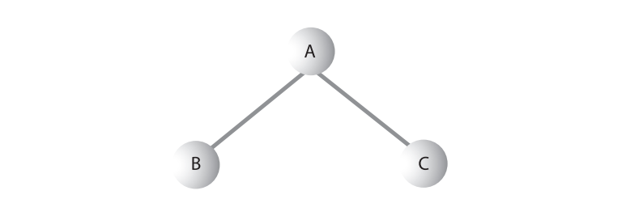

# Занятие №1 18.02.2025
## Правила игры на второй семестр
### Основная информация
- **Количество занятий:** 12 лекций и 8 практических занятий.
- **Форма контроля:** экзамен.
- **Возможность получения автомата:** да, при соблюдении следующих условий:
  - **Все** лабораторные работы сданы (допускается просрочка сдачи не более двух раз).
  - **Не более** 2 пропусков лекций.
  - Превышение лимита пропусков возможно только по уважительной причине с обязательным подтверждением.

#### Организация репозитория с лабораторными
> Осваиваем работу с Git. \
> P.S. Я понимаю, что это напрямую не связано с предметом. 
> Однако, поскольку вы все потенциальные специалисты ИТ-сферы, эти навыки будут вам полезны.

Все лабораторные работы должны быть размещены в одном репозитории.

Репозиторий должен быть организован в виде древовидной структуры.
В корневой директории должен находиться файл-визитка — README.md, содержащий ваше ФИО и номер группы (включая подгруппу).
Каждая лабораторная работа должна располагаться в отдельной папке/директории, название которой соответствует названию лабораторной.
Названия классов должны быть осмысленными и отражать их содержание в соответствии с заданием.

> Если вы испытываете сложности с неймингом, настоятельно рекомендую ознакомиться со второй главой книги "Чистый код" Роберта Мартина.

Лабораторные работы должны добавляться в основную ветку репозитория через pull request.
Что это такое?
Это запрос на объединение изменений из одной ветки в другую.
В рамках такого запроса можно настроить множество параметров, но для нас важно удобство обсуждения кода и утверждения предлагаемых изменений.

> Объясню зачем. \
> Во-первых, это полезная штука. Во всех приличных проектах изменения вносятся через pull request'ы. 
> Это позволяет удобно и наглядно обсуждать изменения, связывая обсуждение непосредственно с кодом.  
> Во-вторых, это упрощает отслеживание прогресса выполнения лабораторных. Нет открытых реквестов — нет долгов.   
> В-третьих, мой тг скажет мне спасибо, так же как и ваш — скажет спасибо вам.

##### Гайд по созданию pull / merge request'a:
1. Выполните лабораторную работу.
2. Создайте новую ветку с названием, соответствующим лабораторной работе.
3. Переключитесь на созданную ветку.
4. Сделайте коммит и отправьте изменения в репозиторий на GitHub.
5. Перейдите в свой репозиторий на GitHub и откройте вкладку **Pull Requests**.
6. Нажмите на кнопку `New pull request`.
7. Выберите ветку, в которую будут вливаться изменения (обычно это основная ветка, например, `main` или `master`), и ветку, из которой берутся изменения (ваша новая ветка).
8. Создайте pull request. По желанию добавьте описание, связанное с выполненной лабораторной работой.


9. Отправьте мне ссылку на pull request в Telegram. Если вы добавите меня в качестве ревьюера, я получу уведомление на почту, и писать в Telegram не обязательно.


После этого мы обсуждаем спорные моменты (если таковые имеются) непосредственно в pull request'е, используя комментарии.

> Не затягивайте с лабораторным, не провоцируйте `merge conflict'ы`, разбирать их крайне неприятно.

---
## Двоичные деревья
### Что такое двоичное дерево?
Прежде чем браться за тему, необходимо разобраться в том, что же называется деревом.
Дерево состоит из узлов, соединенных ребрами. В таком представлении дерева узлы обозначаются кружками, а ребра — линиями, соединяющими кружки.
Деревья как абстрактная математическая категория были достаточно подробно изучены. 
В действительности дерево является частным случаем более общей структуры, называемой графом.


В программах узлы часто представляют сущности: людей, детали машин, забронированные авиабилеты и т. д., то есть типичные элементы, сохраняемые в любых
структурах данных. В ООП-языках, к числу которых относится Java, сущности
реального мира представляются в виде объектов.

Существует несколько разновидностей деревьев.
Но в данный момент нас интересует двоичное дерево.
Особенностью двоичного дерева является то, что каждый узел двоичного
дерева имеет не более двух потомков.


### Для чего нужны двоичные деревья?
Двоичное дерево сочетает в себе преимущества двух структур данных: упорядоченного массива и связного списка. 
Поиск в дереве выполняется так же быстро, как в упорядоченном массиве, а вставка и удаление элементов — так же эффективно, как в связном списке.

Рассмотрим упорядоченный массив, где элементы отсортированы.
Такой массив позволяет быстро находить элементы с помощью двоичного поиска: алгоритм проверяет середину массива и, в зависимости от результата, продолжает поиск в верхней или нижней половине. 
Это обеспечивает время поиска O(log N). 
Кроме того, упорядоченный массив позволяет быстро перебирать элементы в отсортированном порядке.

Однако вставка и удаление элементов в таком массиве требуют значительных затрат времени:
- Для вставки необходимо найти позицию для нового элемента и сдвинуть все большие элементы, чтобы освободить место. В среднем это требует сдвига N/2 элементов.
- Удаление также требует сдвига элементов для заполнения пустого места.

Таким образом, если в вашей задаче часто выполняются операции вставки и удаления, упорядоченный массив будет неэффективным выбором.

С другой стороны, в связных списках операции вставки и удаления выполняются быстро — достаточно изменить несколько ссылок, что занимает время O(1). 
Однако поиск элемента в связном списке неэффективен: алгоритм вынужден последовательно перебирать элементы от начала списка, пока не найдет нужный, что в среднем требует N/2 сравнений и выполняется за время O(N).
Даже если использовать упорядоченный связный список, это не ускорит поиск произвольного элемента, так как для доступа к любому узлу необходимо пройти всю цепочку ссылок с начала. 
Хотя перебор элементов в упорядоченном списке выполняется быстрее, чем в неупорядоченном, это не помогает в поиске конкретного элемента.

Деревья объединяют в себе преимущества обеих структур данных, обеспечивая быстрый поиск, вставку и удаление элементов.

### Основные термины
- **Корень**: Начальный узел дерева, от которого начинаются все остальные узлы.
- **Родительский узел**: Любой узел (кроме корневого) имеет ровно одно ребро, уходящее вверх к другому
  узлу. Узел, расположенный выше, называется родительским узлом (или просто
  родителем) по отношению к данному узлу.
- **Дочерний узел**: Любой узел может иметь одно или несколько ребер, соединяющих его с узлами
  более низкого уровня. Такие узлы, находящиеся ниже заданного узла, называются
  его потомками.
- **Лист**: Узел, не имеющий дочерних элементов.
- **Поддерево**: Любой узел может рассматриваться как корень поддерева, состоящего из его потомков, потомков его потомков и т. д.
- **Посещение**: Переход программы к узлу (обычно с целью выполнения некоторой операции,
  например проверки значения одного из полей данных или вывода) называется
  посещением.
- **Обход**: Обходом дерева называется посещение всех его узлов в некотором заданном порядке. Например, все узлы дерева могут перебираться в порядке возрастания ключей.
- **Уровень**: Уровнем узла называется количество поколений, отделяющих его от корня. Если
  считать, что корень находится на уровне 0, то его потомки находятся на уровне 1,
  потомки потомков — на уровне 2 и т. д.

### Программная реализация
#### Классы представления дерева
Для начала потребуется создать класс, который будет представлять узлы дерева — назовем его `Node`.
Минимальная структура класса `Node` включает следующие поля:
- поле для хранения данных;
- поле, указывающее на левый дочерний узел;
- поле, указывающее на правый дочерний узел.

```java
class Node {
    /*
     * Поле содержащее данные.
     * Данные могут быть какие угодно.
     * Переменная может содержать как примитивы, так и ссылки на другие объекты.
     */
    private final int data;
    // Ссылка на левый узел.
    private Node leftChild;
    // Ссылка на правый узел.
    private Node rightChild;

    public Node(int data) {
        this.data = data;
    }

    // Аксессоры & toString()
}
```
Кроме того, потребуется класс, который будет представлять не отдельные узлы, а всё дерево целиком.
Этот класс можно назвать `Tree`.
Он будет содержать всего одно поле: переменную типа `Node`, в которой хранится корень дерева.
Поля для других узлов не требуются, так как доступ к ним можно получить через корневой узел.

```java
class BinaryTree {
    private final Node root;

    public BinaryTree(Node root) {
        this.root = root;
    }
    
    public Node find(int key) {
        // Тело метода.
    }
    
    public Node insert(int data) {
        // Тело метода.
    }
    
    public Node getRoot() {
        // Тело метода.
    }
}
```
#### Операции
##### Поиск узла
Поиск узла с заданным ключом — простейшая из основных операций с деревьями, поэтому мы начнем с нее.
На рисунке ниже, схематично изображен поиск узла с ключом 57.


###### Программная реализация
```java
public Node find(int key) {
    Node currentNode = root;

    while (currentNode != null && currentNode.getData() != key) {
        if (key < currentNode.getData()) {
            currentNode = currentNode.getLeftChild();
        } else {
            currentNode = currentNode.getRightChild();
        }
    }

    return currentNode;
}
```

Для хранения узла, проверяемого в настоящий момент, используется переменная `current`. Искомое значение хранится в аргументе `key`. 
Поиск начинается с корневого узла (это необходимо, так как в дереве напрямую доступен только этот узел), то есть в начале работы `current` присваивается ссылка на корневой узел.
Затем в цикле `while` искомое значение key сравнивается со значением поля `data` (ключевого поля) текущего узла. 
Если значение key меньше, то `current` присваивается ссылка на левого потомка, а если больше (или равно) — то ссылка на правого потомка узла.

Поиск продолжается до тех пор, пока данные в узле `current` не будут совпадать с искомыми данным (это будет означать, что поиск прошел успешно).
Или до тех пор, пока узел `current` не будет ссылаться на `null` (это будет означать, что узла с искомым ключом пока не существует).

###### Эффективность поиска
Как видно из алгоритма, время поиска узла зависит от количества уровней.
Например, для дерева из пяти уровней требуется не более пяти сравнений.
Это время O(logN).

##### Вставка узла
Чтобы вставить узел, необходимо сначала найти место для его вставки. 
Этот процесс почти эквивалентен поиску несуществующего узла.
Метод отслеживает узел от корня до узла, который станет родителем нового узла. 
Когда родитель будет найден, новый узел вставляется как левый или правый потомок в зависимости от того, будет ли ключ нового узла меньше или больше родительского ключа.

На рисунке ниже, схематично изображена вставка узла с ключом 45.


###### Программная реализация
```java
public Node insert(int data) {
    Node currentNode = root;
    Node newNode = null;

    while (newNode == null) {
        if (currentNode.getData() == data) {
            newNode = currentNode;
        } else if (data < currentNode.getData()) {
            if (currentNode.getLeftChild() == null) {
                newNode = new Node(data);
                currentNode.setLeftChild(newNode);
            } else {
                currentNode = currentNode.getLeftChild();
            }
        } else if (data > currentNode.getData()) {
            if (currentNode.getRightChild() == null) {
                newNode = new Node(data);
                currentNode.setRightChild(newNode);
            } else {
                currentNode = currentNode.getRightChild();
            }
        }
    }

    return newNode;
}
```

Метод вставки работает по схожему принципу с методом поиска.
Основное отличие заключается в действиях при обнаружении отсутствующего потомка.
При поиске, если ссылка на потомка оказывается равной `null`, цикл завершается, и метод возвращает `null`.
В методе вставки, наоборот, создается новый узел, и ссылка родительского узла, которая ранее указывала на `null`, теперь ссылается на этот новый узел.
После этого ссылка на переменную newNode перестает быть `null`, и цикл завершается.

###### Эффективность вставки
Алгоритм вставки очень напоминает алгоритм поиска.
Поэтому его сложность остается такой же, как и у алгоритма поиска, то есть `O(logN)`.

##### Обход дерева
Обходом дерева называется посещение всех его узлов в определенном порядке.
На практике обход используется не так часто, как поиск, вставка и удаление узлов.
Одна из причин заключается в том, что алгоритмы обхода не отличаются быстротой.
Однако обход дерева бывает полезным в некоторых обстоятельствах, и он представляет интерес с теоретической точки зрения.

Существуют три простых алгоритма обхода дерева:
- прямой;
- симметричный;
- обратный;

Для деревьев двоичного поиска чаще всего применяется алгоритм симметричного обхода.

##### Симметричный обход
При симметричном обходе двоичного дерева все узлы перебираются в порядке возрастания ключей.
Если требуется создать отсортированный список данных двоичного дерева — это одно из возможных решений.

Простейший способ обхода основан на использовании рекурсии (см. lesson 2).
При вызове рекурсивного метода для обхода всего дерева в аргументе передается узел.
В исходном состоянии этим узлом является корень дерева.
Метод должен выполнить только три операции:
1. Вызов самого себя для обхода левого поддерева узла.
2. Посещение узла.
3. Вызов самого себя для обхода правого поддерева узла.

> Не стоит забывать, что под посещением узла подразумевается выполнение некоторой операции с данными (вывод данных, запись в файл и т.д.).

Обход работает с любым двоичным деревом, не только с деревьями двоичного поиска.
Алгоритм обхода не обращает внимания на значения ключей; его интересует только наличие у узла потомков.

###### Программная реализация
Код симметричного обхода дерева довольно прост:

```java
void inOrder(Node currentNode) {
    if (currentNode != null) {
        inOrder(currentNode.leftChild);
        System.out.print(currentNode.iData + " ");
        inOrder(currentNode.rightChild);
    }
}
```

В исходном вызове метода в аргументе передается корневой узел.
Далее метод действует самостоятельно, рекурсивно вызывая самого себя до тех пор, пока не останется узлов для обхода.

###### Пример
Простой пример дает представление о работе симметричного обхода.
Предположим, нам потребовалось обойти дерево, которое состоит всего из трех узлов: корня (A) с левым (B) и правым (C) потомками.



Схематично, процесс обхода можно изобразить следующим образом:


###### Эффективность операции обхода дерева
Для того чтобы обойти все дерево, необходимо последовательно пройти по каждой ссылке.
В общем, сложность не отличается от аналогичных операции в рассмотренных ранее структурах данных и составляет `О(n)`.
Если смотреть глубже, то незначительные различия в эффективности выполнения операции могут возникать из-за выбранного метода обхода.

##### Удаление узла
Удаление узлов является самой сложной из стандартных операций с деревьями двоичного поиска.
Тем не менее удаление играет важную роль во многих приложениях, работающих с деревьями, а его подробное изучение помогает глубже разобраться в теме.

Удаление начинается с поиска удаляемого узла.
Далее, необходимо рассмотреть три возможных случая:
1. Удаляемый узел является листом (не имеет потомков).
2. Удаляемый узел имеет одного потомка.
3. Удаляемый узел имеет двух потомков.

###### Поиск целевого узла

Начало метода `delete()` почти не отличается от методов `find()` и `insert()`.
Удаляемый узел необходимо прежде всего найти.
Как и в случае с `insert()`, необходимо запомнить родителя удаляемого узла для изменения полей его потомков.
Если узел будет найден, цикл `while` прерывается; при этом `parent` содержит удаляемый узел.
Если поиск оказался неудачным, `delete()` просто возвращает значение `null`.

```java
public Node delete(int key) {
    Node current = root;
    Node parent = root;
    boolean isLeftChild = true;

    while (current.getData() != key) {
        parent = current;
        if (key < current.getData()) {
            isLeftChild = true;
            current = current.getLeftChild();
        } else {
            isLeftChild = false;
            current = current.getRightChild();
        }

        if (current == null) {
            return null;
        }
    }
    // Продолжение метода
    return current;
}
```

###### Удаляемый узел не имеет потомков

Чтобы удалить листовой узел, достаточно изменить поле соответствующего потомка в родительском узле, сохранив в нем `null` вместо ссылки на узел. 
Узел продолжает существовать, но перестает быть частью дерева.


> Важно отметить, что не во всех языках программирования сборщик мусора работает автоматически. 
> Например, в C и C++ пришлось бы выполнить команду `free()` или `delete()`, чтобы удалить узел из памяти.

###### Программная реализация

```java
public Node delete(int key) {
    Node current = root;
    Node parent = root;
    boolean isLeftChild = true;

    while (current.getData() != key) {
        parent = current;
        if (key < current.getData()) {
            isLeftChild = true;
            current = current.getLeftChild();
        } else {
            isLeftChild = false;
            current = current.getRightChild();
        }

        if (current == null) {
            return null;
        }
    }

    if (current.getLeftChild() == null && current.getRightChild() == null) {
        if (isLeftChild) {
            parent.setLeftChild(null);
        } else {
            parent.setRightChild(null);
        }
    }
    // Продолжение метода
    return current;
}
```

###### Удаляемый узел имеет одного потомка
Второй случай тоже обходится без особых сложностей.
Узел имеет только две связи: с родителем и со своим единственным потомком.
Требуется «вырезать» узел из этой цепочки, соединив родителя с потомком напрямую.
Для этого необходимо изменить соответствующую ссылку в родителе (`leftChild` или `rightChild`), чтобы она указывала на потомка удаляемого узла.


###### Программная реализация

```java
public Node delete(int key) {
    Node current = root;
    Node parent = root;
    boolean isLeftChild = true;

    while (current.getData() != key) {
        parent = current;
        if (key < current.getData()) {
            isLeftChild = true;
            current = current.getLeftChild();
        } else {
            isLeftChild = false;
            current = current.getRightChild();
        }

        if (current == null) {
            return null;
        }
    }

    if (current.getLeftChild() == null && current.getRightChild() == null) {
        if (isLeftChild) {
            parent.setLeftChild(null);
        } else {
            parent.setRightChild(null);
        }
    } else if (current.getRightChild() == null) {
        if (isLeftChild) {
            parent.setLeftChild(current.getLeftChild());
        } else {
            parent.setRightChild(current.getLeftChild());
        }
    } else if (current.getLeftChild() == null) {
        if (isLeftChild) {
            parent.setLeftChild(current.getRightChild());
        } else {
            parent.setRightChild(current.getRightChild());
        }
    }
    // Продолжение метода
    return current;
}
```

###### Удаляемый узел имеет двух потомков
Теперь начинается самое сложное.
Если удаляемый узел имеет двух потомков, нельзя просто заменить его одним из этих потомков (по крайней мере если потомок имеет собственных потомков).
Разберем на примере:


При удалении узла 25 возникает вопрос, какой узел должен быть левым потомком узла 35? 
Левый потомок удаленного узла 15 или левым потомком нового узла 30? 
В обоих случаях узел 30 окажется не на своем месте, но и просто выбросить его из дерева тоже нельзя.

###### Способ решения задачи
К счастью, существует полезный прием, который поможет справиться с этой проблемой, но и у него будут свои нюансы.
Итак, обещанный прием: чтобы удалить узел с двумя потомками, нужно заменить его преемником.


###### Поиск преемника
Фактически, чтобы найти преемника, мы должны найти **наименьший** узел в наборе узлов, **бОльших** исходного узла.
В поддереве правого потомка исходного узла все узлы больше исходного узла, что следует из самого определения дерева двоичного поиска.
В этом дереве ищется наименьшее значение.
Минимальный узел поддерева находится отслеживанием пути, состоящего из левых потомков.
Таким образом, алгоритм находит минимальное значение, большее исходного узла, которое и является преемником удаляемого узла в соответствии с определением.


Если у правого потомка исходного узла нет левых потомков, то сам правый потомок становится преемником.


###### Программная реализация поиска преемника
Метод поиска преемника подразумевает, что у delNode существует правый потомок, но это условие заведомо выполняется — предыдущая проверка определила, что удаляемый узел имеет двух потомков.

```java
private Node getSuccessor(Node deletingNode) {
    Node successorParent = deletingNode;
    Node successor = deletingNode;
    Node currentNode = deletingNode.getRightChild();

    while (currentNode != null) {
        successorParent = successor;
        successor = currentNode;
        currentNode = currentNode.getLeftChild();
    }

    if (successor != deletingNode.getRightChild()) {
        successorParent.setLeftChild(successor.getRightChild());
        successor.setRightChild(deletingNode.getRightChild());
    }

    return successor;
}
```

Метод сначала переходит к правому потомку `deletingNode`, а затем в цикле `while` проходит по цепочке левых потомков этого правого потомка. 
При выходе из цикла `while` переменная successor содержит преемника `deletingNode`.

Метод `getSuccessor()` также выполняет две дополнительные операции, помимо поиска преемника.
Разберем их подробнее.

###### Преемник является правым потомком deletingNode
Если `successor` является правым потомком `currentNode`, ситуация немного упрощается, потому что мы можем просто переместить все поддерево, корнем которого является преемник, и вставить его на место удаленного узла. 
Эта операция выполняется всего за два шага:


1. Отсоединить current от поля `rightChild`(или `leftChild`) его родителя. Сохранить в поле ссылку на преемника.
2. Отсоединить левого потомка current от current и сохранить ссылку на него в поле `leftChild` объекта `successor`.

###### Преемник входит в число левых потомков правого потомка delNode
Если преемник входит в число левых потомков правого потомка удаляемого узла, то удаление выполняется за четыре шага:


1. Сохранить ссылку на правого потомка преемника в поле `leftChild` родителя преемника.
2. Сохранить ссылку на правого потомка удаляемого узла в поле `rightChild` преемника.
3. Убрать current из поля `rightChild` его родителя и сохранить в этом поле ссылку на преемника `successor`.
4. Убрать ссылку на левого потомка `currentNode` из объекта `currentNode` и сохранить ее в поле `leftChild` объекта `successor`.

Шаги 1 и 2 выполняются методом `getSuccessor()`, а шаги 3 и 4 выполняются в `delete()`.

##### Программная реализация операции удаления

```java
public Node delete(int key) {
    Node current = root;
    Node parent = root;
    boolean isLeftChild = true;

    while (current.getData() != key) {
        parent = current;
        if (key < current.getData()) {
            isLeftChild = true;
            current = current.getLeftChild();
        } else {
            isLeftChild = false;
            current = current.getRightChild();
        }

        if (current == null) {
            return null;
        }
    }

    if (current.getLeftChild() == null && current.getRightChild() == null) {
        if (isLeftChild) {
            parent.setLeftChild(null);
        } else {
            parent.setRightChild(null);
        }
    } else if (current.getRightChild() == null) {
        if (isLeftChild) {
            parent.setLeftChild(current.getLeftChild());
        } else {
            parent.setRightChild(current.getLeftChild());
        }
    } else if (current.getLeftChild() == null) {
        if (isLeftChild) {
            parent.setLeftChild(current.getRightChild());
        } else {
            parent.setRightChild(current.getRightChild());
        }
    } else {
        Node successor = getSuccessor(current);
        if (isLeftChild) {
            parent.setLeftChild(successor);
        } else {
            parent.setRightChild(successor);
        }
        successor.setLeftChild(current.getLeftChild());
    }

    return current;
}

private Node getSuccessor(Node deletingNode) {
    Node successorParent = deletingNode;
    Node successor = deletingNode;
    Node currentNode = deletingNode.getRightChild();

    while (currentNode != null) {
        successorParent = successor;
        successor = currentNode;
        currentNode = currentNode.getLeftChild();
    }

    if (successor != deletingNode.getRightChild()) {
        successorParent.setLeftChild(successor.getRightChild());
        successor.setRightChild(deletingNode.getRightChild());
    }

    return successor;
}
```
##### Необходимость удаления
Как вы уже поняли (если конечно дочитали до этого момента) операция удаления довольно сложная.
Поэтому, некоторые программисты предпочитают обходиться без нее.
Они включают в класс node новое поле логического типа с именем вида `isDeleted`.
Чтобы удалить узел, они просто присваивают этому полю значение true.
Другие операции — такие, как `find()`, — прежде чем работать с узлом, проверяют это поле и убеждаются в том, что узел не помечен как удаленный.
При таком подходе удаление узла не изменяет структуру дерева.
Конечно, это также означает, что память может заполняться «удаленными» узлами.

Такой подход выглядит компромиссно, но он может оказаться подходящим при относительно небольшом количестве удалений из дерева. 
(Например, если данные бывших работников остаются в базе данных отдела кадров навсегда.)
___
## Лабораторная работа №0

> Лабораторная необязательная, она по большей части для вас, приобретенные навыки помогут вам без лишней головной боли сдавать следующие лабораторные. 

1. Подготовить репозиторий для дисциплины.
2. Сделать первый тестовый pull request.
3. Прочитать вторую главу книги "Чистый код" Роберта Мартина

___
## Полезные ссылки
- Роберт Мартин "Чистый код".
- https://www.youtube.com/watch?v=zZBiln_2FhM - курс для новичков Git и GitHub.
- https://habr.com/ru/articles/267855/ - бинарные деревья поиска.