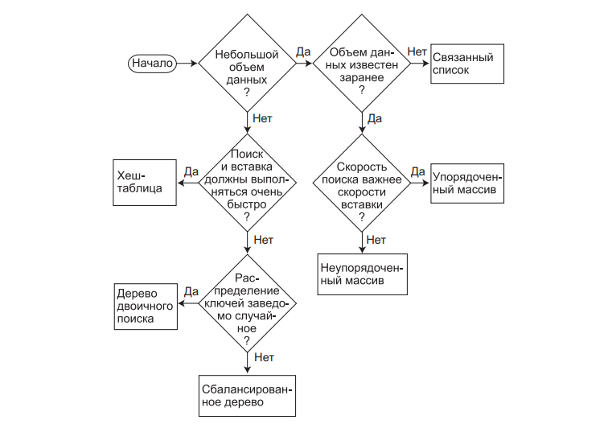

# Занятие №10 06.05.2025
## Рекомендации по использованию. Итоги.
> К приведенным рекомендациям следует относиться осмотрительно.
> Все реальные ситуации не похожи друг на друга, поэтому может оказаться, что приведенное описание не подходит для вашей конкретной задачи.

### Структуры данных общего назначения
Если задача требует хранения реальных данных: сведений о работниках, складской информации, списков контактов, данных о продажах и т. д., вам понадобится структура данных общего назначения.
В этом курсе был рассмотрен целый ряд структур данных этой категории: массивы, связанные списки, деревья и хеш-таблицы. 
Мы называем эти структуры данных «структурами общего назначения», потому что они используются для хранения и выборки данных по значениям ключей.

Какую из структур данных общего назначения следует выбрать для конкретной задачи?
В первом приближении можно воспользоваться рисунком ниже, однако кроме факторов, показанных на рисунке, существует много других.

Структуры данных общего назначения можно приблизительно классифицировать по скорости: массивы и связанные списки считаются медленными, деревья — относительно быстрыми, а хеш-таблицы — очень быстрыми.
Однако, не всегда предпочтение отдается более быстрым структурам.

У быстрых структур данных есть свои оборотные стороны, а в пользу более медленных структур существует весьма весомый довод.
Ежегодно вычислительная мощь процессоров и скорость доступа к памяти современных компьютеров растут.
Закон Мура гласит, что производительность процессоров удваивается за каждые 18 месяцев.

Несколько лет назад компьютер за приемлемое время обрабатывал массив из 100 объектов. В наши дни компьютеры работают намного быстрее, и обработка массива из 10 000 объектов может занять столько же времени.
Многие источники приводят оценку максимального размера структуры данных, при превышении которого она начинает работать слишком медленно.
Относитесь к таким оценкам скептически.
Вчерашние оценки сегодня недействительны.

Начните с простых структур данных.
Реализуйте простую версию массива или связанного списка и посмотрите, что будет.
Если программа выполняется за приемлемое время, остановитесь на этом.
Незачем тратить время на усложнение какой-либо реализации, если это усложнение не приведет к существенному росту производительности.
Только если тестирование покажет, что быстродействия этих структур недостаточно, следует переходить к более сложным структурам данных.

#### Массивы
В большинстве случаев выбор структуры данных для хранения и обработки данных следует начинать с массива. 
Массивы особенно полезны, когда:
- объем данных относительно невелик;
- объем данных известен заранее.

При достаточно большом объеме памяти второе условие не так существенно.
Если важна скорость вставки, используйте неупорядоченный массив. 
Если важна скорость поиска, используйте упорядоченный массив с двоичным поиском.
Удаление в массивах всегда выполняется медленно, потому что для заполнения освободившейся ячейки приходится сдвигать в среднем половину элементов.
Перебор быстро выполняется в упорядоченном массиве, но не поддерживается в неупорядоченном.

#### Связанные списки
Связанные списки обычно применяются в ситуациях, когда объем данных неизвестен заранее или же с данными часто выполняются операции вставки и удаления.
Связанный список автоматически расширяется при добавлении новых элементов, поэтому он может заполнить всю доступную память; в отличие от массивов он не требует заполнения «дыр», оставшихся при удалении.
Вставка в неупорядоченном списке выполняется быстро. 
Операции поиска и удаления относительно медленны (хотя удаление выполняется быстрее, чем в массивах), поэтому связанные списки, как и массивы, желательно использовать при сравнительно небольшом объеме данных.

Связанные списки реализуются несколько сложнее, чем массивы, но проще деревьев или хеш-таблиц.

#### Бинарные деревья
Двоичное дерево — первая структура, которую следует рассмотреть, если массивы и связанные списки оказались слишком медленными. 
Дерево обеспечивает быстрое $(O(logN))$ выполнение вставки, поиска и удаления. 
Перебор выполняется за время $O(N)$, максимальное для любых структур данных (по определению приходится перебирать все элементы). 
Также деревья позволяют быстро найти минимум и максимум и выполнить перебор диапазона элементов.

Несбалансированное двоичное дерево намного проще программируется, чем сбалансированное, но, к сожалению, вставка упорядоченных данных может сократить его быстродействие до $O(N)$ — не лучше, чем у связанного списка. 
Однако если вы твердо уверены в том, что данные будут поступать в случайном порядке, нет никаких причин использовать сбалансированное дерево.

#### Хеш-таблицы
Хеш-таблицы обладают самой высокой скоростью среди всех структур данных, поэтому они практически всегда используются в тех случаях, когда с данными работает не человек, а компьютерная программа.
Хеш-таблицы обычно используются в системах проверки орфографии и при работе с таблицами символических имен компиляторов, когда программе приходится проверять тысячи слов или символьных последовательностей за долю секунды.

Хеш-таблицы полезны и тогда, когда с данными работает человек, а не компьютер.
Как упоминалось ранее, хеш-таблицы не чувствительны к упорядоченности вставляемых данных, поэтому они могут использоваться вместо сбалансированных деревьев. 
По простоте программирования они значительно превосходят сбалансированные деревья.

Самой устойчивой реализацией является хеш-таблица, использующая метод цепочек.
Исключение составляет ситуация, при которой объем данных точно известен заранее; в этом случае открытая адресация, не требующая дополнительного класса связанного списка, упрощает программирование.

Хеш-таблицы не поддерживают ни упорядоченного перебора, ни выборки минимального/максимального элемента. 
Если эти возможности важны для вас, лучше остановиться на дереве двоичного поиска.

#### Быстродействие структуры данных общего назначения
| Структура данных                | Поиск     | Вставка   | Удаление  |
|---------------------------------|-----------|-----------|-----------|
| Массив                          | $O(N)$    | $O(1)$    | $O(N)$    |
| Упорядоченный массив            | $O(logN)$ | $O(N)$    | $O(N)$    |
| Связанный список                | $O(N)$    | $O(1)$    | $O(N)$    |
| Упорядоченный связанный список  | $O(N)$    | $O(N)$    | $O(N)$    |
| Двоичное дерево                 | $O(logN)$ | $O(logN)$ | $O(logN)$ |
| Двоичное дерево (худший случай) | $O(N)$    | $O(N)$    | $O(N)$    |
| Хеш-таблица                     | $O(1)$    | $O(1)$    | $O(1)$    |

Предполагается, что вставка в неупорядоченном массиве выполняется в конце. 
Упорядоченный массив использует быстрый двоичный поиск, но операции вставки и удаления замедляются необходимостью перемещения в среднем половины элементов.

### Специализированные структуры данных
В рамках курса мы рассмотрели стек и очередь. 
Эти структуры обычно не используются для ведения баз данных, ориентированных на взаимодействие с пользователем. 
Они применяются в компьютерных программах для реализации определенных алгоритмов.

Стеки, очереди и приоритетные очереди являются абстрактными типами данных (ADT), которые реализуются на базе более традиционных структур: массивов, связанных списков. 
Абстрактные типы данных предоставляют простой интерфейс для пользователя, как правило, с возможностью обращения или удаления только одного элемента данных:
- Стек: последний вставленный элемент.
- Очередь: первый вставленный элемент.

Абстрактные типы данных могут рассматриваться как концептуальные вспомогательные средства. Их функциональность может быть реализована непосредственно на уровне базовой структуры данных (например, массива), но сокращенный интерфейс упрощает решение многих задач.

#### Стек
Стек используется тогда, когда операции выполняются только с последним вставленным элементом. Таким образом, стек работает по принципу LIFO (Last In, First Ot).

Стеки часто реализуются на базе массива или связанного списка. 
Реализация на базе массива эффективна, потому что элементы вставляются в конец массива, где их удобно удалять.

Если стек содержит много данных, объем которых невозможно точно предсказать заранее (как, например, при стековой реализации рекурсии), в качестве базовой структуры лучше выбрать связанный список.

#### Очередь
Очередь используется тогда, когда операции выполняются только с первым вставленным элементом. Таким образом, очередь работает по принципу FIFO (First In, First Ot).

Очередь, как и стек, может быть реализована на базе массива или связанного списка. 
Обе реализации эффективны.
Массив потребует дополнительного программирования циклического перехода при достижении конца массива. 
Связанный список может быть двусторонним, чтобы вставка и удаление выполнялись с разных концов.

Как и в случае со стеками, выбор базы реализации (массив или связанный список) определяется возможностью прогнозирования объема данных. 
Если объем данных известен заранее, используйте массив, а если нет — связанный список.

#### Быстродействие специализированных структур данных
| Структура данных | Вставка | Удаление | Комментарий                                |
|------------------|---------|----------|--------------------------------------------|
| Стек             | $O(1)$  | $O(1)$   | Извлекается элемент, вставленный последним |
| Очередь          | $O(1)$  | $O(1)$   | Извлекается элемент, вставленный первым    |

### Сортировка
Как и при выборе структуры данных, начать стоит с медленной, но простой сортировки, например сортировки методом вставки.
Может оказаться, что вычислительная мощь современных компьютеров позволит отсортировать данные за разумное время.

Сортировка методом вставки также хорошо подходит для приблизительно отсортированных файлов; если количество неупорядоченных элементов относительно невелико, она выполняется за время $O(N)$.
Чаще всего подобная ситуация встречается при добавлении нескольких новых элементов в уже отсортированный файл.

Если скорость сортировки методом вставки оказывается неудовлетворительной, то следующим кандидатом является сортировка Шелла. 
Она относительно легко реализуется и не предъявляет никаких особых требований к данным.

Только если и сортировка Шелла оказывается слишком медленной, следует переходить к более сложным и более быстрым методам сортировки: сортировке слиянием и быстрой сортировке.
Сортировка слиянием требует дополнительной памяти и уступает по скорости быстрой сортировке.
Но если данные недостаточно случайны, быстродействие
быстрой сортировки может ухудшиться до $O(N^2)$.

| Алгоритм                   | Средняя сложность | Сложность в худшем случае | Оценка            | Доп. затраты памяти |
|----------------------------|-------------------|---------------------------|-------------------|---------------------|
| Пузырьковая сортировка     | $O(N^2)$          | $O(N^2)$                  | Плохо             |                     |
| Сортировка методом выбора  | $O(N^2)$          | $O(N^2)$                  | Удовлетворительно |                     |
| Сортировка методом вставки | $O(N^2)$          | $O(N^2)$                  | Хорошо            |                     |
| Сортировка Шелла           | $O(N^(3/2))$      | $O(N^(3/2))$              | -                 |                     |
| Быстрая сортировка         | $O(N*logN)$       | $O(N^2)$                  | Хорошо            |                     |
| Сортировка слиянием        | $O(N*logN)$       | $O(N*logN)$               | Удовлетворительно |                     |

> Для сортировки Шелла оценка отсутствует из-за отсутствия других алгоритмов с той же скоростью.

### Графы
Графы занимают особое место в структурах данных.
Они не используются для хранения данных общего назначения и не играют роль вспомогательных инструментов в других алгоритмах.
Обычно графы применяются при непосредственном моделировании реальных ситуаций. 
Структура графа отражает структуру задачи.

Если задача требует применения графа, никакая другая структура данных вам не подойдет, так что принимать решения по выбору структуры данных не нужно.
Основное решение связано со способом представления графа: матрица смежности или списки смежности. 
Выбор зависит от того, является ли граф насыщенным (лучше использовать матрицу смежности) или разреженным (списки смежности).

С представлением в виде матрицы смежности алгоритмы обхода в глубину и в ширину выполняются за время $O(V2)$, где $V$ — количество вершин. 
Для представления в виде списка смежности они выполняются за время $O(V + E)$, где $E$ — количество ребер. 
Алгоритмы построения минимального охватывающего дерева и выбора кратчайшего пути выполняются за время $O(V^2)$ при использовании матрицы смежности и за время $O((E + V)logV)$ при использовании списков смежности. 
Оцените значения $V$ и $E$ для своего графа и вычислите, какое представление более уместно.

## Итоги
Наш курс подошел к концу. Но не ваше изучение структур данных и алгоритмов! (надеюсь...)
Алгоритмы и структуры данных обширная и сложная тема, стать экспертом после изучения одного курса невозможно.

Если вы решите продолжить изучение, то обратите внимание на красно-черные деревья, взвешенные графы и особенности работы с внешними источниками информации.
Не забывайте развивать ум с помощью задач, изучите подходы к решению задач, такие как жадные алгоритмы, подход "разделяй и властвуй", динамическое программирование и т.д.

Если вы стремитесь построить карьеру в ИТ, то без уверенных знаний основ АиСД не получится устроиться в крупную компанию.
(Если не верите мне, то посмотрите требования к соискателям в Яндексе или Т-Банке).

Желаю успехов в дальнейшем обучении!
