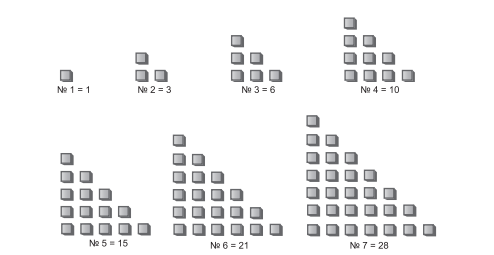
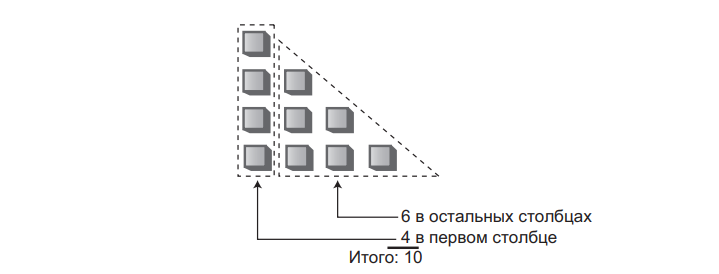
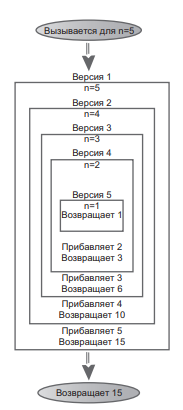
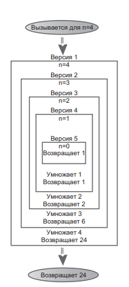
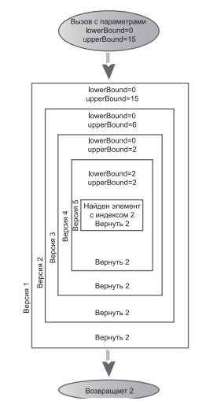

# Занятие №2 25.02.2025
## Рекурсия
### Теория
Рекурсией называется методология программирования, при которой метод (функция) вызывает сам себя. 
На первый взгляд такой вызов выглядит довольно странно и даже кажется катастрофической ошибкой. 
Однако на практике рекурсия оказывается одной из самых интересных и неожиданно эффективных методологий программирования.
Рекурсия не только работает, но и предоставляет уникальную концептуальную основу для решения многих задач.

### Треугольные числа
Начнем с байки.
Говорят, пифагорейцы — группа древнегреческих математиков, работавших под началом Пифагора — ощущали мистическую связь с числовыми рядами вида 1, 3, 6, 10, 15, 21, ….
Особенностью таких рядов является то, что N-е число ряда получается прибавлением n к предыдущему числу. 
Таким образом, чтобы получить второе число, мы увеличиваем первое (1) на 2; 1 + 2 = 3. 
Третье число получается увеличением второго (3) на 3; 3 + 3 = 6 и т. д.
Такие ряды называются треугольными числами, потому что их можно наглядно
представить как число объектов, которые могут быть расставлены в форме треугольника.



#### Вычисление n-го треугольного числа
Представим нереальное, у вас вдруг появилась острая необходимость написать программу по расчету n-ого треугольного числа.
Как его вычислить? Из рисунка выше видно, что значение любого числа ряда вычисляется суммированием величин всех вертикальных столбцов.


Для четвертого числа первый столбец состоит из четырех квадратиков, второй — из трех и т. д. 
Суммирование 4 + 3 + 2 + 1 дает 10.

В приведенном ниже методе `triangle()` суммирование по столбцам используется для вычисления треугольных чисел. 
Метод суммирует высоты всех столбцов от n до 1:

```java
long triangle(int n) {
    int total = 0;
    while (n > 0) {         // Пока n равно 1 и более
        total = total + n;  // Переменная total увеличивается на n (высоту столбца)
        --n;                // Уменьшение высоты столбца
    }
    return total;
}
```
Метод выполняет n итераций цикла. 
В первой итерации `total` увеличивается на n, во второй — на n – 1 и так далее до 1. 
Когда значение n становится равно 0, цикл прерывается.

#### Вычисление n-го треугольного числа

Решение с циклом получается простым и доступным, но существует и другой подход к решению этой задачи. 
Значение n-го числа ряда может рассматриваться как сумма только двух слагаемых (вместо суммы целого ряда):

1. Первый (самый высокий) столбец со значением n.
2. Сумма всех остальных столбцов.



Для воплощения данной концепции нам нужен метод для вычисления суммы всех остальных столбцов.
Если бы такой метод был в нашем распоряжении, то метод `triangle()` можно преобразовать следующим образом:

```java
long triangle(int n) {
    return n + sumRemainigColumns(n - 1);
}
```

Но чего мы добились? 
Написать метод `sumRemainingColumns()` ничуть не проще, чем исходный метод `triangle()`.

Но ведь если задуматься, метод `sumAllColumns()` делает точно то же самое, что и метод `triangle()`: он суммирует все столбцы для числа n, переданного в аргументе. 
Так почему бы не заменить его самим методом `triangle()`? 
Результат будет выглядеть так:

```java
long triangle(int n) {
    return n + triangle(n - 1);
}
```

#### Эстафета

Рекурсивное решение напоминает эстафетную передачу. 
Кто-то приказывает вам вычислить 9-е треугольное число. 
Вы знаете, что оно равно сумме 9-го и 8-го треугольного числа, поэтому вы вызываете person_1 и приказываете ему вычислить 8-е треугольное число. 
Получив от него ответ, вы прибавляете к нему 9 и получаете конечный результат.

person_1 знает, что 8-е треугольное число равно сумме 8-го и 7-го треугольного числа. 
Он вызывает person_2 и приказывает ему вычислить 7-е треугольное число.
Процесс продолжается, а каждый участник передает эстафету следующему.

Когда кончается передача? 
В определенный момент кто-то сможет вычислить ответ, не обращаясь за помощью. 
Если бы этого не произошло, то возникла бы бесконечная цепочка людей, обращающихся друг к другу с запросами — математическая «пирамида», которая никогда не кончается. 
Для метода `triangle()` это означало бы, что метод бесконечно вызывает сам себя, пока программа не завершится сбоем.

#### Прекращение эстафеты. Базовое ограничение.

Для предотвращения бесконечной передачи человек, которому приказано вычислить первое треугольное число `(n = 1)`, должен знать, что ответ равен 1 — для получения этого ответа он ни к кому не обращается с запросом. 
Минимальное число достигнуто, поэтому передача эстафеты прекращается. 
Ситуация выражается включением в метод `triangle()` дополнительного условия:

```java
long triangle(int n) {
    if (n == 1) {
        return 1;
    } else {
        return n + triangle(n - 1);  
    }
}
```

Условие, приводящее к возврату управления рекурсивным методом без следующего рекурсивного вызова, называется базовым ограничением. Каждый рекурсивный метод должен иметь базовое ограничение для предотвращения бесконечной рекурсии и последующего аварийного завершения программы.

#### Что на самом деле происходит?



### Характеристики рекурсивных методов
Метод `triangle()`, несмотря на простоту, обладает всеми характеристиками рекурсивных методов:
- Он вызывает сам себя.
- Рекурсивный вызов предназначен для решения упрощенной задачи.
- Существует версия задачи, достаточно простая для того, чтобы метод мог решить ее и вернуть управление без рекурсии.

При каждом последующем вызове рекурсивного метода значение аргумента уменьшается (или диапазон, определяемый несколькими аргументами, сужается) — в этом проявляется постепенное «упрощение» задачи.
Когда аргумент или диапазон достигает определенного минимального размера, срабатывает базовое ограничение, и метод возвращает управление без рекурсии.

### Эффективность рекурсии
Вызов метода сопряжен с определенными непроизводительными затратами ресурсов.
Управление должно передаваться из текущей точки вызова в начало метода.
Кроме того, аргументы метода и адрес возврата заносятся во внутренний стек, чтобы метод мог обратиться к значениям аргументов и знать, по какому адресу следует вернуть управление.

В ситуации с методом `triangle()` вполне вероятно, что из-за этих затрат решение с циклом будет работать быстрее рекурсивного решения. 
Отставание может быть незначительным, но при большом количестве вызовов желательно избавиться от рекурсии.
Другой фактор снижения эффективности — затраты памяти на хранение всех промежуточных аргументов и возвращаемых значений во внутреннем стеке. 
Большой объем данных может создать проблемы и привести к переполнению стека.
Рекурсия обычно применяется ради концептуального упрощения задачи, а не оттого, что она изначально более эффективна.

### Другие примеры
#### Факториал
Факториалы сходны с треугольными числами, если не считать того, что вместо сложения используется операция умножения. 
Треугольное число с номером n вычисляется суммированием треугольного числа `n – 1` с `n`, а факториал `n` вычисляется умножением факториала `n – 1` на `n`. 
Иначе говоря, пятое треугольное число вычисляется по формуле 5 + 4 + 3 + 2 + 1, а факториал 5 вычисляется по формуле 5 × 4 × 3 × 2 × 1 = 120.

Для вычисления факториала можно использовать рекурсивный метод, аналогичный методу `triangle()`.



```java
long factorial(long n) {
    if (n == 0) {
        return 1;
    } else {
        return n * factorial(n - 1);
    }
}
```

#### Рекурсивный двоичный поиск
Метод двоичного поиска, использующий цикл, достаточно легко преобразуется в рекурсивный метод.
В циклической версии новый диапазон определяется посредством изменения `lowerBound` или `upperBound`, после чего цикл выполняется заново.
При каждой итерации диапазон делится (приблизительно) надвое.

В рекурсивной версии вместо изменения `lowerBound` или `upperBound` метод `find()` вызывается заново для новых значений параметров `lowerBound` или `upperBound`.
Цикл исключается из программы и заменяется рекурсивными вызовами.
Вот как это выглядит:

```java
private boolean recursionBinarySearch(long searchKey, int lowerBound, int upperBound) {
    int currentIndex = (lowerBound + upperBound) / 2;

    if (array[currentIndex] == searchKey) {
        return true;
    } else if (lowerBound > upperBound) {
        return false;
    } else {
        if (array[currentIndex] < searchKey) {
            return recursionBinarySearch(searchKey, currentIndex + 1, upperBound);
        } else {
            return recursionBinarySearch(searchKey, lowerBound, currentIndex - 1);
        }
    }
}
```

Вышеописанный метод используется основным методом `contains()`.
Не стоит обременять рекурсивный метод дополнительной логикой.

```java
public boolean contains(long searchValue) {
    return recursionBinarySearch(searchValue, 0, nElems - 1);
}
```

Вот как схематически выглядит процесс бинарного поиска с помощью рекурсии:



## Итог
Одни алгоритмы хорошо адаптируются к рекурсии, другие — нет.
Как мы уже видели, рекурсивные методы `triangle()` и `factorial()` более эффективно реализуются с использованием простого цикла.
С другой стороны, различные алгоритмы последовательного разделения (такие, как сортировка слиянием) очень хорошо работают в рекурсивной форме.

Часто алгоритм легко представляется рекурсивным методом на концептуальном уровне, но на практике рекурсия оказывается недостаточно эффективной. 
В таких случаях от рекурсии стоит отказаться.

## Полезные ссылки

- https://stepik.org/lesson/13232/step/1?unit=3417 - непростой в освоении курс из-за скудной теории, однако, если вы его освоите, то по многим темам вопросов больше не будет. 
