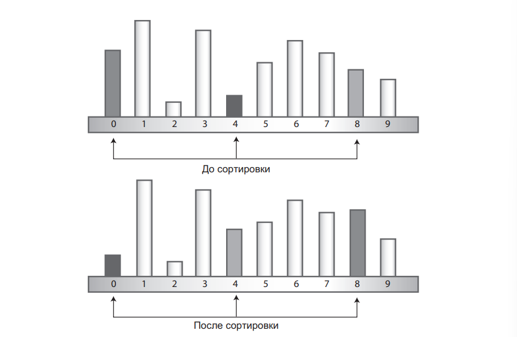
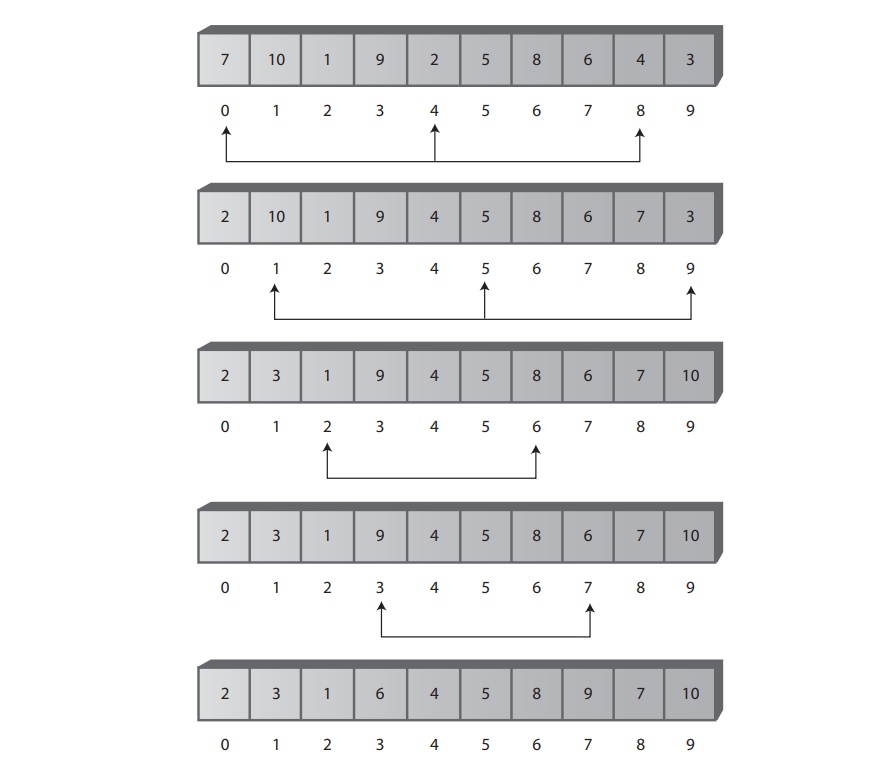

# Занятие №3 04.03.2025
## Нетривиальная сортировка. Сортировка методом Шелла.
### 1. Общие принципы
Ранее мы рассмотрели простейшие сортировки.
- Пузырьковая сортировка.
- Сортировка выбором.
- Сортировка вставкой.

Эти сортировки легко реализуются, но, если опустить детали, то все они очень долго выполняются. 
Сложность данных сортировок $O(n^2)$.

Алгоритм Шелла основан на сортировке методом вставок, но он обладает новой особенностью, кардинально улучшающей скорость сортировки.
Сортировка Шелла хорошо подходит для массивов среднего размера — например, до нескольких тысяч элементов. 
По скорости она уступает быстрой сортировке и другим алгоритмам, выполняемым за время $O(N × logN)$, поэтому для очень больших объемов данных она не оптимальна. 
Тем не менее сортировка Шелла заметно быстрее алгоритмов $O(N2)$ — таких, как сортировки методом выбора и вставок.

Так как алгоритм Шелла основан на сортировке методом вставок, возможно, вам стоит вернуться к 5-ому занятию 1-го семестра.
Рассмотрим главный недостаток сортировки методом вставки.
Предположим, у правого края массива — там, где должны быть большие элементы — находится малый элемент.
Чтобы переместить его на подходящее место где-то слева, необходимо сдвинуть все промежуточные элементы (то есть элементы между его фактическим и итоговым местом) на одну позицию вправо.
Это потребует выполнения где-то до $N$ операций копирования всего для одного элемента.
Не все элементы придется перемещать на полные $N$ позиций, но в среднем один элемент будет перемещаться на $N/2$ позиций.
Итого $N/2$ сдвигов будут выполняться $N$ раз, а среднее количество операций копирования составит $N^2 / 2$. Таким образом, сортировка методом вставок обладает эффективностью $O(N^2)$.

Сортировка Шелла выполняет «дальние» сдвиги, сортируя разобщенные элементы посредством сортировки методом вставок. 
После сортировки этих элементов сортируются элементы, находящиеся на меньшем расстоянии и т. д. 
Расстояние между элементами при такой сортировке называется приращением и традиционно обозначается буквой $h$.

Рассмотрим на примерах:


На рисунке показан первый шаг процесса сортировки 10-элементного массива с приращением 4.
Здесь сортируются элементы 0, 4 и 8.
После того как будут отсортированы элементы 0, 4 и 8, алгоритм сдвигается на одну ячейку и сортирует элементы 1, 5 и 9.



Выше показаны следующие шаги сортировки.
После полной 4-сортировки массив можно рассматривать как совокупность четырех подмассивов: (0,4,8), (1,5,9), (2,6) и (3,7), каждый из которых полностью отсортирован.
Данный подход позволяет сделать массив "почти" отсортированным.
А как мы выяснили ранее, сортировка методом вставок чрезвычайно эффективна для почти отсортированных массивов.
---
### 2. Интервальные последовательности
Выше мы использовали условный термин "4-сортировка", это обозначало, что интервал между элементами наших подмассивов составлял 4 элемента в оригинальном массиве включая крайние.
Этот интервал неплохо показывает себя для 10 элементов, но для массивов большего размера предварительная сортировка должна начинаться с намного большего интервала, который затем будет последовательно сокращаться вплоть до одного.
Выбор интервальной последовательности шагов оказывает существенное влияние на производительность сортировки.
В первую очередь, хотелось бы рассмотреть наиболее популярный способ расчета интервальной последовательности.

#### Последовательность Кнута
Допустим, что у нас есть массив из 1000 элементов.
В нем могут быть проведены 364-сортировка, затем 121-сортировка, 40-сортировка, 13-сортировка, 4-сортировка и, наконец, 1-сортировка.
Серия чисел, используемых при генерировании интервалов (в данном примере 364, 121, 40, 13, 4, 1), является интервальной последовательностью.
Приведенная интервальная последовательность, приписываемая Кнуту, весьма популярна.
В обратной форме, начиная с 1, она генерируется по рекурсивной формуле:
$$h = 3*h+1$$

В алгоритме сортировки сначала в коротком цикле вычисляется исходный интервал. 
В качестве первого значения h используется 1, а затем по формуле
h = h × 3 + 1 генерируется последовательность 1, 4, 13, 40, 121, 364 и т. д. 
Процесс завершается тогда, когда величина интервала превышает размер массива. 
Для массива из 1000 элементов седьмое число в последовательности (1093) оказывается слишком большим; соответственно процесс сортировки начинается с шестого Сортировка Шелла 303 числа (364).

Затем при каждой итерации внешнего цикла метода сортировки интервал сокращается по формуле, обратной по отношению к приведенной:
$$h = (h-1)/3$$

#### Пример расчета интервалов для массива длины 100
| h    | $3*h + 1$ | $(h-1)/3$ |
|------|-----------|-----------|
| 1    | 4         |           |
| 4    | 13        | 1         |
| 13   | 40        | 4         |
| 40   | 121       | 13        |
| 121  | 364       | 40        |
| 364  | 1093      | 121       |
| 1093 | 3280      | 364       |

#### Другие варианты интервальных последовательностей
Выбор интервальной последовательности не имеет каких-то четких критериев.
На практике с разной степенью успеха имеют место и другие последовательности.
Единственное неизменное требование состоит в том, что уменьшающаяся интервальная последовательность должна завершаться 1.

В исходной статье Шелл предложил в качестве исходного интервала значение $N/2$, которое затем просто делилось на $2$ при каждом проходе.
Преимуществом такого способа является простота, но такая последовательность не является оптимальной.
В некоторых случаях время выполнения может ухудшаться до $O(n)$.

В одной из разновидностей этого подхода интервал делится на $2,2$ вместо $2$.
Например, для $N = 100$ генерируются числа 45, 20, 9, 4, 1.
Это позволяет избежать худших случаев с эффективностью $O(N^2)$.
---
### 3. Программная реализация
#### Основные этапы алгоритма:

1. Выбор начального интервала: Начальный интервал выбирается на основе длины массива.
2. Сортировка с интервалом: Массив сортируется с использованием выбранного интервала.
   Это делается путем сравнения и обмена элементами, находящимися на расстоянии интервала друг от друга.
3. Шаг уменьшается согласно выбранной последовательности интервалов.
4. Процесс повторяется до тех пор, пока шаг не станет равным 1 (обычная сортировка вставками).

```java

public void shellSort() {
   int inner, outer;
   long temp;
   int h = 1;

   // Вычисляем максимальный шаг из последовательности Кнута
   while (h <= nElems / 3) {
      h = h * 3 + 1;
   }

   // Сортировка с использованием последовательности Кнута
   while (h > 0) {
      for (outer = h; outer < nElems; outer++) {
         temp = array[outer]; // выбирается "внешний" элемент интервальной последовательности
         inner = outer;
         while (inner > h - 1 && array[inner - h] >= temp) { // "внешний" элемент сравнивается с предыдущим элементом интервальной последовательности
            array[inner] = array[inner - h];
            inner -= h;
         }
         array[inner] = temp;
      }
      h = (h - 1) / 3; // интервальная последовательность пересчитывается
   }
}
```
---
### 4. Сравнение сложности
До настоящего момента еще никому не удалось теоретически обосновать эффективность сортировки Шелла, если не считать некоторых частных случаев.
Оценки, полученные на основании экспериментов, лежат в интервале от $O(N3/2)$ до $O(N7/6)$.

| Алгоритм                        | O()          | 10 элементов | 100 элементов | 1000 элементов | 10000 элементов |
|---------------------------------|--------------|--------------|---------------|----------------|-----------------|
| Сортировка методом вставки и др | $N^2$        | 100          | 10000         | 1000000        | 100000000       |
| Сортировка Шелла                | $N^{3/2}$    | 32           | 1000          | 32000          | 1000000         |
| Сортировка Шелла                | $N*(logN)^2$ | 10           | 400           | 9000           | 160000          |
| Сортировка Шелла                | $N^{5/4}$    | 18           | 316           | 5600           | 100000          |
| Сортировка Шелла                | $N^{7/6}$    | 14           | 215           | 3200           | 46000           |
___
### 5. Итоги
- В худшем случае сортировка Шелла может иметь сложность \(O(n^2)\), но в среднем она работает быстрее простейших алгоритмов.
- Использование оптимальных последовательностей интервалов значительно улучшает производительность.

Сортировка Шелла — это мощный алгоритм, который превосходит простейшие методы сортировки, но при этом остаётся менее эффективным, чем современные алгоритмы, такие как быстрая сортировка или сортировка слиянием.
___
## Лабораторная работа №1

1. Внедрить алгоритм сортировки Шелла в классы массивов с которыми вы работали в прошлом семестре.
2. Провести анализ влияния выбора интервальной последовательности на скорость выполнения алгоритма, выраженную во времени.
   
> _**Примечание**_
> 
> Лабораторная должна находится в собственной директории.
> Лабораторные заливаются в репозиторий через pull request.
> Последнее напоминание о 1-ом занятии.
> 
> Лабораторная должна содержать:
> 1. Файл с кодом класса.
> 2. Файл README.md с отчетом.
> 
> Вам необходимо изменить метод расчета переменной `h`. 
> В рамках лекции были описаны несколько вариантов.
> Приветствуется использование новых способов.
>
> В отчете должна быть таблица с ключевыми показателями, такими как название способа, формула, размер массива, время сортировки и вывод, составленный в свободной форме.
