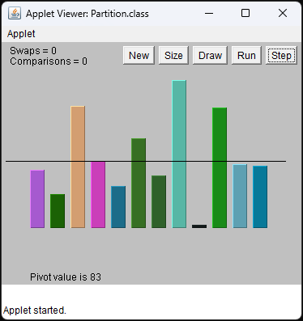
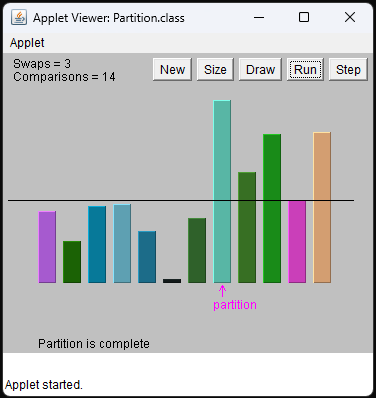
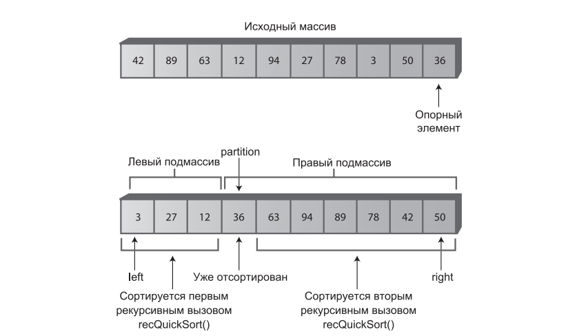
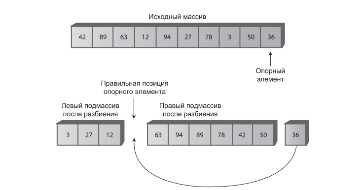
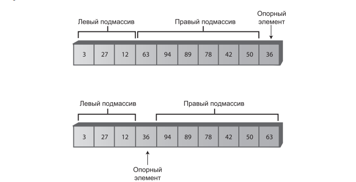
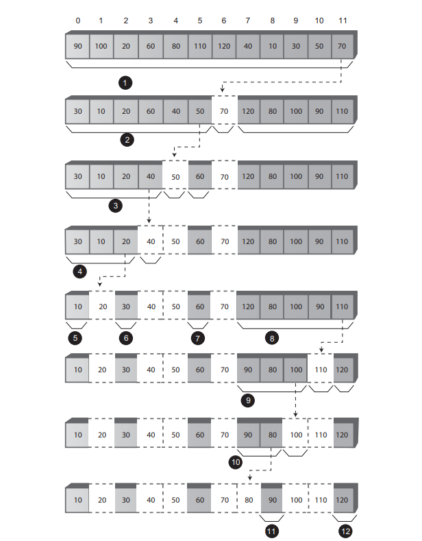
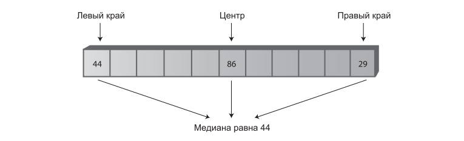

# Занятие №4 11.03.2025
## Нетривиальная сортировка. Быстрая сортировка.
### Введение
Быстрая сортировка является самым популярным алгоритмом сортировки, что вполне понятно: в большинстве ситуаций он выполняется быстрее всех за время $O(N*logN)$.
По сути, алгоритм быстрой сортировки разбивает массив на два подмассива, а затем рекурсивно вызывает себя для выполнения быстрой сортировки каждого из этих подмассивов.

### 1. Разбиение
Чтобы понять суть быстрой сортировки, необходимо знать алгоритм разбиения.
Разбиением данных называется такое разделение на две группы, при котором в одну группу входят все элементы со значением ключа выше заданного порога, а в другую — все элементы со значением ключа ниже заданного порога.

Механизм разбиения может быть полезен и сам по себе.
Нетрудно представить себе ситуацию, в которой может возникнуть необходимость в разбиении данных.
Допустим, преподаватель хочет разделить студентов на две группы: со средним баллом 3,5 и выше и тех, у кого средний балл ниже этого значения.
Поэтому, мы разберем этот механизм подробно.

На рисунках ниже вы можете увидеть наглядный пример массива до и после разбиения.
Горизонтальная линия изображает опорное значение, по которому определяется принадлежность элемента к той или иной группе.





Разбиение ни в коем случае не обеспечивает сортировки, данные просто делятся на две группы.
Тем не менее они становятся более упорядоченными, чем прежде. 
Также, разбиение не обладает свойством устойчивости.
Иначе говоря, порядок элементов в каждой группе не соответствует исходному порядку следования элементов в массиве.
Плюсом ко всему, хотелось бы сказать, что процесс разбиения вовсе не обязан делить массив пополам, это зависит от опорного значения и ключевых значений данных. 
Количество элементов в одной группе может быть значительно больше, чем в другой. 

#### Программная реализация
```java
int partition(long pivot) {
    int leftPtr = -1; // Справа от первого элемента
    int rightPtr = elementsNumber; // Слева от опорного элемента

    while (true) {
        do {
            leftPtr += 1;
        } while (leftPtr < elementsNumber && data[leftPtr] < pivot); // Поиск элемента, который больше опорного, в левой части массива

        do {
            rightPtr -= 1;
        } while (rightPtr > 0 && data[rightPtr] > pivot); // Поиск элемента, который меньше опорного, в правой части массива

        if (leftPtr >= rightPtr) { // Условие выхода из цикла, если указатели leftPtr и rightPtr сошлись
            break;
        } else {
            swap(leftPtr, rightPtr); // Если указатели еще не сошлись, элементы, найденные выше, меняются местами
        }
    }
    return leftPtr; // Позиция разбиения
}

void swap(int index1, int index2) {
    long temp = data[index1];
    data[index1] = data[index2];
    data[index2] = temp;
}
```

В начале работы алгоритма разбиения два указателя находятся на разных концах массива.
Левый указатель `leftPtr` перемещается вправо, а правый указатель `rightPtr` перемещается влево.
Строго говоря, `leftPtr` инициализируется позицией слева от первой ячейки, а `rightPtr` — позицией справа от последней ячейки, 
потому что они соответственно увеличиваются и уменьшаются перед использованием.

Если `leftPtr` указывает на элемент, меньший опорного значения, он продолжает перемещаться, потому что этот элемент уже находится в правильной группе.
Однако при обнаружении элемента, большего опорного, он останавливается.
Аналогичным образом, если `rightPtr` указывает на элемент, больший опорного значения, он продолжает перемещаться, а при обнаружении меньшего элемента — останавливается.
Процессом проверки управляют два внутренних цикла `do while`, для `leftPtr` и для `rightPtr`.
Перемещение указателя останавливается из-за выхода из его внутреннего цикла.

Выполнение первого цикла `do while` прерывается при обнаружении элемента, превышающего опорное значение `pivot`; 
выполнение второго цикла — при обнаружении элемента, меньшего `pivot`. 
При выходе из обоих циклов как `leftPtr`, так и `rightPtr` указывают на элементы, находящиеся в неверных частях массива; 
эти элементы меняются местами.

Когда два указателя сходятся, процесс разбиения завершен, а выполнение внешнего цикла `while` также прерывается.

#### Эффективность алгоритма разбиения
Алгоритм разбиения выполняется за время $O(N)$.
Указатели начинают движение с разных концов массива и перемещаются друг к другу с более или менее постоянной скоростью, периодически останавливаясь для перестановки элементов.
Когда они сходятся, разбиение завершается.
Если бы в разбиении участвовало вдвое больше элементов, то указатели двигались бы с той же скоростью, но количество сравниваемых и переставляемых элементов также увеличилось бы вдвое, поэтому процесс занял бы вдвое больше времени. 
Таким образом, время выполнения пропорционально $N$.

### 2. Быстрая сортировка
#### Программная реализация
Код базового рекурсивного метода быстрой сортировки относительно прост. 
Пример:

```java
void sort() {
    quickSort(0, elementsNumber - 1);
}

void quickSort(int left, int right) {
    if (right - left > 0) {
        long pivot = data[right];

        int partition = partition(left, right, pivot);
        quickSort(left, partition-1);
        quickSort(partition+1, right);
    }
}

int partition(int leftIndex, int rightIndex, long pivot) {
    int leftPtr = leftIndex - 1;
    int rightPtr = rightIndex;
    while (true) {
        do {
            leftPtr += 1;
        } while (data[leftPtr] < pivot);

        do {
            rightPtr -= 1;
        }
        while (rightPtr > leftIndex && data[rightPtr] > pivot);

        if (leftPtr >= rightPtr) {
            break;
        } else {
            swap(leftPtr, rightPtr);
        }
    }
    swap(leftPtr, rightIndex);
    return leftPtr;
}

void swap(int index1, int index2) {
    long temp = data[index1];
    data[index1] = data[index2];
    data[index2] = temp;
}
```

Алгоритм состоит из трех основных шагов:
1. Массив или подмассив разбивается на две группы: левую (с меньшими ключами) и правую (с большими ключами).
2. Рекурсивный вызов метода для сортировки левой группы.
3. Рекурсивный вызов метода для сортировки правой группы.

После разбиения все элементы левого подмассива меньше элементов правого подмассива. 
Если отсортировать левый подмассив и правый подмассив, то весь массив будет упорядочен. 
Как отсортировать эти подмассивы? 
Посредством рекурсивных вызовов.

Аргументы метода `recQuickSort()` определяют левую и правую границы массива (или подмассива), который должен сортироваться при вызове. 
Метод сначала проверяет, не состоит ли массив только из одного элемента. 
Если условие выполняется, значит, массив уже отсортирован, и метод немедленно возвращает управление. 
Это базовое ограничение процесса рекурсии.



Обратите внимание: элемент данных с индексом partition не включается ни в один из рекурсивных вызовов.

#### Выбор опорного значения
Подобно выбору способа расчета интервальной последовательности в сортировке Шелла, при реализации быстрой сортировки возникает вопрос выбора опорного значения.
Можно выделить несколько ключевых критериев:
- Опорное значение должно быть ключом существующего элемента; этот элемент называется опорным.
- Опорный элемент выбирается более или менее произвольно. 
  Для простоты мы всегда будем выбирать элемент, находящийся у правого края массива.
- После разбиения опорный элемент, вставленный на границе между левым и правым подмассивом, всегда находится в своей окончательной позиции сортировки.

Последний пункт кажется неочевидным, но вспомните: так как ключ опорного элемента используется для разбиения массива, после его выполнения в левом подмассиве собираются элементы, меньшие опорного, а в правом — элементы, большие опорного.
На рисунке ниже показана схема разбиения с опорным элементом 36.



В действительности дело обстоит сложнее — массив нельзя «раздвинуть», как это сделано на рисунке.
Мы конечно можем сдвинуть все значения справа от опорного элемента вправо, но это не эффективно.
Есть более элегантное решение.

Все элементы правого подмассива, пусть и больше опорного значения, еще не отсортированы, поэтому их перемещение в правом подмассиве ни на что не повлияет.
Следовательно, для упрощения вставки опорного элемента в нужной позиции мы можем просто поменять местами опорный элемент (36) с левым элементом правого подмассива (63).
В результате перестановки опорный элемент занимает положенное место в позиции между левой и правой группами. 
Элемент 63 перемещается к правому краю, но поскольку он остается в правой (большей) группе, разбиение при этом не нарушается. 



Код алгоритма разбиения немного отличается от кода рассмотренного в соответствующем разделе.
Это сделано для того, чтобы мы могли реализовать схему с выбором крайнего правого элемента массива в качестве опорного.
Плюсом, нам удалось обойтись без проверки конца массива в первом внутреннем цикле $do while$.

На рисунке ниже изображена последовательность вызовов рекурсии.



#### Вырожденное быстродействие $O(N^2)$
Выбирая опорным значением крайний правый элемент, может возникнуть ситуация, когда эффективность алгоритма ухудшится до $O(N^2)$.
Такая ситуация возникнет в случае, если нам придется сортировать массив, отсортированный в другом порядке.

Дело в том, что в идеале опорное значение должно быть медианой сортируемых элементов.
Иначе говоря, половина элементов должна быть больше опорного значения, а другая половина — меньше его. 
Это приведет к тому, что массив будет разбиваться на два подмассива равных размеров.
Такая ситуация идеальна для алгоритма быстрой сортировки.

Если алгоритму приходится сортировать два массива разных размеров, его эффективность ухудшается, поскольку больший массив приходится разбивать большее количество раз.
Худшая ситуация возникает, когда необходимо сортировать обратно отсортированный массив.
То есть, разбиение массива из $N$ элементов на два подмассива, из $1$ и $N – 1$ элементов.
Если такое деление на $1$ и $N – 1$ происходит с каждым разбиением, то на каждый элемент потребуется свой шаг разбиения.
В данной ситуации преимущество от процесса разбиения теряется, а эффективность алгоритма вырождается до $O(N2)$.

Помимо неэффективности, быстрая сортировка за время $O(N^2)$ создает еще одну проблему. 
При увеличении количества разбиений соответственно возрастает и количество рекурсивных вызовов. 
Каждый вызов занимает место в машинном стеке. 
Если вызовов окажется слишком много, возможно переполнение стека и парализация системы.

Подведем итог: алгоритм, рассмотренный ранее, в качестве опорного выбирает крайний правый элемент. 
Для случайных данных такой выбор неплох.
Тем не менее, если данные отсортированы (в прямом или обратном порядке), выбор опорного элемента с края массива становится нежелательным.

#### Определение медианы по трем точкам
Существует много схем выбора опорного значения.
Такая схема должна быть простой, но при этом с большой вероятностью избегать выбора наибольшего или наименьшего значения. 
Случайный выбор элемента прост, но как мы уже видели, не всегда приводит к хорошему результату. 
Конечно, можно проанализировать все элементы и вычислить медиану. 
Выбор будет идеальным, но сам процесс вряд ли можно признать практичным — он займет больше времени, чем сама сортировка.

В одном из компромиссных решений медиана определяется по первому, последнему и среднему элементам в массиве. 
Полученное значение используется в качестве опорного. 
Выбор медианы первого, последнего и среднего элементов называется определением медианы по трем точкам.



Конечно, определение медианы по трем точкам происходит намного быстрее, чем определение по всем элементам массива. 
При этом оно успешно избегает выбора наибольшего или наименьшего элемента в тех случаях, когда данные уже отсортированы в прямом или обратном порядке. 
Вероятно, в некоторых патологических случаях эта схема тоже будет плохо работать, но в обычной ситуации она позволяет быстро и эффективно выбрать опорное значение.

У определения медианы по трем точкам имеется еще одно второстепенное преимущество: после сортировки трех элементов процессу разбиения уже не придется проверять их заново.
Разбиение можно начать с позиций `left + 1` и `right - 1`, потому что элементы `left` и `right` фактически уже прошли его.
Мы знаем, что элемент `left` принадлежит правильному подмассиву, потому что он находится слева и его значение меньше опорного, а элемент `right` — потому что он находится справа, а его значение больше опорного.

Таким образом, разбиение по медиане, определенной по трем точкам, не только избегает снижения эффективности до $O(N^2)$ с уже отсортированными данными, но и способствует ускорению внутренних циклов алгоритма разбиения, а также незначительно сокращает количество обрабатываемых элементов.

#### Программная реализация

```java
void quickSort(int leftIndex, int rightIndex) {
    if (rightIndex - leftIndex + 1 <= 3) {
        manualSort(leftIndex, rightIndex);
    } else {
        long pivot = medianOfThreePoints(leftIndex, rightIndex);
    
        int partition = partition(leftIndex, rightIndex, pivot);
        quickSort(leftIndex, partition - 1);
        quickSort(partition + 1, rightIndex);
    }
}

long medianOfThreePoints(int leftIndex, int rightIndex) {
    int center = (leftIndex + rightIndex) / 2;
  
    if (data[leftIndex] > data[center]) {
        swap(leftIndex, center);
    } else if (data[leftIndex] > data[rightIndex]) {
        swap(leftIndex, rightIndex);
    } else if (data[center] > data[rightIndex]) {
        swap(center, rightIndex);
    }
    swap(center, rightIndex - 1);
    return data[rightIndex - 1];
}

void manualSort(int leftIndex, int rightIndex) {
    int size = rightIndex - leftIndex + 1;
    if (size <= 1) {
        return;
    } if (size == 2) {
        if (data[leftIndex] > data[rightIndex]) {
            swap(leftIndex, rightIndex);
        }
    } else {
        if (data[leftIndex] > data[rightIndex - 1]) {
            swap(leftIndex, rightIndex - 1);
        }
        if (data[leftIndex] > data[rightIndex]) {
            swap(leftIndex, rightIndex);
        }
        if (data[rightIndex - 1] > data[rightIndex]) {
            swap(rightIndex - 1, rightIndex);
        }
    }
}

int partition(int leftIndex, int rightIndex, long pivot) {
    int leftPtr = leftIndex;
    int rightPtr = rightIndex - 1;
    while (true) {
        do {
            leftPtr += 1;
        } while (data[leftPtr] < pivot);
    
        do {
            rightPtr -= 1;
        } while (data[rightPtr] > pivot);
    
        if (leftPtr >= rightPtr) {
            break;
        } else {
            swap(leftPtr, rightPtr);
        }
      }
    swap(leftPtr, rightIndex - 1);
    return leftPtr;
}
```

### 3. Итоги
Быстрая сортировка — это мощный и универсальный алгоритм, который широко используется благодаря своей эффективности. Понимание его работы, включая выбор опорного элемента и процесс разбиения, является важным для изучения алгоритмов сортировки и анализа их производительности.

---
## Лабораторная работа №2
1. Внедрите алгоритм быстрой сортировки в классы массивов с которыми вы работали в прошлом семестре.
2. Вспомнить, какая из простых сортировок использовалась на завершающих этапах быстрой сортировки? (Мы проходили это в прошлом семестре.)
3. Внедрить алгоритм из пункта 2 в алгоритм быстрой сортировки.

_Задание со звездочкой_: избавиться от рекурсии.

> Подсказка:
> Нужно изменить условие в блоке `if (rightIndex - leftIndex + 1 <= 3)` в методе quickSort.
> Реализовать в классе массива сортировку из пункта 2. И внедрить его в тело вышеописанного условного блока. 