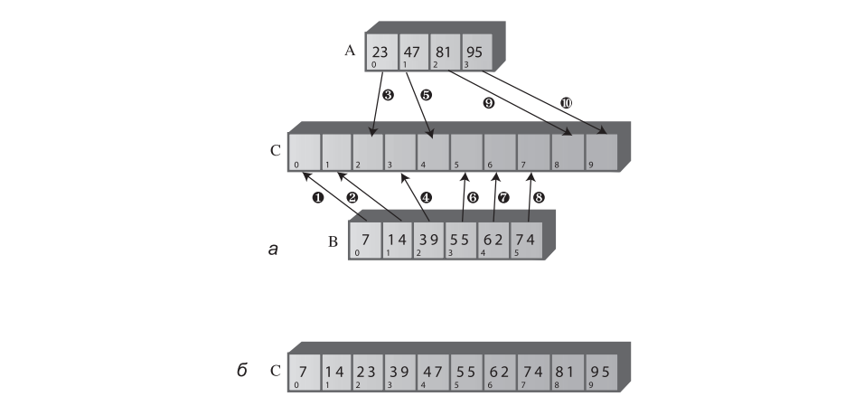

# Занятие №5 18.03.2025
## Нетривиальная сортировка. Сортировка слиянием.
### Введение
Алгоритм сортировки слиянием завершает наше знакомство с нетривиальными сортировками.
Рассмотренные алгоритмы сортировок не являются единственными способами упорядочить данные.
Есть и другие алгоритмы, которые, возможно, будут превосходить ранее изученные способы в некоторых ситуациях.
Однако, они являются базовыми и как говорится: "Такое знать надо.".

Алгоритм сортировки слиянием выполняется за время $O(N × logN)$.
Кроме того, сортировка слиянием относительно легко реализуется. 
На концептуальном уровне она проще алгоритмов быстрой сортировки и сортировки Шелла, описанных ранее.

Недостаток сортировки слиянием заключается в том, что она требует выделения в памяти дополнительного массива с размером, равным размеру сортируемого массива. 
Если исходный массив с трудом помещается в памяти, то сортировка слиянием вам не подойдет, но при наличии достаточного свободного пространства этот алгоритм весьма эффективен.

### Слияние двух отсортированных массивов
#### Описание
Центральное место в алгоритме сортировки слиянием занимает слияние двух предварительно отсортированных массивов.
Сначала мы рассмотрим сам процесс слияния, а потом разберемся, как он используется при сортировке.
Представьте, что у вас имеются два предварительно отсортированных массива (причем необязательно одинакового размера). 
Допустим, массив $A$ содержит $4$ элемента, а массив $B$ — $6$. 
Массивы объединяются посредством слияния в массив $C$, изначально состоящий из $10$ пустых ячеек.



На рисунке числа в кружках обозначают порядок перемещения элементов из $A$ и $B$ в $C$.

В таблице нижу перечислены сравнения, необходимые для определения копируемых элементов. 
Нумерация операций в таблице соответствует нумерации на рисунке. 
После каждого сравнения меньший элемент копируется в $A$.

| Шаг | Сравнение | Копирование |
|-----|-----------|-------------|
| 1   | 23 и 7    | 7 из B в C  |
| 2   | 23 и 14   | 14 из A в C |
| 3   | 23 и 39   | 23 из A в C |
| 4   | 39 и 47   | 39 из B в C |
| 5   | 55 и 47   | 47 из A в C |
| 6   | 55 и 81   | 55 из B в C |
| 7   | 62 и 81   | 62 из B в C |
| 8   | 74 и 81   | 74 из B в C |
| 9   |           | 81 из A в C |
| 10  |           | 95 из A в C |

Так как после выполнения шага $8$ массив $B$ не содержит элементов, дополнительные сравнения не нужны; все оставшиеся элементы просто копируются из $A$ в $C$.

#### Программная реализация
```java
public static long[] orderedMerge(OrderedArray array1, OrderedArray array2) {
    long[] result = new long[array1.actualSize() + array2.actualSize()];

    int array1Index = 0;
    int array2Index = 0;
    int resultArrayIndex = 0;

    while (array1Index < array1.actualSize() && array2Index < array2.actualSize()) {
        if (array1.get(array1Index) < array2.get(array2Index)) {
            result[resultArrayIndex++] = array1.get(array1Index++);
        } else {
            result[resultArrayIndex++] = array2.get(array2Index++);
        }
    }

    while (array1Index < array1.actualSize()) {
        result[resultArrayIndex++] = array1.get(array1Index++);
    }

    while (array2Index < array2.actualSize()) {
        result[resultArrayIndex++] = array2.get(array2Index++);
    }

    return result;
}
```

Метод `orderedMerge` содержит три цикла `while`.

Первый цикл перебирает массивы `array1` и `array2`, сравнивает элементы и копирует меньший из них в `result`.

Второй цикл используется в ситуации, в которой из массива `array2` уже были извлечены все элементы, а в массиве `array1` элементы все еще остаются (именно это происходит в нашем примере, где в `array1` оставались элементы $81$ и $95$).
Цикл просто копирует оставшиеся элементы из `array1` в `result`.

Третий цикл решает аналогичную задачу, когда все элементы были извлечены из массива `array1`, а массив `array2` еще не пуст; оставшиеся элементы копируются в `result`.

### Сортировка слиянием
#### Описание
Идея сортировки слиянием заключается в том, чтобы разделить массив пополам, отсортировать каждую половину, а затем воспользоваться методом `merge()` для слияния двух половин в один отсортированный массив.
Как отсортировать каждую половину?
Половина делится на две четверти, каждая четверть сортируется по отдельности, после чего две четверти объединяются в отсортированную половину

Мы видели, что в общем случае каждый вызов рекурсивного метода приводит к уменьшению некоторого параметра, а при каждом возвращении из метода этот параметр снова увеличивается. 
В `mergeSort()` при каждом рекурсивном вызове диапазон делится надвое, а при каждом возвращении — две половины объединяются в один больший диапазон.

Когда метод `mergeSort()` возвращает управление после обнаружения двух массивов, содержащих по одному элементу, он объединяет их в отсортированный массив из двух элементов. 
Далее каждая пара полученных 2-элементных массивов объединяется в массив из 4-х элементов.
Процесс продолжается с массивами постоянно увеличивающихся размеров до тех пор, пока весь массив не будет отсортирован.


Обратите внимание: при сортировке слиянием два разных массива не объединяются в третий, как это делалось в программе слияния двух массивов. 
Вместо этого осуществляется слияние частей одного массива внутри него самого.

Резонно спросить, где все эти подмассивы хранятся в памяти? 
Алгоритм создает рабочую область, размер которой равен размеру исходного массива. 
Таким образом, подмассивы из исходного массива копируются в соответствующие места рабочей области. 
После каждого слияния данные из рабочей области копируются в исходный массив.

#### Программная реализация
```java
public void sort() {
    long[] tempArray = new long[elementsNumber];
    mergeSort(tempArray, 0, elementsNumber - 1);
}

private void mergeSort(long[] tempArray, int lowerBound, int upperBound) {
    if (lowerBound != upperBound) { // Если только один элемент, сортировка не требуется.
        int middle = (lowerBound + upperBound) / 2; // Поиск середины
        mergeSort(tempArray, lowerBound, middle); // Сортировка нижней половины
        mergeSort(tempArray, middle + 1, upperBound); // Сортировка верхней половины
        merge(tempArray, lowerBound, middle + 1, upperBound); // Слияние
    }
}

private void merge(long[] tempArr, int lowPtr, int highPtr, int upperBound) {
    int tempArrIndex = 0;
    int lowerBound = lowPtr;
    int middle = highPtr - 1;
    int elementsNumber = upperBound - lowerBound + 1;

    while (lowPtr <= middle && highPtr <= upperBound) {
        if (data[lowPtr] < data[highPtr]) {
            tempArr[tempArrIndex++] = data[lowPtr++];
        } else {
            tempArr[tempArrIndex++] = data[highPtr++];
        }
    }

    while (lowPtr <= middle) {
        tempArr[tempArrIndex++] = data[lowPtr++];
    }

    while (highPtr <= upperBound) {
        tempArr[tempArrIndex++] = data[highPtr++];
    }

    for (tempArrIndex = 0; tempArrIndex < elementsNumber; tempArrIndex++) {
        data[lowerBound + tempArrIndex] = tempArr[tempArrIndex];
    }
}
```

Как видите, кроме проверки базового ограничения, этот метод содержит всего четыре команды.
Одна команда вычисляет среднюю точку диапазона, затем следуют два рекурсивных вызова `mergeSort()` (по одному для каждой половины массива) и, наконец, вызов `merge()` объединяет две отсортированные половины.
Базовое ограничение заключается в том, что диапазон состоит из единственного элемента `(lowerBound==upperBound)`; в этом случае происходит немедленный возврат.

В программе пользователю класса виден только метод `sort()`.
Он создает массив `tempArray[]` и вызывает рекурсивную функцию `mergeSort()` для фактического выполнения сортировки. 
Массив рабочей области создается в `mergeSort()`, так как при его создании в `mergeSort()` он заново создавался бы с каждым рекурсивным вызовом (конечно, это было бы крайне неэффективно).

В аргументах метода `merge()` передается начальная точка подмассива нижней половины, начальная точка подмассива верхней половины, а также верхняя граница подмассива верхней половины. 
На основании этой информации метод вычисляет размеры подмассивов.

### Итоги
Обычно в итогах мы делали какие-то выводы по производительности.
Сейчас же, хотелось бы сказать лишь то, что алгоритмы, рассмотренные в этом цикле лекций, бесспорно являются быстрыми.
Составление более формализованных выводов, я оставляю вам на лабораторную работу.

## Лабораторная работа №3
1. Внедрите алгоритмы сортировки методом Шелла, быстрой сортировки и сортировки слиянием, в классы массивов с которыми вы работали в прошлом семестре.
2. Установить счетчики подсчитывающие кол-во операций сравнения и перестановок.
3. Установить счетчик времени выполнения алгоритма.
4. Сравнить скорость выполнения алгоритмов на основе показателей из пункта 2 и 3, на **одинаковой** выборке элементов.
5. Составить отчет.