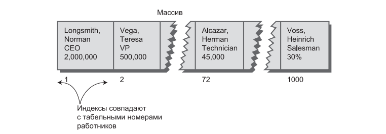
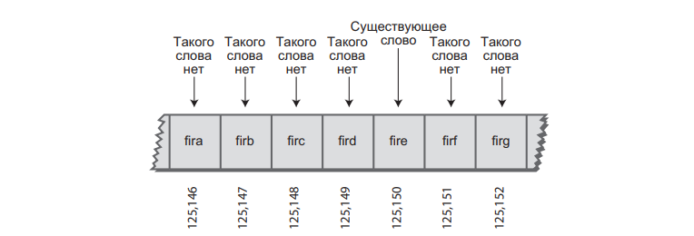
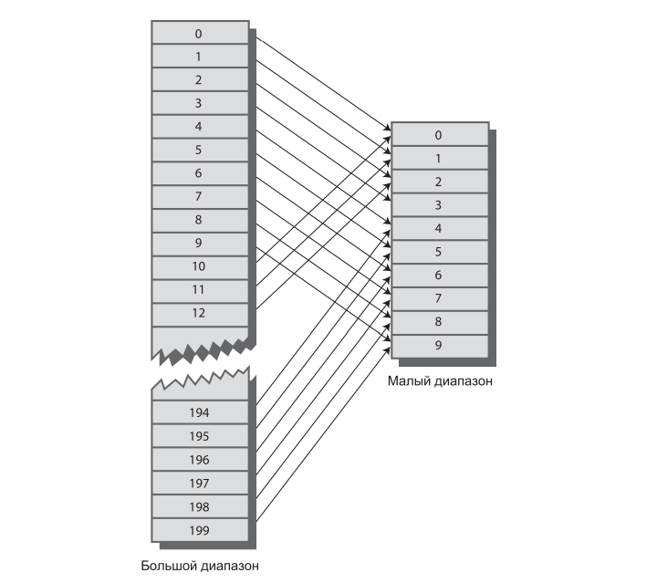
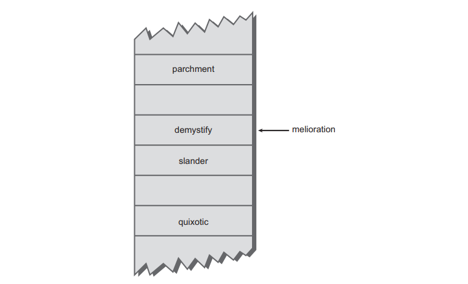
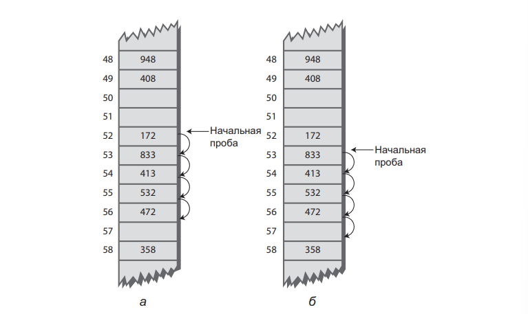
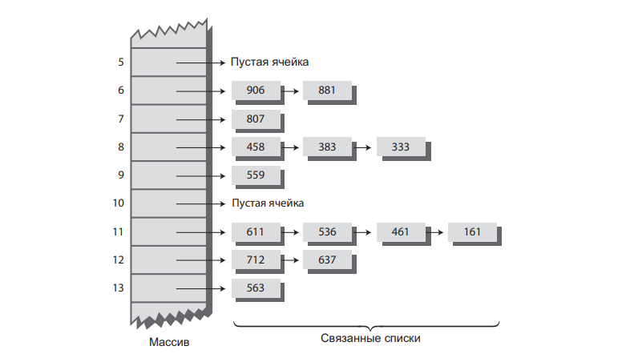

# Занятие №6 01.04.2025
## Хеш-таблицы. Хеширование.
### Введение
Хеш-таблицей называется структура данных, обеспечивающая очень быструю вставку и поиск.
Трудно поверить, но независимо от количества элементов данных вставка и поиск (а иногда и удаление) выполняются за время, близкое к постоянному: $O(1)$.

Хеш-таблицы по скорости значительно превосходят деревья, которые, как мы выяснили ранее, выполняют операции за относительно малое время $O(logN)$.

Однако, у хеш-таблиц также имеются свои недостатки.
Они реализуются на базе массивов, а массивы трудно расширить после создания. 
У некоторых разновидностей хеш-таблиц быстродействие катастрофически падает при заполнении таблицы, поэтому программист должен довольно точно представлять, сколько элементов данных будет храниться в таблице.

Кроме того, при работе с хеш-таблицами не существует удобного способа перебора элементов в определенном порядке (скажем, от меньших к большим). 
Если необходима такая возможность, стоит поискать другую структуру данных.

Но если нет нужды перебирать элементы в определенном порядке, а размер базы данных можно спрогнозировать заранее, хеш-таблицы не имеют себе равных по скорости и удобству.

### Хеширование
Одним из основных понятий работы хеш-таблиц является ключ.
Ключ формируется с помощью хеш-функций и определяет индекс расположения элемента в массиве, но с некоторыми оговорками, которые мы разберем далее.
Ранее, во время изучения сравнений объектов и контракта `equals & hashCode`, вы уже сталкивались с понятием хеш-функции.
Когда мы переопределяем метод `hashCode`, по сути, мы создаем свою хеш-функцию.
Единственное, у этой функции другое концептуальное значение, в чем вы убедитесь далее.

Сегодня мы сделаем акцент на процессе хеширования и формирования хеш-функции.
Впрочем, для некоторых видов ключей хеширование не требуется, значения ключей могут использоваться напрямую как индексы массива.
Начнем с разбора этой простой ситуации, а затем перейдем к применению хеширования в ситуациях, когда ключи не имеют удобного распределения.

#### Пример 1. Табельные номера как ключи.
Предположим, мы пишем программу для отдела кадров небольшой компании — допустим, со штатом в 1000 работников.
Директор отдела кадров требует как можно более быстрого доступа к любой отдельной записи.
Всем работникам в штате фирмы присвоены табельные номера от 1 (учредитель) до 1000 (последний нанятый работник).
Табельные номера могут использоваться в качестве ключей для обращения к записям; в быстром доступе по другим ключам необходимости нет.
Работники увольняются редко, причем даже после увольнения их записи остаются в базе данных (для учета выходных пособий и т. д.). 
Какую структуру данных следует использовать в такой ситуации?

##### Индексы как ключи
База данных легко реализуется в виде простого массива.
Каждая запись работника занимает одну ячейку, а индекс ячейки используется в качестве табельного номера.


Как известно, обращение к элементу массива по индексу происходит очень быстро. 
Пользователь, ищущий данные работника _Henry Alcazar_, знает, что этому работнику присвоен табельный номер 72; он вводит это число, и программа немедленно обращается к элементу массива с индексом 72.
`Employee emp = databaseArray[72];`

Операция добавления нового элемента тоже выполняется очень быстро: элемент просто вставляется за последней занятой ячейкой. 
Следующая новая запись будет записана в ячейку 1001. 
`databaseArray[totalEmployees++] = newEmp;`

Размер массива несколько превышает текущее количество работников для возможного расширения штата, но сколько-нибудь значительного расширения не планируется.

Благодаря скорости и простоте обращения к элементам в такой базе данных такое решение выглядит весьма привлекательно. 
Однако в нашей ситуации оно работает только потому, что ключи имеют четко определенную структуру. 
Записи нумеруются последовательно от единицы до заранее известного максимума, и этот максимум соответствует приемлемому размеру массива. 
При отсутствии удалений в массиве не появятся пустоты, приводящие к неэффективному расходованию памяти. 
Новые элементы последовательно добавляются в конец массива, поэтому размер массива не обязан значительно превышать текущее количество элементов.

#### Пример 2. Словарь. Отсутствие четкой структуры.
Однако, ключи далеко не всегда настолько удобны, как в только что рассмотренном примере.
Классическим примером служит словарь.
У слов нет табельных номеров которые можно было бы использовать в качестве индексов массива.
Если мы хотите разместить в памяти компьютера все слова английского языка, от _a_ до _zyzzyva_ с возможностью быстрого обращения, хеш-таблица хорошо подойдет для этой цели.

> Хеш-таблицы также часто применяются в компиляторах для работы с таблицами символических имен.
> В таблице символических имен хранятся все имена переменных и функций, заданные программистом, вместе с адресами их расположения в памяти.
> Компилятор должен очень быстро обращаться к этим именам, поэтому хеш-таблица в данном случае является предпочтительной структурой данных.

Допустим, мы хотим сохранить в оперативной памяти словарь английского языка на 50 000 слов.
Каждое слово должно занимать отдельную ячейку массива, чтобы к каждому слову можно было обратиться по его индексу.
Доступ к данным будет очень быстрым, но как связать индексы со словами?
Скажем, вы хотите найти в словаре слово _morphosis_, как определить его индекс?

##### Преобразование слов в числа
Нам нужна система, которая преобразует слово в соответствующий ему индекс.
Как известно, компьютеры используют разные схемы числового представления отдельных символов.
Одной из таких схем является кодировка ACII.
Для примера мы используем упрощенную кодировку.
Допустим, буква «a» представляется кодом 1, буква «b» — кодом 2 и т. д., до «z» (код 26). 
Пробел представляется 0, итого 27 символов.

Как объединить коды отдельных букв в число, представляющее целое слово?
Рассмотрим пару способов.

###### Суммирование
Простейший способ преобразования слова в число заключается в обычном суммировании кодов символов.
Допустим, мы хотим преобразовать слово _cats_ в число.
Сначала преобразуем символы в числа, а затем просто просуммируем их.

$$$c = 3$$$
$$$a = 1$$$
$$$t = 20$$$
$$$s = 19$$$
$$$3 + 1 + 20 + 19 = 43.$$$

Итак, в нашем словаре слово cats будет храниться в ячейке массива с индексом 43. 
Другим словам также назначаются индексы, вычисленные аналогичным образом.

Но так ли хорош этот подход?
Допустим, что мы храним слова максимум из 10 букв.
В таком случае первое слово алфавита «_a_» будет кодироваться следующей последовательностью (напомню, что пробел кодируется 0):

$$$0 + 0 + 0 + 0 + 0 + 0 + 0 + 0 + 0 + 1 = 1.$$$

Теоретически последним словом в словаре будет последовательность _zzzzzzzzzz_
(10 букв «_z_»). Суммируя коды символов, получаем

$$$26 + 26 + 26 + 26 + 26 + 26 + 26 + 26 + 26 + 26 = 260.$$$

Таким образом, все коды в словаре лежат в диапазоне от 1 до 260. 
К сожалению, словарь содержит 50 000 слов, и индексов оказывается явно недостаточно. 
В каждом элементе массива придется хранить в среднем 192 слова ($50 000/260$).

Естественно, в рамках схемы «одно слово на один элемент массива» это создаст проблемы. 
Теоретически в каждом элементе массива можно разместить подмассив или связанный список слов. 
К сожалению, такое решение приведет к серьезному ухудшению скорости доступа. 
Обращение к элементу массива будет быстрым, но перебор 192 слов в поисках нужного займет слишком много времени.

Итак, первый способ преобразования слов в числа оставляет желать лучшего.
Слишком много слов преобразуется в одинаковые индексы.
Следовательно, описанный подход не обладает достаточной избирательностью — полученный массив содержит слишком мало элементов. 
Диапазон возможных индексов необходимо расширить.

###### Умножение на степени
Рассмотрим другой способ перевода слов в числа.
Попробуем создать массив, в котором каждое слово гарантированно занимает отдельную ячейку.
Для этого необходимо разработать такую схему преобразования, в которой каждый символ слова вносит уникальный вклад в итоговое число.

Вспомним, в обычном числе, состоящем из нескольких цифр, каждая цифра представляет значение в 10 раз большее, чем цифра справа от нее. 
Таким образом, запись 7546 в действительности означает
$$$7*1000 + 5*100 + 4*10 + 6*1 = 7*10^3 + 5*10^2 + 4*10^1 + 6*10^0$$$

В этой схеме число разбивается на цифры, каждая цифра умножается на соответствующую степень 10 (так как существует 10 возможных цифр), после чего произведения суммируются.

Аналогичным образом можно поступить и со словом: разложить его на буквы, преобразовать буквы в числовые эквиваленты, умножить их на соответствующие степени 27 (так как существует 27 возможных символов, включая пробелы) и сложить результаты. 
В результате для каждого слова генерируется уникальное число.

Допустим, нам потребовалось преобразовать слово _cats_ в число. 
Мы заменяем буквы цифрами так, как было показано ранее, после чего умножаем каждое число на соответствующую степень 27 и суммируем результаты:

$$$3*273 + 1*272 + 20*271 + 19*270 = 3*19 683 + 1*729 + 20*27 + 19*1 = 59 049 + 729 + 540 + 19 = 60 337$$$

Эта схема действительно генерирует уникальное число для каждого потенциального слова. 
Мы только что вычислили числовой эквивалент слова из четырех букв.
А что произойдет со словами большего размера? 
К сожалению, диапазон чисел становится очень большим. 
Наибольшее 10-буквенное слово zzzzzzzzzz преобразуется в

$$$26*27^9 + 26*27^8 + 26*27^7 + 26*27^6 + 26*27^5 + 26*27^4 + 26*27^3 + 26*27^2 + 26*27^1 + 26*27^0$$$

Значение $27^9$ само по себе превышает $7 000 000 000 000$, так что сумма получается огромной. 
Массив, хранимый в памяти, не может содержать такого количества элементов.

Концептуальным недостатком этой схемы является то, что элемент массива выделяется для каждой последовательности букв, независимо от того, существует такое слово или нет. 



##### Итог
Первая схема (с суммированием кодов букв) генерировала слишком мало индексов. 
Вторая схема (с суммированием кодов букв, умноженных на степени 27) генерирует слишком много индексов.

#### Хеширование
Вернемся к хешированию, в контексте рассматриваемых ранее примеров.
Огромный диапазон чисел, полученных по схеме с умножением на степени, необходимо каким-то образом сжать до диапазона, соответствующего приемлемому размеру массива.

Каким должен быть этот размер для массива, в котором хранится словарь?
Можно предположить, раз слов 50000, то и массив должен состоять из 50000 элементов.
Однако, массив должен содержать примерно вдвое больше ячеек (причины мы выясним позже).
Нам понадобится массив из 100 000 элементов.

Это означает, что отображение должно сжимать диапазон от $0$ до более $7 000 000 000 000$ до диапазона от $0$ до $100 000$.
Простейшим решением является использование оператора вычисления остатка от целочисленного деления (`%`).
Разберем этот подход на более скромном примере.
Допустим, числа из диапазона от $0$ до $199$ (представленные переменной `largeNumber`) должны отображаться в диапазон от $0$ до $9$ (переменная `smallNumber`).
Сокращенный диапазон состоит из $10$ чисел (переменная `smallRange`).
Верхняя граница «большого» диапазона для нас не существенна (лишь бы числа не превышали максимальное значение переменной).
Выражение для выполнения преобразования на языке Java выглядит так: `smallNumber = largeNumber % smallRange;`.
Остатки от деления любого числа на $10$ всегда лежат в диапазоне от $0$ до $9$; например, результат выражения `13%10` равен $3$, а результат `157%10` равен $7$.
Диапазон $0–199$ преобразуется в диапазон $0–9$, то есть происходит сжатие с коэффициентом $20:1$.



Аналогичное выражение может использоваться для сжатия очень больших чисел, однозначно представляющих каждое слово нашего словаря, в индексы массива:
`arrayIndex = hugeNumber % arraySize;`

Это выражение является примером хешфункции — функции, преобразующей число из большего диапазона в число из меньшего диапазона. 
Меньший диапазон соответствует индексам массива. 
Массив, в который вставляются данные с использованием **хеш-функции**, называется **хеш-таблицей**.

Подведем итог: слово преобразуется в очень большое число, для чего код каждого символа умножается на соответствующую степень 27.
```
hugeNumber = ch0*27^9 + ch1*27^8 + ch2*27^7 + ch3*27^6 + ch4*27^5 + ch5*27^4 + ch6*27^3 + ch7*27^2 + ch8*27^1 + ch9*27^0
```

Затем при помощи оператора вычисления остатка (`%`) числовой диапазон «сжимается» в диапазон, размер которого вдвое больше количества хранимых элементов. 
В преобразовании используется хеш-функция:

```
arraySize = numberWords * 2;
arrayIndex = hugeNumber % arraySize;
```

В большом диапазоне каждое число представляет потенциальный элемент данных (последовательность букв), но лишь немногие из этих чисел представляют реально существующие элементы. 
Хеш-функция преобразует большие числа в индексы намного меньшего массива. 
Предполагается, что в нашем массиве на каждые две ячейки будет приходиться одно слово. 
В некоторых ячейках слов не будет, а в других будет более одного слова.

Конечно, у этой схемы есть проблемы, самая жирная, это то, что число `hugeNumber` однозначно вылезет за границы переменной `long`.
Но для концептуального понимания, этого более чем достаточно.

#### Коллизии
Сокращение диапазона значений имеет свою цену.
Схема уже не гарантирует, что после сжатия два слова не будут хешироваться в один индекс массива.

Нечто похожее происходило и при суммировании кодов букв, но тогда все было гораздо хуже. 
При суммировании было всего 260 возможных результатов (для слов длиной до 10 букв), а теперь диапазон расширяется до 50 000 возможных результатов.

Мы надеялись, что на один индекс будет приходиться один элемент данных, но как оказалось, это невозможно. 
Лучшее, на что можно надеяться, что не слишком много слов будет хешироваться в один индекс.

Предположим, в массив вставляется слово _melioration_. 
Слово хешируется, вы вычисляете его индекс — и тут выясняется, что ячейка с этим индексом уже занята словом _demystify_, которое имеет точно такой же хеш-код (для заданного размера массива).
Такая ситуация называется **коллизией**.



Может показаться, что из-за возможности коллизий вся схема хеширования теряет смысл, но у проблемы существует несколько обходных решений.

При определении массива количество зарезервированных ячеек вдвое превышало количество элементов данных. 
Таким образом, приблизительно половина ячеек остается пустой.

Одно из возможных решений при возникновении коллизии заключается в систематизированном поиске пустой ячейки и вставке нового элемента в нее (вместо индекса, полученного в результате применения хеш-функции). 
Такое решение называется **открытой адресацией**. 
Если слово _cats_ хешируется в индекс $5421$, а эта ячейка уже занята словом _parsnip_, можно попытаться вставить _cats_ в другую ячейку, например $5422$.

Во втором решении (упоминавшемся ранее) создается массив, содержащий связанные списки слов вместо самих слов. 
При возникновении коллизии новый элемент просто вставляется в список с соответствующим индексом. 
Этот метод называется **методом цепочек**.

#### Открытая адресация. Линейное пробирование.
Если элемент данных не удается разместить в ячейке с индексом, вычисленным посредством хеш-функции, метод открытой адресации ищет в массиве другую ячейку.
Сегодня, мы рассмотрим одну из разновидностей открытой адресации - линейное пробирование.

> Есть еще два: квадратичное пробирование и двойное хеширование.
> Их мы рассмотрим на следующей лекции.

Алгоритм линейного пробирования последовательно ищет пустые ячейки.
Если при попытке вставки элемента выясняется, что ячейка $5421$ занята, мы переходим к ячейке $5422$, затем к ячейке $5423$ и т. д.
Индекс последовательно увеличивается до тех пор, пока не будет найдена пустая ячейка. 
Процедура поиска называется «линейным пробированием», потому что она основана на линейной проверке последовательности ячеек.

##### Программная реализация
Перед тем как рассматривать код, хотелось бы сделать одно замечание.
В алгоритме, мы часто будем допускать тот факт, что таблица не заполнена до конца.
Как мы отметили во введении, хеш-таблица работает не оптимально в случае полной заполненности.
Поэтому, ответственный программист не только не будет ждать заполнения таблицы, но и расширит ее, когда наполнение будет на уровне примерно $2/3$.

Наша таблица будет содержать в себе довольно простые объекты.
```java
public class Item {
    private final int key;

    public Item(int key) {
        this.key = key;
    }

    public int getKey() {
        return key;
    }
}
```

###### Метод `find()`
```java
public Item find(int key) { // Поиск элемента с заданным ключом (Метод предполагает, что таблица не заполнена)
    int hashVal = hashFunc(key); // Хеширование ключа
    while (hashArray[hashVal] != null) { // Пока не будет найдена пустая ячейка
        if (hashArray[hashVal].getKey() == key) { // Ключ найден?
            return hashArray[hashVal]; // Да, вернуть элемент
        }
        hashVal += 1; // Переход к следующей ячейке
        hashVal %= arraySize; // При достижении конца таблицы
    } // происходит возврат к началу
    return null; // Элемент не найден
}
```


Алгоритм Find последовательно перебирает каждую ячейку последовательности. 
Обнаружив пустую ячейку до того, как будет обнаружен искомый ключ, он знает, что поиск завершился неудачей. 
Искать дальше бессмысленно, потому что алгоритм вставки поместил бы элемент в эту (или более раннюю) ячейку.

###### Метод `insert()`
```java
public void insert(Item item) {// Вставка элемента данных (Метод предполагает, что таблица не заполнена)
    int key = item.getKey(); // Получение ключа
    int hashVal = hashFunc(key); // Хеширование ключа
    // Пока не будет найдена
    while (hashArray[hashVal] != null && hashArray[hashVal].getKey() != -1) { // пустая ячейка или -1,
        hashVal += 1; // Переход к следующей ячейке
        hashVal %= arraySize; // При достижении конца таблицы
    } // происходит возврат к началу
    hashArray[hashVal] = item; // Вставка элемента
}
```

Метод `insert()` использует похожий алгоритм для определения позиции, в которой должен находиться элемент данных, но вместо конкретного элемента он ищет пустую ячейку или удаленный элемент (ключ –1). 
Обнаружив пустую ячейку, `insert()` размещает в ней новый элемент.

###### Метод `delete()`
```java
public Item delete(int key) {// Удаление элемента данных
    int hashVal = hashFunc(key); // Хеширование ключа
    while (hashArray[hashVal] != null) { // Пока не будет найдена пустая ячейка
        if (hashArray[hashVal].getKey() == key) { // Ключ найден?
            Item temp = hashArray[hashVal]; // Временное сохранение
            hashArray[hashVal] = new Item(-1); // Удаление элемента
            return temp; // Метод возвращает элемент
        }
        hashVal += 1; // Переход к следующей ячейке
        hashVal %= arraySize; // При достижении конца таблицы
    } // происходит возврат к началу
    return null; // Элемент не найден
}
```

Реализация метода `delete()` использует код, аналогичный `find()`, для поиска существующего элемента. 
Обнаружив элемент, `delete()` заменяет его специальным элементом данных с заранее определенным ключом $–1$.

#### Группировка
По мере заполнения хеш-таблицы группы элементов, образовывающиеся в результате пробирования, становятся все длиннее. 
Группировка приводит к значительному увеличению продолжительности пробирования. 
А это означает, что обращения к ячейкам в конце последовательности происходят очень медленно.

Чем сильнее заполняется массив, тем серьезнее становится проблема группировки. 
В массиве, заполненном наполовину, эта проблема обычно не проявляется; и даже при заполнении массива на две трети все еще приемлемо. 
Но превышение этого порога приводит к серьезному снижению быстродействия, так как группы становятся все больше и больше.

Следовательно, при проектировании хеш-таблицы очень важно позаботиться о том, чтобы таблица никогда не заполнялась более чем наполовину или по крайней мере на две трети.

#### Расширение массива
Когда хеш-таблица становится слишком полной, ее необходимо расширить.
В языке Java массивы имеют фиксированный размер и не могут расширяться динамически. 
Программа должна создать новый массив большего размера, а затем вставить в него все содержимое старого (меньшего) массива.

Напомним, что хеш-функция при вычислении местонахождения заданного элемента данных учитывает размер массива, поэтому в больших и малых массивах элементы должны занимать разные ячейки.
Следовательно, элементы нельзя просто скопировать из одного массива в другой.
Придется последовательно, ячейка за ячейкой, перебрать старый массив и вставить каждый найденный элемент в новый массив методом `insert()`.
Процесс перехеширования занимает много времени, но он необходим для расширения массива.

Расширенный массив обычно вдвое больше исходного массива. 
Вообще говоря, поскольку размер массива должен быть простым числом, размер нового массива должен возрасти немного более, чем вдвое. 
Вычисление нового размера массива является частью процесса перехеширования.

```java
private int getPrime(int min) { // Возвращает первое простое число > min
    for (int j = min + 1; true; j++) {// Для всех j > min
        if (isPrime(j)) { // Число j простое?
            return j; // Да, вернуть его
        }
    }
}

private boolean isPrime(int n) { // Число n простое?
    for (int j = 2; (j * j <= n); j++) { // Для всех j
        if (n % j == 0) { // Делится на j без остатка?
            return false; // Да, число не простое
        }
    }
    return true; // Нет, число простое
}
```

#### Метод цепочек
При открытой адресации коллизии разрешаются поиском свободных ячеек в хештаблице. Другое возможное решение основано на ведении отдельного связанного списка по каждому индексу в хеш-таблице.
Ключ элемента данных хешируется в индекс обычным способом, а полученный элемент вставляется в связанный список по этому индексу. 
Другие элементы, хешируемые в тот же индекс, просто добавляются в связанный список; искать пустые ячейки в первичном массиве просто не нужно.



На концептуальном уровне метод цепочек реализуется проще, чем различные схемы пробирования, используемые при открытой адресации. 
С другой стороны, объем кода увеличивается, так как программа должна реализовать механизм ведения связанных списков — как правило, для их представления в программу вводятся дополнительные классы.

##### Программная реализация
```java
public class Link {
    private final int key;
    private Link next;

    public Link(int key) {
        this.key = key;
    }

    public int getKey() {
        return key;
    }

    public Link getNext() {
        return next;
    }

    public void setNext(Link next) {
        this.next = next;
    }

    public void displayLink() {
        System.out.print(key + " ");
    }
}
```

```java
public class LinkedList {
    private Link first;

    public void insert(Link theLink) {
        int key = theLink.getKey();
        Link previous = null;
        Link current = first;

        while (current != null && key > current.getKey()) {
            previous = current;
            current = current.getNext();
        }
        if (previous == null) {
            first = theLink;
        } else {
            previous.setNext(theLink);
        }
        theLink.setNext(current);
    }

    public void delete(int key) {
        Link previous = null;
        Link current = first;

        while (current != null && key != current.getKey()) {
            previous = current;
            current = current.getNext();
        }

        if (previous == null) {
            first = first.getNext();
        } else {
            previous.setNext(current.getNext());
        }
    }

    public Link find(int key) {
        Link current = first;

        while (current != null && current.getKey() <= key) {
            if (current.getKey() == key) {
                return current;
            }
            current = current.getNext();
        }
        return null;
    }

    public void displayList() {
        System.out.print("List (first-->last): ");
        Link current = first;
        while (current != null) {
            current.displayLink();
            current = current.getNext();
        }
        System.out.println();
    }
}
```

###### Конструктор
```java
public ChainHashTable(int size) {
    arraySize = size;
    hashArray = new LinkedList[arraySize]; // Создание массива
    for (int j = 0; j < arraySize; j++) { // Заполнение массива списками
        hashArray[j] = new LinkedList();
    }
}
```

###### Метод `find()`
```java
public Link find(int key) { // Поиск элемента
    int hashVal = hashFunc(key); // Хеширование ключа
    return hashArray[hashVal].find(key); // Метод возвращает найденный элемент
}
```

###### Метод `insert()`
```java
public void insert(Link theLink) { // Вставка элемента
    int key = theLink.getKey();
    int hashVal = hashFunc(key); // Хеширование ключа
    hashArray[hashVal].insert(theLink); // Вставка в позиции hashVal
}
```

###### Метод `delete()`
```java
public void delete(int key) { // Удаление элемента
    int hashVal = hashFunc(key); // Хеширование ключа
    hashArray[hashVal].delete(key); // Удаление
}
```

## Итог
На этом занятии, вы узнали основные понятия необходимые для работы с хеш-таблицами.
Разобрали ситуации разрешения коллизии и проведения компрессии.

На следующих занятиях мы разберем более сложные способы разрешения коллизий.
Углубимся в процесс создания хеш-функций.
И проанализируем сложность при различных способах реализации хеш-таблиц.

## Лабораторная работа №6
1. Реализовать хеш-таблицу из чисел типа `int`.
2. Внедрить алгоритм расширения хеш-таблицы, при достижении количества элементов определенного значения.