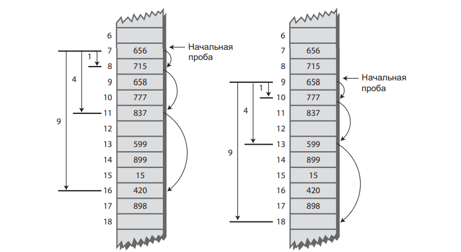
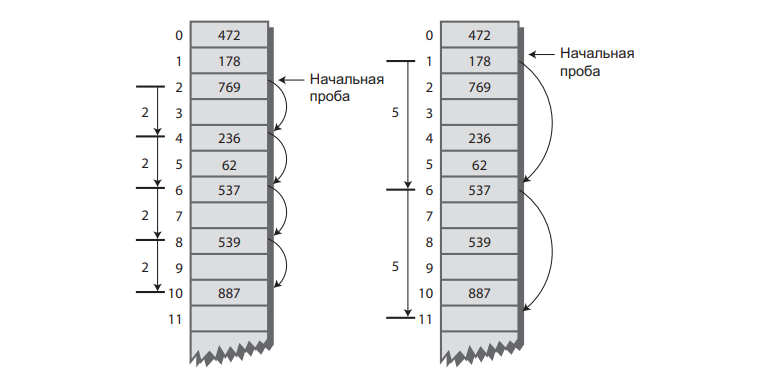

# Занятие №7 08.04.2025
## Хеш-таблицы. Продвинутое пробирование. Хеш-функции.
### Квадратичное пробирование
Как мы выяснили на прошлом занятии, одной из проблем линейного пробирования является образование группировок.
Образовавшиеся группы начинают расширяться.
Элементы, хешируемые в пределах группы, добавляются в конец группы, в результате чего группа становится еще больше. 
Чем больше размер группы, тем быстрее она растет.

> Чем больше толпа, тем больше людей она привлекает.

Квадратичное пробирование пытается избежать образования групп. 
Его идея заключается в том, чтобы проверять ячейки, находящиеся на больших расстояниях (вместо ячеек, находящихся вблизи от исходной позиции хеширования).

#### Вычисление шага
При линейном пробировании, если первичный индекс хеширования равен $x$, то последующие пробы проверяют позиции $x + 1$, $x + 2$, $x + 3$ и т. д.
При квадратичном пробировании проверяются позиции $x + 1$, $x + 4$, $x + 9$, $x + 16$, $x + 25$ и т. д.
Если более формально, то расстояние от исходной позиции вычисляется как квадрат номера шага: $x + 1^2$ , $x + 2^2$ , $x + 3^2$ , $x + 4^2$ , $x + 5^2$ и т. д.



Квадратичное пробирование решает проблему группировки, присущую линейной группировке - первичную группировку;
Однако, возникает проблема вторичной группировки. 
Как мы выяснили, все ключи, хешируемые в конкретный индекс, ищут свободную ячейку в одной и той же последовательности.
Допустим, элементы 184, 302, 420 и 544 хешируются в индекс 7 и вставляются в хеш-таблицу в указанном порядке. 
В этом случае индекс 302 потребует смещения на одну ячейку, индекс 420 — смещения на 4 ячейки, а индекс 544 — на 9 ячеек.
У каждого дополнительного элемента, хешируемого в индекс 7, смещение будет еще большим. 
Это явление называется вторичной группировкой.

Пусть вторичная группировка и не создает серьезных проблем.
Все же квадратичное пробирование на практике применяется нечасто, потому что существует другое, более удачное решение.

### Двойное хеширование
Для устранения как первичной, так и вторичной группировки применяется алгоритм двойного хеширования.
В идеале последовательность проб должна генерироваться в зависимости от ключа (вместо использования набора одинаковых смещений для всех ключей).
В этом случае числа с разными ключами, хешируемые в один индекс, будут использовать разные последовательности смещений.

Задача решается повторным хешированием ключа с другой хеш-функцией и использованием результата в качестве смещения.
Для заданного ключа размер смещения остается постоянным при пробировании, но для разных ключей используются разные размеры.

Как показала практика, вторичная хеш-функция должна обладать некоторыми характеристиками:
- Она не должна совпадать с первичной хеш-функцией.
- Ее результат никогда не должен быть равен 0.

Как правило используют функцию следующего вида: `смещение = константа - (ключ % константа);`, где константа - простое число, меньшее размера массива.
Допустим константа равна $5$, в таком случае `stepSize = 5 - (key % 5);`.
При такой хеш-функции размеры смещений лежат в диапазоне от 1 до 5.



#### Программная реализация
Реализация хеш-таблицы с двойным хешированием очень похожа на хеш-таблицу с линейным пробированием.
Основным отличием является использование дополнительной хеш-функции для расчета смещения.

##### Метод `find()`
```java
public Item find(int key) { // Поиск элемента с заданным ключом (Метод предполагает, что таблица не заполнена)
    int hashVal = hashFunc(key); // Хеширование ключа
    int stepSize = stepSizeCounter(key); // Расчет смещения
    
    while (hashArray[hashVal] != null) { // Пока не будет найдена пустая ячейка
        if (hashArray[hashVal].getKey() == key) { // Ключ найден?
            return hashArray[hashVal]; // Да, вернуть элемент
        }
        hashVal += stepSize; // Переход к следующей ячейке
        hashVal %= arraySize; // При достижении конца таблицы
    } // происходит возврат к началу
    return null; // Элемент не найден
}
```

##### Метод `insert()`
```java
public void insert(Item item) {// Вставка элемента данных (Метод предполагает, что таблица не заполнена)
    int key = item.getKey(); // Получение ключа
    int hashVal = hashFunc(key); // Хеширование ключа
    int stepSize = stepSizeCounter(key); // Расчет смещения
    
    // Пока не будет найдена
    while (hashArray[hashVal] != null && hashArray[hashVal].getKey() != -1) { // пустая ячейка или -1,
        hashVal += stepSize; // Переход к следующей ячейке
        hashVal %= arraySize; // При достижении конца таблицы
    } // происходит возврат к началу
    hashArray[hashVal] = item; // Вставка элемента
}
```

##### Метод `delete()`
```java
public Item delete(int key) {// Удаление элемента данных
    int hashVal = hashFunc(key); // Хеширование ключа
    int stepSize = stepSizeCounter(key); // Расчет смещения
    
    while (hashArray[hashVal] != null) { // Пока не будет найдена пустая ячейка
        if (hashArray[hashVal].getKey() == key) { // Ключ найден?
            Item temp = hashArray[hashVal]; // Временное сохранение
            hashArray[hashVal] = new Item(-1); // Удаление элемента
            return temp; // Метод возвращает элемент
        }
        hashVal += stepSize; // Переход к следующей ячейке
        hashVal %= arraySize; // При достижении конца таблицы
    } // происходит возврат к началу
    return null; // Элемент не найден
}
```

##### Пример
Ниже показано, что произойдет при вставке 21 элемента в хеш-таблицу из 23 ячеек с применением двойного хеширования (константа = 5).

| Номер | Ключ | Хеш-код | Смещение | Последовательность проб  |
|-------|------|---------|----------|--------------------------|
| 1     | 1    | 1       | 4        |                          |
| 2     | 38   | 15      | 2        |                          |
| 3     | 37   | 14      | 3        |                          |
| 4     | 16   | 16      | 4        |                          |
| 5     | 20   | 20      | 5        |                          |
| 6     | 3    | 3       | 2        |                          |
| 7     | 11   | 11      | 4        |                          |
| 8     | 24   | 1       | 1        | 2                        |
| 9     | 5    | 5       | 5        |                          |
| 10    | 16   | 16      | 4        | 20 1 5 9                 |
| 11    | 10   | 10      | 5        |                          |
| 12    | 31   | 8       | 4        |                          |
| 13    | 18   | 18      | 2        |                          |
| 14    | 12   | 12      | 3        |                          |
| 15    | 30   | 7       | 5        |                          |
| 16    | 1    | 1       | 4        |                          |
| 17    | 19   | 19      | 1        |                          |
| 18    | 36   | 13      | 4        | 17                       |
| 19    | 41   | 18      | 4        | 22                       |
| 20    | 15   | 15      | 5        | 20 2 7 12 17 22 4        |
| 21    | 25   | 2       | 5        | 7 12 17 22 4 9 14 19 1 6 |

Первые 15 ключей хешируются в основном в свободные ячейки.
Далее по мере заполнения массива последовательности проб удлиняются.
Итоговый массив ключей выглядит так: ` ** 1 24 3 15 5 25 30 31 16 10 11 12 1 37 38 16 36 18 19 20 ** 41 `

### Выбор размера таблицы
Подытожить тему устранения коллизий хотелось ответом на крайне важный вопрос: "Как правильно выбрать размер таблицы?".

Если коротко, то размер таблицы должен быть простым числом.

Если подробнее, то стоит начать с примера.
Представим ситуацию, в которой размер таблицы простым числом не является.
Предположим, размер массива равен 15 (индексы от 0 до 14), а конкретный ключ хешируется в исходный индекс 0 со смещением 5. 
Пробы будут выполняться в последовательности 0, 5, 10, 0, 5, 10 и т. д. до бесконечности.
Проверяются только эти три ячейки, поэтому алгоритм «не увидит» пустые ячейки 1, 2, 3 и т. д., а из попытки выполнения операции ничего не выйдет.

Если бы размер массива был равен 13 (простое число), то в процессе пробирования в конечном итоге была бы проверена каждая ячейка: 0, 5, 10, 2, 7, 12, 4, 9, 1, 6, 11, 3 и т. д. 
Даже если в массиве имеется всего одна пустая ячейка, она будет успешно обнаружена. 
Простой размер массива не делится нацело ни на какое число, поэтому последовательность проб рано или поздно проверит каждую ячейку.

### Итог
В общем случае при использовании открытой адресации предпочтение следует отдавать двойному хешированию.

### Хеш-функции
Для начала, хотелось бы отметить основное требование к хеш-функции.
Хорошая хеш-функция должна быть простой, чтобы ее результат быстро вычислялся.
Если хеш-функция работает медленно, то будет утрачено главное преимущество хеш-таблиц — скорость.

Основной целью хеш-функции является преобразование диапазона ключей в диапазон индексов, обеспечивающее равномерное распределение ключей по индексам хеш-таблицы.
Ключи могут быть как полностью случайными, так и частично детерминированными.

#### Случайные ключи
Идеальная хеш-функция ставит в соответствие каждому значению ключа уникальный индекс.
Такое поведение возможно только при нетипично «хорошем» поведении ключей с диапазоном, достаточно узким для прямого использования в качестве индексов (как в примере с табельными номерами работников).

Как мы видели в примере со словарем ни одно из этих условий не выполняется, и хеш-функции приходится сжимать широкий диапазон ключей в меньший диапазон индексов.
В случае случайных ключей, мы можем допустить, что данные равномерно распределены по всему диапазону.
Для такой ситуации хеш-функция вида `индекс = ключ % размер_массива;`.

#### Неслучайные ключи
Однако на практике данные часто распределяются не полностью случайным образом.
Представим БД деталей для машин, ключами будут выступать номера деталей в формате:
$$$033-400-03-94-05-0-535$$$
Формат номера интерпретируется следующим образом:
Цифры 0–2: код поставщика (от 1 до 999, в настоящее время до 70). \
Цифры 3–5: код категории (100, 150, 200, 250 и т. д. до 850). \
Цифры 6–7: месяц запуска в производство (от 1 до 12). \
Цифры 8–9: год запуска в производство (от 00 до 99). \
Цифры 10–11: серийный номер (от 1 до 99). \
Цифра 12: признак токсичности (0 или 1). \
Цифры 13–15: контрольная сумма (остаток от деления суммы других полей на
100). \

Ключ для приведенного номера детали будет иметь вид 0 334 000 394 050 535.
Однако такие ключи распределены неравномерно.
Большинство чисел из диапазона 0 до 9 999 999 999 999 999 не может использоваться в качестве ключа (например, числа с кодами поставщиков выше 70, коды категорий, не кратные 50, или месяцы от 13 до 99).
Кроме того, контрольная сумма вычисляется в зависимости от других чисел.
Чтобы эти числа образовали более случайный диапазон, их необходимо подвергнуть дополнительной обработке.

##### Исключение неинформативных частей
Поля ключа необходимо по возможности «сжать», чтобы каждый их бит нес полезную информацию.
Например, поле кода категории можно изменить так, чтобы в нем могли храниться только значения в диапазоне от 0 до 15.
Кроме того, поле контрольной суммы следует исключить из ключа, так как оно не содержит дополнительной информации; это избыточные данные, намеренно введенные с целью контроля.

##### Использование всех данных
Каждая часть ключа (кроме неинформативных частей, о которых говорилось выше) должна вносить свой вклад в вычисление хеш-функции.
Чем больше данных учитывается при вычислении ключа, тем больше вероятность хеширования ключей по всему диапазону индексов.

##### Использование простых чисел при вычислении остатка
Ранее рассмотренные примеры дали нам понять, что в хеш-функциях часто используется оператор вычисления остатка (%) с размером таблицы.
Также, мы выяснили, что выбор простого числа в качестве размера таблицы играет важную роль при квадратичном пробировании и двойном хешировании.
Но если сами ключи имеют неслучайное распределение, размер таблицы должен быть простым числом независимо от выбора системы хеширования.

Дело в том, что если многие ключи имеют общий делитель с размером массива, они часто хешируются в одну позицию, а это приводит к группировке.
Простой размер таблицы исключает такую возможность.
Чем больше делителей может быть у числа, тем больше вероятность возникновения коллизий.

#### Хеширование строк
На прошлом занятии мы рассматривали способ преобразования коротких строк в числовые ключи, основанный на умножении кодов символов на степени константы.
$cats = 3*27^3 + 1*27^2 + 20*27^1 + 19*27^0$
К достоинствам такого решения следует отнести то, что в нем задействованы все символы входной строки.
Вычисленное значение ключа хешируется в индекс массива обычным способом:
`index = (key) % arraySize;`

```java
public static int hashFunc1(String key) {
    int hashVal = 0;
    int pow27 = 1; // 1, 27, 27*27 и т. д.
    for (int j = key.length() - 1; j >= 0; j--) { // Справа налево
        int letter = key.charAt(j) - 96; // Получение кода символа
        hashVal += pow27 * letter; // Умножение на степень 27
        pow27 *= 27; // Следующая степень 27
    }
    return hashVal % arraySize;
}
```

Метод `hashFunc1()` не так эффективен, как хотелось бы.
Помимо преобразования символов, в цикле выполняются два умножения и сложение.
Чтобы исключить умножение, можно воспользоваться математической формулой, называемой методом Горнера.
$$$x_4*n^4 + x_3*n^3 + x_2*n^2 + x_1*n^1 + x_0*n^0 = (((x_4*n + x_3)*n + x_2)*n + x_1)*n + x_0$$$

Вычисление результата по этой формуле начинается с внутренних скобок и двигается наружу. 
В результате преобразования формулы в код Java мы получаем следующий метод:

```java
public static int hashFunc2(String key) {
    int hashVal = key.charAt(0) - 96;
    for (int j = 1; j < key.length(); j++) { // Слева направо
        int letter = key.charAt(j) - 96; // Получение кода символа
        hashVal = hashVal * 27 + letter; // Умножение и сложение
    }
    return hashVal % arraySize; // Вычисление остатка
}
```

К сожалению, метод `hashFunc2()` не может работать со строками, длина которых превышает семь символов.
Ограничение появляется из-за границ типа `int` (при использовании типа `long` граница тоже имеется).

Для того чтобы обойти это ограничение, стоит обратить внимание на то что ключ, получаемый в результате хеширования, всегда меньше размера массива, потому что мы применяем оператор получения остатка.
Слишком велик не результат, а промежуточное значение.

Формула Горнера позволяет включить оператор `%` в каждый шаг вычисления.
В результате мы получим такой же результат, как при однократном применении оператора в конце, но избежим промежуточного переполнения.

```java
public static int hashFunc3(String key) {
    int hashVal = 0;
    for (int j = 0; j < key.length(); j++) { // Слева направо
        int letter = key.charAt(j) - 96; // Получение кода символа
        hashVal = (hashVal * 27 + letter) % arraySize; // Оператор %
    }
    return hashVal; // Без оператора %
}
```

Этот способ (или его аналоги) обычно применяют при хешировании строк.

#### Свертка
Другой неплохой вариант хеш-функции основан на разбиении ключа на группы цифр с последующим суммированием групп.
Такое решение гарантирует, что хеш-код будет зависеть от каждой цифры исходных данных.
Количество цифр в группе должно соответствовать размеру массива. (n = 1000, группа = 3 символа)

Предположим, мы хотим хешировать 11-разрядные номера СНИЛС (123-456-789 12).
Если размер массива равен 1000, число из 11 цифр делится на 4 группы (123, 456, 789, 12).
Ключ вычисляется следующим образом: $ 123 + 456 + 789 + 12 = 1380 $.
Оператор `%` усекает полученную сумму, чтобы максимальное значение индекса составляло 999: ` 1380 % 1000 = 380 `.

Когда размер массива кратен 10, работу этой схемы легко понять.
Но как было показано для других хеш-функций, оптимальный размер массива должен быть простым числом. 

### Эффективность хеш-таблиц
Эффективность вставки и поиска в хеш-таблицах может достигать `O(1)`.
При отсутствии коллизий вставка нового или поиск существующего элемента требует только вызова хеш-функции и одного обращения к элементу массива.
Это минимальное время доступа из всех возможных.

Однако, есть некоторые нюансы связанные с коллизиями.
В случае их возникновения (то есть почти всегда), к постоянному времени прибавляется время "решения" коллизии.
Так, при открытой адресации время выполнения той или иной операции увеличивается на длину пробирования.
А в случае метода цепочек, на длину списка в который вставляется новый элемент.

Тем не менее хочется отметить следующее, при использовании открытой адресации двойное хеширование обычно превосходит квадратичное пробирование.
Если количество элементов, которые будут вставляться в хеш-таблицу, неизвестно на момент ее создания, метод цепочек предпочтительнее открытой адресации.
Увеличение коэффициента заполнения при открытой адресации приводит к резкому снижению быстродействия, а с методом цепочек быстродействие убывает всего лишь линейно.

В ситуации когда состав данных неизвестен лучше использовать метод цепочек.
У него есть свои недостатки — прежде всего необходимость в дополнительном классе связанного списка, но зато если в список будет внесено больше данных, чем ожидалось изначально, реализация по крайней мере не замедлится до полного паралича.

## Лабораторная работа №5
В этот раз будет относительно простое задание.
Нужно реализовать хеш-таблицу с открытой адресацией и квадратичным пробированием.
На прошлом занятии мы рассматривали код линейного пробирования, код квадратичного пробирования во многом на него похож.
