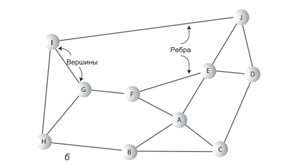

# Занятие №8 15.04.2025
## Графы. Алгоритмы обхода.
### Введение
Графы принадлежат к числу самых гибких и универсальных структур, используемых в программировании.
Как правило, задачи, решаемые при помощи графов, существенно отличаются от задач, которые рассматривались нами ранее.
В области типичного хранения данных, скорее всего, графы вам не понадобятся, но в некоторых областях — и притом очень интересных — они оказывают неоценимую помощь.

### Основные определения
>Я процентов на 80 уверен в том, что вы уже изучали графы.
>Однако, давайте начнем с базы.

Граф как структура данных имеет много общего с деревом.
Более того, в математическом смысле дерево является частным случаем графа.
И все же в программировании графы используются не так, как деревья.

Если смысл дерева заключается в упрощении поиск данных и вставку новых узлов, а ребра представляют быстрый способ перехода от узла к узлу.
То строение графа часто определяется физической или абстрактной задачей.
Например, узлы графа могут представлять города, а ребра — маршруты авиарейсов между этими городами.

Основным отличием графа от рассмотренных ранее структур данных является то что строение графа всегда определяется конкретной ситуацией, а не применяемым к ней алгоритмам.



##### Вершины и ребра
На рисунке выше представлен граф, моделирующий дорожную сеть.
На графе кружки соответствуют дорожным развязкам, а прямые линии, которыми эти кружки соединяются, — дорожным сегментам. 
Кружки являются **вершинами**, а линии — **ребрами** графа. 
Вершины обычно каким-то образом помечаются — часто для пометки используются буквы, как в этом случае. 
Каждое ребро ограничивается двумя вершинами, находящимися на его концах.

Ребра графа не отражают физические расстояния или направления.
Важен сам факт соединения одной развязки с другой (или его отсутствия).

##### Смежность
Две вершины называются **смежными**, если они соединены одним ребром.

##### Пути
**Путь** представляет собой последовательность вершин. 

##### Связные графы
Граф называется **связным**, если от каждой вершины к любой другой вершине ведет хотя бы один путь.
Но если «отсюда дотуда не добраться», граф становится несвязным.


##### Направленные и взвешенные графы
На рисунках выше изображены **ненаправленные** графы. 
Ребра таких графов не имеют направления; перемещения по ним возможны в обоих направлениях, то есть алгоритм может перейти как от вершины A к вершине B, так и от вершины B к вершине A.
Ненаправленные графы хорошо моделируют многие задачи, например построение дорожной сети.

Однако, графы также часто используются для моделирования ситуаций, в которых перемещение по ребру возможно только в одном направлении — от A к B, но не от B к A.
Такие графы называются **направленными** (или **ориентированными**).
Разрешенное направление обычно обозначается стрелкой на конце ребра.

На некоторых графах ребрам присваиваются веса — числа, представляющие физическое расстояние между двумя вершинами, время перехода от вершины к вершине или затраты на такой переход.
Такие графы называются **взвешенными**. Их мы рассмотрим на следующем занятии.

### Программное представление
С теорией разобрались, перейдем к практике.
Какая структура данных лучше подойдет для моделирования графа?
Начнем с вершин, а затем перейдем к ребрам.

#### Вершины
На практике вершины обычно представляют реально существующие объекты, а объекты описываются полями данных.
Например, если вершина представляет город в модели сети воздушного сообщения, в ней может храниться название города, высота над уровнем моря, координаты и т. д.
Таким образом, для представления вершин обычно удобно использовать объекты соответствующего класса.

Рассмотрим простой пример, для каждой вершины хранится только буквенная метка (например, A) и флаг, используемый поисковыми алгоритмами.

```java
public class Vertex {
    private final char label;
    private boolean isVisited;

    public Vertex(char label) {
        this.label = label;
        this.isVisited = false;
    }

    //геттеры и сеттеры
}
```

Объекты вершин можно хранить в массиве и обращаться к ним по индексу.
В наших примерах они будут храниться в массиве с именем `vertexList`.

#### Ребра
Резонно предположить, что для реализации ребер может подойти способ, используемый для реализации ветвей у деревьев.
Однако, в двоичном дереве каждый узел имеет не более двух потомков, а в графе каждая вершина может быть соединена с произвольным количеством других вершин.

Граф не имеет такой жесткой структуры, как двоичное дерево, где у каждого узла может быть только два потомка.
Для моделирования такой структуры нужен другой способ представления ребер.

Выделяют два основных способа: _матрица смежности_ и _список смежности_.

##### Матрица смежности
Матрица смежности представляет собой двумерный массив, элементы которого обозначают наличие связи между двумя вершинами. 
Если граф содержит $N$ вершин, то матрица смежности представляет собой массив $N × N$.

|   | A | B | C | D |
|---|---|---|---|---|
| A | 0 | 1 | 1 | 1 |
| B | 1 | 0 | 0 | 1 |
| C | 1 | 0 | 0 | 0 |
| D | 1 | 1 | 0 | 0 |

Заголовками как строк, так и столбцов являются метки вершин.
Ребро между двумя вершинами обозначается 1; при отсутствии ребра элемент матрицы равен 0.

> Также можно использовать логические значения true/false.

Как видно из таблицы, вершина A является смежной со всеми тремя остальными вершинами, вершина B — с вершинами A и D, вершина C — только с A, а вершина D — с A и B.
В этой матрице «соединение» вершины с самой собой обозначается 0, поэтому диагональ, идущая из левого верхнего в правый нижний угол (от A–A до D–D), заполнена нулями.

Обратите внимание: треугольная часть матрицы над диагональю является зеркальным отражением части, находящейся под ней; оба треугольника содержат одни и те же данные.
Подобная избыточность может показаться неэффективной, но в большинстве языков программирования не существует удобных средств для представления треугольных массивов, поэтому проще смириться с избыточностью.

##### Список смежности
В другом способе представления ребер графа используется список смежности.
В их основе лежат связанные списки.
Список смежности является массивом списков, содержащий информацию о том, какие вершины являются смежными по отношению к заданной.

| Вершина | Список      |
|---------|-------------|
| A       | B -> C -> D |
| B       | A -> D      |
| C       | A           |
| D       | A -> B      |

Не путайте содержимое списков смежности с путями.
Список смежности показывает, какие вершины являются смежными по отношению к заданной (то есть находятся от нее на расстоянии одного ребра); он не является описанием пути между вершинами.

#### Добавление вершин и ребер в граф
Для того чтобы добавить новую вершину в граф нужно:
1. Создать вершину и добавить ее в список вершин `vertexList[vertexNumber++] = new Vertex('F');`;
2. Нужно добавить ребро между новой вершиной и существующей. 
   Способ добавления ребра зависит от выбранного представления.
   Допустим, что мы используем матрицу смежности.
   `matrix[1][3] = 1; matrix[3][1] = 1;`

#### Программная реализация
```java
public class Graph {
    private final int maxVertex;
    private Vertex[] vertexList; // Массив вершин
    private int[][] matrix;      // Матрица смежности
    private int vertexNumber;    // Текущее количество вершин

    public Graph(int maxVertex) { // Конструктор
       this.maxVertex = maxVertex;
        vertexList = new Vertex[maxVertex];
        matrix = new int[maxVertex][maxVertex]; // Матрица смежности
        vertexNumber = 0;
        for (int i = 0; i < maxVertex; i++) {     // Матрица смежности
            for (int j = 0; j < maxVertex; j++) { // заполняется нулями
                matrix[i][j] = 0;
            }
        }
    }

    public void addVertex(char label) { // В аргументе передается метка
        vertexList[vertexNumber++] = new Vertex(label);
    }

    public void addEdge(int start, int end) {
        matrix[start][end] = 1;
        matrix[end][start] = 1;
    }

    public void displayVertex(int v) {
        System.out.print(vertexList[v].getLabel());
    }
}
```

В классе Graph вершины определяются своим индексом в списке vertexList.
Большинство приведенных методов уже рассматривалось ранее. 
Вывод вершины сводится к выводу ее символьной метки.

Информация, хранящаяся в матрице смежности (или списке смежности), является локальной для конкретной вершины, а именно она сообщает, какие вершины соединены одним ребром с заданной вершиной. 
Чтобы получить ответы на более глобальные вопросы о взаимном расположении вершин, необходимо использовать специальные алгоритмы. 
Начнем с обхода.

### Обход
Сначала пример, представим, что у нас есть печатная плата.
На плате размещаются различные компоненты — в основном микросхемы, контакты которых вставляются в отверстия на плате.
Микросхемы закрепляются посредством пайки, а электрическое соединение их контактов с другими контактами осуществляется при помощи дорожек.
На графе контакты могут представляться вершинами, а дорожки — ребрами.

На печатной плате обычно имеется много электрических цепей, не связанных друг с другом, поэтому граф ни в коем случае не обязан быть связным.
А следовательно, в процессе проектирования будет полезно построить граф и воспользоваться им для определения того, какие контакты подключены к текущей цепи.


Существует два основных способа обхода графов: _обход в глубину_ и _обход в ширину_.
Обход в глубину реализуется на базе стека, а обход в ширину реализуется на базе очереди.
Как мы вскоре убедимся, это приводит к обходу вершин графа в разном порядке.

#### Обход в глубину


Обход в глубину начинается с выбора отправной точки — в нашем примере это вершина A.
Затем алгоритм выполняет три операции: посещает вершину, заносит ее в стек и помечает для предотвращения повторных посещений.

Затем алгоритм переходит к любой вершине, смежной с A, которая еще не посещалась ранее. 
Будем считать, что вершины выбираются в алфавитном порядке; значит, это будет вершина B. 
Алгоритм посещает B, помечает вершину и заносит в стек.

Что теперь? Текущей вершиной является B, поэтому алгоритм делает то же, что и прежде: он переходит к смежной вершине, которая еще не посещалась ранее.
В нашем примере это вершина F. 
Назовем этот процесс правилом 1.
> Посетить смежную вершину, не посещавшуюся ранее, пометить ее и занести в стек.

Применение правила 1 снова приводит к вершине H. 
Однако на этот раз необходимо сделать что-то другое, потому что в графе не осталось непосещенных вершин, смежных с H. 
На помощь приходит правило 2.
> Если выполнение правила 1 невозможно, извлечь вершину из стека.

В соответствии с этим правилом вершина H извлекается из стека, в результате чего алгоритм возвращается к F.

После того как у вершины A не осталось непосещенных соседей, она извлекается из стека.
В стеке не остается элементов, и вступает в действие правило 3.
> Если выполнение правил 1 и 2 невозможно, обход закончен.

В таблице ниже показано содержимое стека на разных стадиях этого процесса.

| Событие        | Стек |
|----------------|------|
| Посещение A    | A    |
| Посещение B    | AB   |
| Посещение F    | ABF  |
| Посещение H    | ABFH |
| Посещение H    | ABF  |
| Посещение G    | AB   |
| Посещение B    | A    |
| Посещение C    | AC   |
| Посещение C    | A    |
| Посещение D    | AD   |
| Посещение G    | ADG  |
| Посещение I    | ADGI |
| Посещение I    | ADG  |
| Посещение G    | AD   |
| Посещение D    | A    |
| Посещение E    | AE   |
| Посещение E    | A    |
| Посещение A    |      |
| Обход завершен |      |

В нашем примере вершины будут посещаться в порядке ABFHCDGI.

Таким образом, алгоритм обхода в глубину стремится как можно быстрее удалиться от исходной вершины и возвращается к ней только при достижении тупика.

##### Программная реализация
Для реализации обхода в глубину нам нужно вспомнить прошлый семестр, а именно стек.
```java
public class Stack {

    private int maxSize;
    private int[] stackArray;
    private int top;

    public Stack(int s) {
        maxSize = s;
        stackArray = new int[maxSize];
        top = -1;
    }

    public void push(int j) {
        stackArray[++top] = j;
    }

    public int pop() {
        return stackArray[top--];
    }

    public int peek() {
        return stackArray[top];
    }

    public boolean isEmpty() {
        return top == -1;
    }

    public boolean isFull() {
        return top == maxSize - 1;
    }
}
```

Далее используя класс вершины рассмотренный ранее и класс стека, мы можем дополнить класс графа для поиска в глубину.

```java
public class Graph {
    private final int maxVertex;
    private Vertex[] vertexList;
    private int[][] matrix;
    private int vertexNumber;
    private Stack stack;

    public Graph(int maxVertex) {
        this.maxVertex = maxVertex;
        this.vertexList = new Vertex[maxVertex];
        this.matrix = new int[maxVertex][maxVertex];
        this.vertexNumber = 0;
        for (int i = 0; i < maxVertex; i++) {
            for (int j = 0; j < maxVertex; j++) {
                this.matrix[i][j] = 0;
            }
        }
        this.stack = new Stack(maxVertex);
    }

    public void addVertex(char label) {
        vertexList[vertexNumber++] = new Vertex(label);
    }

    public void addEdge(int start, int end) {
        matrix[start][end] = 1;
        matrix[end][start] = 1;
    }

    public void displayVertex(int v) {
        System.out.print(vertexList[v].getLabel());
    }

    public void depthFirstTraversal() { // Алгоритм начинает с вершины 0
        vertexList[0].setVisited(true); // Пометка
        displayVertex(0); // Вывод
        stack.push(0); // Занесение в стек
        while (!stack.isEmpty()) { // Пока стек не опустеет
            // Получение непосещенной вершины, смежной к текущей
            int v = getUnvisitedVertex(stack.peek());
            if (v == -1) { // Если такой вершины нет,
                stack.pop(); // элемент извлекается из стека
            } else { // Если вершина найдена
                vertexList[v].setVisited(true); // Пометка
                displayVertex(v); // Вывод
                stack.push(v); // Занесение в стек
            }
        }
        // Стек пуст, работа закончена
        for (int i = 0; i < vertexNumber; i++) { // Сброс флагов
            vertexList[i].setVisited(false);
        }
    }

   // Метод возвращает непосещенную вершину, смежную по отношению к вершине под индексом index
    private int getUnvisitedVertex(int index) {
        for (int i = 0; i < vertexNumber; i++) {
            if (matrix[index][i] == 1 && !vertexList[i].isVisited()) {
                return i; // Возвращает первую найденную вершину
            }
        }
        return -1; // Таких вершин нет
    }
}
```

#### Обход в ширину
При обходе в ширину, напротив, алгоритм стремится держаться как можно ближе к исходной вершине.
Он посещает все вершины, смежные с исходной, и только после этого отходит дальше.
Такая разновидность обхода реализуется на базе очереди (вместо стека).


Перейдем к правилам.
Обход начинается с вершины A; алгоритм посещает ее и делает текущей.
> Посетить следующую вершину, не посещавшуюся ранее, смежную с текущей вершиной, пометить ее и занести в очередь.

> Если выполнение правила 1 невозможно, извлечь вершину из очереди и сделать ее текущей вершиной.

> Если выполнение правил 1 и 2 невозможно, обход закончен.

Таким образом, сначала посещаются все вершины, смежные с A.
Алгоритм вставляет каждую вершину в очередь при посещении. 
Так посещаются вершины A, B, C, D и E. 
На этой стадии очередь (от начала к концу) содержит вершины BCDE.

Других непосещенных и смежных с A вершин не осталось, поэтому алгоритм извлекает B из очереди и ищет вершины, смежные с B.

И так далее до выполнения правила 3.

В таблице ниже приведено содержимое очереди на разных стадиях процесса обхода.

| Событие        | Стек |
|----------------|------|
| Посещение A    |      |
| Посещение B    | B    |
| Посещение C    | BC   |
| Посещение D    | BCD  |
| Посещение E    | BCDE |
| Посещение B    | CDE  |
| Посещение F    | CDEF |
| Посещение C    | DEF  |
| Посещение D    | EF   |
| Посещение G    | EFG  |
| Посещение E    | FG   |
| Посещение F    | G    |
| Посещение H    | GH   |
| Посещение G    | H    |
| Посещение I    | HI   |
| Посещение H    | I    |
| Посещение I    |      |
| Обход завершен |      |

В каждый промежуточный момент в очереди хранятся вершины, которые были посещены в процессе обхода, но соседи которых не были полностью исследованы.
Узлы посещаются в порядке ABCDFGHI.

##### Программная реализация
Метод поиска в глубину класса Graph похож на метод поиска в ширину, но стек в нем заменен очередью, а один цикл — вложенными циклами.

```java
public class Queue {
    private int maxSize;
    private int[] queArray;
    private int front;
    private int rear;

    public Queue(int s) {
        maxSize = s;
        queArray = new int[maxSize];
        front = 0;
        rear = -1;
    }

    public void insert(int j) {
        if (rear == maxSize - 1) {
            rear = -1;
        }
        queArray[++rear] = j;
    }

    public int remove() {
        int temp = queArray[front++];
        if (front == maxSize) {
            front = 0;
        }
        return temp;
    }

    public long peekFront() { // Чтение элемента в начале очереди
        return queArray[front];
    }

    public boolean isEmpty() {
        return (rear + 1 == front || (front + maxSize - 1 == rear));
    }
}
```

```java
public class Graph {
    private final int maxVertex;
    private Vertex[] vertexList;
    private int[][] matrix;
    private int vertexNumber;
    private Queue queue;

    public Graph(int maxVertex) {
        this.maxVertex = maxVertex;
        this.vertexList = new Vertex[maxVertex];
        this.matrix = new int[maxVertex][maxVertex];
        this.vertexNumber = 0;
        for (int i = 0; i < maxVertex; i++) {
            for (int j = 0; j < maxVertex; j++) {
                this.matrix[i][j] = 0;
            }
        }
        this.queue = new Queue(maxVertex);
    }

    public void addVertex(char label) {
        vertexList[vertexNumber++] = new Vertex(label);
    }

    public void addEdge(int start, int end) {
        matrix[start][end] = 1;
        matrix[end][start] = 1;
    }

    public void displayVertex(int v) {
        System.out.print(vertexList[v].getLabel());
    }

    public void breadthFirstTraversal() { // Обход в ширину
    // Алгоритм начинает с вершины 0
        vertexList[0].setVisited(true); // Пометка
        displayVertex(0); // Вывод
        queue.insert(0); // Вставка в конец очереди

        int v2;
        while (!queue.isEmpty()) { // Пока очередь не опустеет
            int v1 = queue.remove(); // Извлечение вершины в начале очереди

            while ((v2 = getUnvisitedVertex(v1)) != -1) { // Получение вершины
                vertexList[v2].setVisited(true); // Пометка
                displayVertex(v2); // Вывод
                queue.insert(v2); // Вставка
            }
        }

        // Очередь пуста, обход закончен
        for (int i = 0; i < vertexNumber; i++) { // Сброс флагов
            vertexList[i].setVisited(false);
        }
    }

    private int getUnvisitedVertex(int index) {
        for (int i = 0; i < vertexNumber; i++) {
            if (matrix[index][i] == 1 && !vertexList[i].isVisited()) {
                return i;
            }
        }
        return -1;
    }
}
```

Обход в ширину обладает одним интересным свойством: он сначала находит все вершины, находящиеся на расстоянии одного ребра от начальной вершины, затем все вершины на расстоянии двух ребер и т. д.
Это свойство может пригодиться при поиске кратчайшего пути от начальной вершины к заданной.

### Итог
На этом занятии мы рассмотрели базовые понятия теории графов.
Разобрали программную реализацию и алгоритмы обхода в глубину и ширину.
Приобретенные на этом занятии знания очень пригодятся на следующем занятии во время рассмотрения других задач для решения которых используются графы.

## Лабораторная работа №6
Реализуйте граф, в котором будет использоваться не матрица, а **список** смежности.
Игнорируйте алгоритмы поиска. 
Меня интересует только корректное добавление вершин и ребер. 