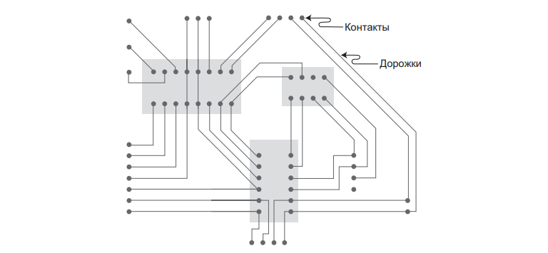
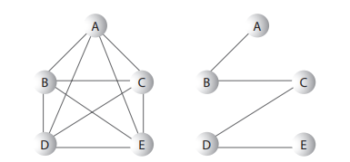
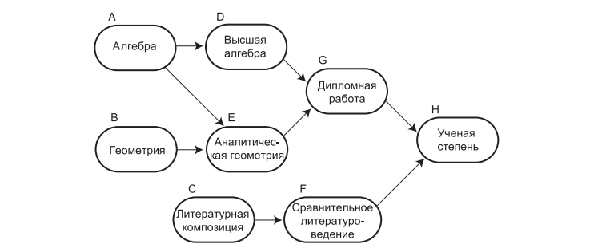
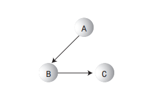

# Занятие №9 22.04.2025
## Минимальные остовные деревья. Направленные графы.
### Минимальные остовные деревья
Продолжим изучение графов с темы построения минимальных остовных деревьев.

Пример. Представим, мы проектируем печатную плату и хотим свести количество дорожек к минимуму.



Иначе говоря, между контактами не должно быть лишних соединений, которые только занимают место и усложняют проводку других цепей.

Для решения этой задачи понадобится алгоритм, который бы для любого связного набора вершин и ребер удалял все лишние ребра.
Эти ребра образуют **минимальное остовное дерево**.



Для заданного набора вершин существует много возможных минимальных остовных деревьев.
А если быть точным количество ребер $E$ в инимальном остовном дереве всегда на единицу меньше количества вершин $V$ : $E = V - 1$.

Алгоритм построения минимального остовного дерева почти идентичен алгоритму обхода. 
Он может базироваться как на обходе в глубину, так и на обходе в ширину.
В рамках занятия мы будем использовать обход в глубину.

Обход в глубину с сохранением ребер, посещенных при поиске, приводит к автоматическому построению минимального остовного дерева.
Единственная задача, которую мы должны решить, это сохранение посещенных ребер.

#### Программная реализация
```java
public void breadthFirstTraversal() {
    vertexList[0].setVisited(true);
    displayVertex(0);
    queue.insert(0);

    int v2;
    while (!queue.isEmpty()) {
        int v1 = queue.remove();

        while ((v2 = getUnvisitedVertex(v1)) != -1) {
            vertexList[v2].setVisited(true);
            displayVertex(v2);
            queue.insert(v2);
        }
    }

    for (int i = 0; i < vertexNumber; i++) { // Сброс флагов
        vertexList[i].setVisited(false);
    }
}

private int getUnvisitedVertex(int index) {
    for (int i = 0; i < vertexNumber; i++) {
        if (matrix[index][i] == 1 && !vertexList[i].isVisited()) {
            return i;
        }
    }
    return -1;
}
```

Код метода очень похож на код `depthFirstTraversal()`.
В секции else выводится текущая вершина и следующий непосещенный сосед.
Эти две вершины определяют ребро, по которому алгоритм перемещается для получения новой вершины.
Такие ребра составляют минимальное остовное дерево.

Минимальное остовное дерево естественным образом строится на базе обхода в глубину, потому что этот алгоритм посещает все узлы, но только по одному разу.
Он никогда не переходит к узлу, который уже был посещен ранее, а все его перемещения по ребрам ограничены строгой необходимостью.
Таким образом, путь алгоритма по графу должен образовывать минимальное остовное дерево.

### Направленные графы
#### Топологическая сортировка
Топологическая сортировка также принадлежит к числу операций, которые могут моделироваться при помощи графов.
Она удобна в ситуациях, в которых требуется расставить некоторые элементы или события в определенном порядке.
Например, для получения того или иного научного достижения, нужно выполнить список определенных условий (пройти дисциплину, получить диплом и т.д.).
Так, процесс получения абстрактной ученой степени можно обозначить следующим графом.



#### Направленные графы
Как видно из рисунка выше, для представления подобной структуры курсов можно воспользоваться графом.
Однако граф этот должен обладать свойством, с которым мы еще не сталкивались: каждое его ребро должно обладать направлением.
Такие графы называются _направленными_.
В направленном графе переходы по ребрам возможны только в одном из двух направлений. 
На схеме графа такие направления обозначаются стрелками.



В программе основное различие между ненаправленным и направленным графом заключается в том, что ребро направленного графа обозначается только одним элементом матрицы смежности.

|   | A | B | C |
|---|---|---|---|
| A | 0 | 1 | 0 |
| B | 0 | 0 | 1 |
| C | 0 | 0 | 0 |

Заголовки строк определяют начало направленного ребра, а заголовки столбцов — его конец. 
Таким образом, ребро от вершины A в B представлено значением 1 на пересечении строки A и столбца B.

Для ненаправленных графов, как упоминалось ранее, половина матрицы смежности является симметричным отражением другой половины, а половина ячеек оказывается лишней. 
Но для взвешенного графа каждая ячейка матрицы смежности несет полезную информацию.
В направленном графе метод для добавления ребра состоит всего из одной команды:
```java
public void addEdge(int start, int end) {
    adjMat[start][end] = 1;
}
```

#### Топологическая сортировка
Вернемся к топологической сортировке и прохождению курсов.
Допустим, вы составляете список всех курсов, необходимых для получения ученой степени, на основе рисунка рассмотренного ранее.

Курсы необходимо выстроить в порядке их прохождения.
Ученая степень находится на последней позиции этого списка, который может выглядеть так: $BAEDGCFH$.

Граф, упорядоченный подобным образом, называется топологически отсортированным.
Каждый учебный курс, который должен быть пройден ранее некоторого другого курса, предшествует ему в списке.

Моделирование планирования заданий с использованием графов называется _анализом критических путей_.

Алгоритм топологической сортировки основан на нестандартной, но простой идее.
Он состоит из двух шагов.
> Найти вершину, не имеющую преемников.

Преемниками вершины называются вершины, расположенные непосредственно «за ней», то есть соединенные с ней ребром, указывающим в их направлении.
> Удалить эту вершину из графа и вставить ее метку в начало списка.

Шаги 1 и 2 повторяются до тех пор, пока из графа не будут удалены все вершины. 
На этой стадии список состоит из всех вершин, упорядоченных в топологическом порядке.

Работа алгоритма основана на том факте, что вершина, не имеющая преемников, должна быть последней в топологическом порядке. 
Сразу же после ее удаления появляется другая вершина, не имеющая преемников; она должна стать предпоследней в результатах сортировки и т. д.

> Есть один нюанс, алгоритм топологической сортировки не может справиться с циклическими графами.
> Что такое цикл? Это путь, который завершается в той точке, с которой он начинается.

##### Программная реализация.
```java
public class DirectedGraph {
    private final int maxVertex;
    private Vertex[] vertexList;
    private int[][] matrix;
    private int vertexNumber;
    private Stack stack;

    public DirectedGraph(int maxVertex) {
        this.maxVertex = maxVertex;
        this.vertexList = new Vertex[maxVertex];
        this.matrix = new int[maxVertex][maxVertex];
        this.vertexNumber = 0;
        for (int i = 0; i < maxVertex; i++) {
            for (int j = 0; j < maxVertex; j++) {
                this.matrix[i][j] = 0;
            }
        }
        this.stack = new Stack(maxVertex);
    }

    public void addVertex(char label) {
        vertexList[vertexNumber++] = new Vertex(label);
    }

    public void addEdge(int start, int end) {
        matrix[start][end] = 1;
    }

    public void displayVertex(int v) {
        System.out.print(vertexList[v].getLabel());
    }

    public void topologicSearch() {
        int originVertexNumber = vertexNumber; // Сохранение количества вершин
        char[] sortedArray = new char[maxVertex];
        while (vertexNumber > 0) {  // Пока в графе остаются вершины
            // Получение вершины без преемников или -1
            int currentVertex = getNoSuccessorsVertex();
            if (currentVertex == -1) { // В графе есть цикл
                System.out.println("ERROR: Graph has cycles");
                return;
            }
            // Вставка метки вершины в массив (начиная с конца)
            sortedArray[vertexNumber - 1] = vertexList[currentVertex].getLabel();

            deleteVertex(currentVertex); // Удаление вершины
        }

        // Все вершины удалены, вывод содержимого sortedArray
        System.out.print("Topologically sorted order: ");
        for (int j = 0; j < originVertexNumber; j++) {
            System.out.print(sortedArray[j]);
        }
        System.out.println();
    }

    private int getNoSuccessorsVertex() { // Метод возвращает вершину, не имеющую преемников (или -1, если ее нет)
        boolean isEdge;  // Ребро в матрице adjMat, ведущее от row в column

        for (int row = 0; row < vertexNumber; row++) { // Для каждой вершины
            isEdge = false; // Проверка ребер
            for (int col = 0; col < vertexNumber; col++) {
                if (matrix[row][col] > 0) { // Если существует ребро
                    isEdge = true; // У вершины имеется преемник
                    break;
                }
            }
            if (!isEdge) { // Если ребер нет, то нет и преемников
                return row;
            }
        }

        return -1; // Вершина не найдена
    }

    private void deleteVertex(int deletedVertexIndex) {
        if (deletedVertexIndex != vertexNumber - 1) { // Если вершина не последняя Удаление из vertexList
            for (int i = deletedVertexIndex; i < vertexNumber - 1; i++) {
                vertexList[i] = vertexList[i + 1];
            }
            for (int row = deletedVertexIndex; row < vertexNumber - 1; row++) {
                moveRowUp(row, vertexNumber); // удаление строки из matrix
            }
            for (int col = deletedVertexIndex; col < vertexNumber - 1; col++) {
                moveColLeft(col, vertexNumber - 1); // Удаление столбца из matrix
            }
            vertexNumber--; // Количество вершин уменьшается на 1
        }
    }

    private void moveRowUp(int row, int length) {
        for (int col = 0; col < length; col++) {
            matrix[row][col] = matrix[row + 1][col];
        }
    }

    private void moveColLeft(int col, int length) {
        for (int row = 0; row < length; row++) {
            matrix[row][col] = matrix[row][col + 1];
        }
    }
}
```

Вся работа выполняется в цикле while, который продолжает выполняться до тех пор, пока количество вершин не сократится до 0. 
Метод работает по следующему алгоритму:
1. Вызов `getNoSuccessorsVertex()` ищет любую вершину, не имеющую преемников.
2. Если вершина найдена, ее метка помещается в конец массива sortedArray[], а сама вершина удаляется из графа.
3. Если вершина не найдена, значит, в графе существует цикл.

Последняя удаляемая вершина должна находиться на первом месте в списке, поэтому метки вершин помещаются в sortedArray, начиная с конца, и продвигаются к началу с уменьшением значения `vertexNumber` (количества вершин в графе).

### Итог
На этом занятии мы заканчиваем рассмотрение базовых понятий и задач по теме графов.
Мы еще не рассмотрели такие темы как алгоритм Уоршелла и все что связано с взвешенными графами. 
Я уверен, при должном рвении вы изучите их самостоятельно.

## Лабораторная работа №7
Последняя лабораторная в этом семестре.
Реализуйте направленный граф, в котором топологическая сортировка не будет удалять вершины из исходного массива, а будет использовать какой-нибудь временный массив.
